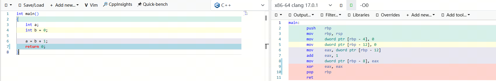
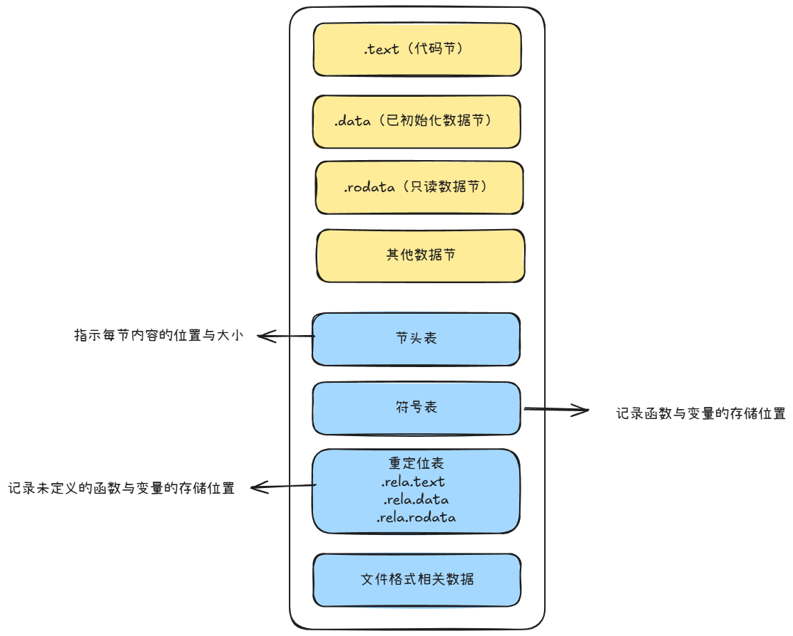

# 编译

从敲下编译命令开始，我们就将之后的一切托付给了编译器，我们希望程序可以顺利编译通过，希望程序可以正确运行。提到编译器是做什么的，大部分人想到的都是“把代码编译成汇编的工具”，事实正是如此。只不过我们平常所说的“编译程序”实际上可以分为两个环节，编译与链接。以C语言为例，编译阶段将.c文件翻译为.o文件，链接阶段将多个.o文件链接生成目标程序。本节介绍的是编译环节的一些细节。

# 概览

以一段C代码为例，在编译阶段结束后，编译器将他们最终翻译为了CPU可以“取指”的汇编代码。



可以看到汇编代码的每一行均由操作指令和操作数构成，例如`mov eax, dword ptr[rbp - 12]`，操作指令为`mov`，将操作数二的值赋值到操作数一中。操作数可以是地址、寄存器、常数。例如`eax`就是寄存器名，而`dword ptr[rbp - 12]`则是一个地址，这个地址在rbp“向下”12个字节。

> 此处的rsp rbp为函数栈内存地址指针，rsp（Stack Pointer Register）总是指向程序当前的栈顶，rbp（Base Pointer Register）通常是用来保存本次调用栈的基准位置，用来定位参数（+）和局部变量（-）的偏移。
> 
> 通常来说，操作系统为程序分配的内存空间中，栈内存向下生长，而堆内存向上生长。

硬件CPU从计算机诞生之初，就是以二进制的方式看待所有的程序，不断在变化的是程序员编写程序的方式，从最早的卡带打点，到使用汇编，到如今的各种高级语言编码，为了程序的可读性和可维护性，基于一层又一层的抽象封装，最终使得大量的底层细节被屏蔽，程序员不再需要考虑CPU的指令集，不需要考虑寄存器分配，不需要考虑变量内存位置，如今剩下的只是声明一个变量、赋值一个变量、对变量执行运算操作。

所以，程序员不需要考虑的部分，编译器帮忙考虑了：

- 程序的引导代码与结束代码
- 寄存器操作
- 参数、变量内存位置计算
- 函数栈维护

程序员没有考虑到的部分，编译器也帮忙考虑了：

- 内存对齐
- 指令优化

编译器通过语法规则解析高级程序语言代码，将其翻译为运行环境的CPU指令集下的汇编代码。我们应该记住是先有汇编语言，才有为了方便而诞生的高级程序语言。因此平常遇到的一些编译器的约定行为很有可能是在汇编时代留下的。

> 例如函数调用时，寄存器的保存和恢复是由被调用者负责执行而不是操作者自己处理，这个就是汇编时代的约定习惯。

# 原理

说到语法规则的解析，编译原理也同样是一个重量级知识域，什么词法分析、语法分析、语义分析，更多详见黑皮书《编译原理》，本人学艺不精这里就不班门弄斧了。暂且挖个坑然后先跳过，等待后续补充。

总而言之，高级语言代码在编译环节将经历如下步骤，最终生成目标汇编代码：

- 词法分析（Lexical Analysis）
  - 将源代码字符流分解为有意义的词法单元（tokens），如关键字、标识符、常量、运算符等。
  - 例如：`int a = 10;`被拆分为 `int`（关键字）、`a`（标识符）、`=`（运算符）、`10`（常量）、`;`（分隔符）。
- 语法分析（Syntax Analysis）
  - 根据编程语言的语法规则，将词法单元组织成抽象语法树（AST），检查结构是否正确。
  - 例如：确认表达式和语句是否符合C语言语法（如括号匹配、分号结尾等）。
- 语义分析（Semantic Analysis）
  - 检查程序逻辑是否合法，如类型匹配、变量声明、作用域规则等。
  - 例如：确保未声明变量不被使用，或整数与浮点数运算时进行隐式类型转换。
- 中间代码生成（Intermediate Code Generation）
  - 生成与机器无关的中间表示（如三地址码），便于后续优化和目标代码生成。
  - 例如：将 `a = b + c * 2`转换为类似 `t1 = c * 2; a = b + t1`的中间代码。
- 代码优化（Code Optimization）
  - 对中间代码进行优化，提高运行效率或减少代码体积。
  - 例如：常量折叠（将 `2 * 3`直接替换为 `6`）、死代码删除等。
- 目标代码生成（Code Generation）
  - 将优化后的中间代码转换为特定机器的汇编代码。
  - 例如：根据目标架构（如x86、ARM）选择指令集，分配寄存器，管理内存访问。

# 产物

为了对照源代码(.c)与对象文件(.o)之间的对应关系，我们以在这段代码为例，代码中声明了2个未初始化的int类型全局变量，1个初始化的int类型全局变量以及1个指向常量字符串的指针。

```C++
[root@iZ2zeamih4tp4e8ya0gnukZ ~]# cat a.c
int g_uninit_var1;
int g_uninit_var2;
int g_init_var = 100;
const char *buf = "abc";

int main()
{
    int a;
    int b = 1;
    char buf[10] = "abc";

    a = b + 1;
    return 0;
}
```

使用`gcc -c`命令将.c文件编译成.o文件。

```Bash
[root@iZ2zeamih4tp4e8ya0gnukZ ~]# gcc -c a.c
[root@iZ2zeamih4tp4e8ya0gnukZ ~]# ls -l
-rw-r--r-- 1 root root  183 Feb 24 17:10 a.c
-rw-r--r-- 1 root root 1624 Feb 24 17:11 a.o
```

## 对象文件结构

在对象文件中，函数被翻译成了机器码，可以直接被CPU取指运行，变量被分配了地址，可以被指令读写

因此我们可以猜测一个对象文件中存在：

1. 翻译后的机器码数据
2. 变量分配的地址信息

在实际的程序中，这部分内容被分类为了四个常见的节（section）：

- .text（代码节）：存放程序的机器码。
- .data（数据节）：存放**要初始化**的全局变量和静态变量以及初始化的数值。
- .bss（未初始化数据节）：存放**所有初始值为零**的全局变量和静态变量。由于它们的值已知（全零），该段在目标文件中**不存储实际数据**，仅记录所需空间大小。程序加载时，操作系统会据此分配相应大小的内存并初始化为零。
- .rodata（只读数据节）：存放只读数据，如字符串常量或const修饰的全局变量。与.text类似，是只读的，但通常不包含指令。

这四个节被称为数据节，而这些数据外部想要访问的话必然需要有一些额外信息，例如每个节在文件的哪个位置，长度有多长等等，这些额外信息被称为元数据，通常包含了文件格式头部、节头表、符号表、重定向表等等。

可以简单理解为.data节存放了代码中默认值的全局变量和静态变量，而.bss节存放的是没有默认值的变量，后续被加载时会被隐式初始化为0.

那么假如声明一个初始值为0的全局变量或静态变量呢？多数编译器也会优化将其放在.bss节以便于减少占用空间。.bss节设计的核心目的就是记录那些无需存储初始值的数据。

## 文件格式头部

众所周知，Linux操作系统中的程序可能是a.elf，而Windows下可能是a.exe，编译器在针对特定系统将源代码编译完成后需要将这个系统的信息写入这个二进制文件中，以便于操作系统确认是否支持。

常见的格式主要有：

- ELF (Executable and Linkable Format)：用于 Linux、大多数 Unix-like 系统、Android 等。
- COFF (Common Object File Format)：早期 Unix 和 Windows 使用（现已被 PE 取代）。
- Mach-O (Mach Object)：用于 macOS、iOS 等 Apple 系统。
- PE (Portable Executable)：用于 Windows 系统。
- a.out (Assembler Output):早期 Unix 系统的默认格式，现在较少使用。

在不同的系统平台下使用gcc -c命令编译同一段C代码，生成的对象文件格式将与系统平台保持一致。（这里不考虑交叉编译）

上文中的示例就是在Linux系统下执行的gcc -c，生成的就是elf格式的对象文件，因此除了objdump外，还可以用readelf工具来读取。

```SQL
[root@iZ2zeamih4tp4e8ya0gnukZ ~]# readelf -S a.o 
There are 13 section headers, starting at offset 0x318:

Section Headers:
  [Nr] Name              Type             Address           Offset
       Size              EntSize          Flags  Link  Info  Align
  [ 0]                   NULL             0000000000000000  00000000
       0000000000000000  0000000000000000           0     0     0
  [ 1] .text             PROGBITS         0000000000000000  00000040
       0000000000000029  0000000000000000  AX       0     0     1
  [ 2] .data             PROGBITS         0000000000000000  00000070
       0000000000000010  0000000000000000  WA       0     0     8
  [ 3] .rela.data        RELA             0000000000000000  00000280
       0000000000000018  0000000000000018   I      10     2     8
  [ 4] .bss              NOBITS           0000000000000000  00000080
       0000000000000008  0000000000000000  WA       0     0     4
  [ 5] .rodata           PROGBITS         0000000000000000  00000080
       0000000000000004  0000000000000000   A       0     0     1
  [ 6] .comment          PROGBITS         0000000000000000  00000084
       0000000000000036  0000000000000001  MS       0     0     1
  [ 7] .note.GNU-stack   PROGBITS         0000000000000000  000000ba
       0000000000000000  0000000000000000           0     0     1
  [ 8] .eh_frame         PROGBITS         0000000000000000  000000c0
       0000000000000038  0000000000000000   A       0     0     8
  [ 9] .rela.eh_frame    RELA             0000000000000000  00000298
       0000000000000018  0000000000000018   I      10     8     8
  [10] .symtab           SYMTAB           0000000000000000  000000f8
       0000000000000150  0000000000000018          11     9     8
  [11] .strtab           STRTAB           0000000000000000  00000248
       0000000000000035  0000000000000000           0     0     1
  [12] .shstrtab         STRTAB           0000000000000000  000002b0
       0000000000000061  0000000000000000           0     0     1
Key to Flags:
  W (write), A (alloc), X (execute), M (merge), S (strings), I (info),
  L (link order), O (extra OS processing required), G (group), T (TLS),
  C (compressed), x (unknown), o (OS specific), E (exclude),
  l (large), p (processor specific)
```

## 节头表

对象文件中，代码、变量等内容有序排列在了数据区域，因此对应的就需要有信息来区分每个部分的开始和结束，这个信息就是元数据类型的节信息，存储在节头表中，节信息描述了每个部分从哪里开始读取（File off）以及要读取多长（Size）等信息。

- Size（节大小）
  - 含义：节占用的字节数。
  - 区别：
    - 对于有 CONTENTS的节（如 .text、.data）：表示文件中的实际数据大小（从磁盘读取的字节数）。
    - 对于无 CONTENTS的节（如 .bss）：表示运行时需要分配的内存大小（不占磁盘空间）。
- VMA（Virtual Memory Address）（虚拟内存地址）
  - 含义：节加载到内存后的虚拟地址（运行时地址）。
  - 在目标文件（.o）中，通常为 00000000（未分配），因为地址需在链接时确定。
  - 在可执行文件中，会显示实际地址（如 0x400000）。
- LMA（Load Memory Address）（加载内存地址）
  - 含义：节数据从文件加载到内存的物理地址（通常与 VMA 相同）。
  - 特殊情况：某些嵌入式系统可能将代码加载到 RAM 运行，但存储在 ROM 中（LMA 与 VMA 不同）
- File off
  - 含义：节数据在文件中的起始位置（相对于文件开头的字节偏移）。
  - 注意：
    - 对于有内容的节（如 .text），这是数据开始的位置。
    - 对于无内容的节（如 .bss），该值通常无效或与上一个节结束位置相同。
- Algn
  - 含义：节在内存和文件中的对齐边界。
  - 格式：2**N（表示 2 的 N 次方字节对齐）。

对齐的原因是为了提升CPU访问效率

使用`objdump -h`可以显示出节头表中的节信息。

```YAML
[root@iZ2zeamih4tp4e8ya0gnukZ ~]# objdump -h a.o

a.o:     file format elf64-x86-64

Sections:
Idx Name          Size      VMA               LMA               File off  Algn
  0 .text         00000029  0000000000000000  0000000000000000  00000040  2**0
                  CONTENTS, ALLOC, LOAD, READONLY, CODE
  1 .data         00000010  0000000000000000  0000000000000000  00000070  2**3
                  CONTENTS, ALLOC, LOAD, RELOC, DATA
  2 .bss          00000008  0000000000000000  0000000000000000  00000080  2**2
                  ALLOC
  3 .rodata       00000004  0000000000000000  0000000000000000  00000080  2**0
                  CONTENTS, ALLOC, LOAD, READONLY, DATA
  4 .comment      00000036  0000000000000000  0000000000000000  00000084  2**0
                  CONTENTS, READONLY
  5 .note.GNU-stack 00000000  0000000000000000  0000000000000000  000000ba  2**0
                  CONTENTS, READONLY
  6 .eh_frame     00000038  0000000000000000  0000000000000000  000000c0  2**3
                  CONTENTS, ALLOC, LOAD, RELOC, READONLY, DATA
```

可以看到生成的对象文件各个节的内容和代码相符：

- .data节Size为0x10(16)个字节
  - 1个int类型整型变量（4字节）
  - 1个指针变量（8字节）
  - 2**3（8字节对齐）
- .bss节Size为0x8(8)个字节
  - 2个int类型整型变量（2*4字节）
- .rodata节Size为0x4(4)个字节
  - 常量字符串由4个字符组成("a" + "b" + "c" + "\0")（4*1字节）
- .text节Size为29，可以使用`objdump -d`查看具体内容

```YAML
[root@iZ2zeamih4tp4e8ya0gnukZ ~]# objdump -d a.o

a.o:     file format elf64-x86-64


Disassembly of section .text:

0000000000000000 <main>:
   0:   55                      push   %rbp
   1:   48 89 e5                mov    %rsp,%rbp
   4:   c7 45 fc 01 00 00 00    movl   $0x1,-0x4(%rbp)
   b:   48 c7 45 ee 61 62 63    movq   $0x636261,-0x12(%rbp)
  12:   00 
  13:   66 c7 45 f6 00 00       movw   $0x0,-0xa(%rbp)
  19:   8b 45 fc                mov    -0x4(%rbp),%eax
  1c:   83 c0 01                add    $0x1,%eax
  1f:   89 45 f8                mov    %eax,-0x8(%rbp)
  22:   b8 00 00 00 00          mov    $0x0,%eax
  27:   5d                      pop    %rbp
  28:   c3                      retq   
```

## 符号表

函数与变量在对象文件中本质上都是存储在某个偏移的二进制数据，被称为“符号”。而既然被存储在了对象文件的数据节中，那么就需要有记录来告知他们存储的偏移量，存储这些符号信息的就是符号表。

符号表可以用`objdump -t`和`readelf -s`查看。

```SQL
[root@iZ2zeamih4tp4e8ya0gnukZ ~]# objdump -t a.o

a.o:     file format elf64-x86-64

SYMBOL TABLE:
0000000000000000 l    df *ABS*  0000000000000000 a.c
0000000000000000 l    d  .text  0000000000000000 .text
0000000000000000 l    d  .data  0000000000000000 .data
0000000000000000 l    d  .bss   0000000000000000 .bss
0000000000000000 l    d  .rodata        0000000000000000 .rodata
0000000000000000 l    d  .note.GNU-stack        0000000000000000 .note.GNU-stack
0000000000000000 l    d  .eh_frame      0000000000000000 .eh_frame
0000000000000000 l    d  .comment       0000000000000000 .comment
0000000000000000 g     O .bss   0000000000000004 g_uninit_var1
0000000000000004 g     O .bss   0000000000000004 g_uninit_var2
0000000000000000 g     O .data  0000000000000004 g_init_var
0000000000000008 g     O .data  0000000000000008 buf
0000000000000000 g     F .text  0000000000000029 main


[root@iZ2zeamih4tp4e8ya0gnukZ ~]# readelf -s a.o

Symbol table '.symtab' contains 14 entries:
   Num:    Value          Size Type    Bind   Vis      Ndx Name
     0: 0000000000000000     0 NOTYPE  LOCAL  DEFAULT  UND 
     1: 0000000000000000     0 FILE    LOCAL  DEFAULT  ABS a.c
     2: 0000000000000000     0 SECTION LOCAL  DEFAULT    1 
     3: 0000000000000000     0 SECTION LOCAL  DEFAULT    2 
     4: 0000000000000000     0 SECTION LOCAL  DEFAULT    4 
     5: 0000000000000000     0 SECTION LOCAL  DEFAULT    5 
     6: 0000000000000000     0 SECTION LOCAL  DEFAULT    7 
     7: 0000000000000000     0 SECTION LOCAL  DEFAULT    8 
     8: 0000000000000000     0 SECTION LOCAL  DEFAULT    6 
     9: 0000000000000000     4 OBJECT  GLOBAL DEFAULT    4 g_uninit_var1
    10: 0000000000000004     4 OBJECT  GLOBAL DEFAULT    4 g_uninit_var2
    11: 0000000000000000     4 OBJECT  GLOBAL DEFAULT    2 g_init_var
    12: 0000000000000008     8 OBJECT  GLOBAL DEFAULT    2 buf
    13: 0000000000000000    41 FUNC    GLOBAL DEFAULT    1 main
```

符号表记录了变量的偏移量，例如g_uninit_var1和g_uninit_var2被存储在了.bss节，并且g_uninit_var1相对于.bss节的偏移是0字节，因为g_uninit_var2的分配位置是.bss+sizeof(g_uninit_var1)，所以g_uninit_var2的偏移是4。

又因为.data节是按8字节对齐的，所以g_init_var放在0的位置，而buf被放在了.data + sizeof(g_init_var)的下一个可以被8整除的位置上（0x8）。

.text节中0x0的位置就是main函数的机器码，所以main函数的位置就是.text的起始(0x0)。

## 重定位表

上文中反复提到的例子实际上一个.c文件就可以编译成程序运行。不过在实际的模块化编程中，单个.c文件经常需要引用外部变量或函数，一个程序由多个.c文件构成。已知`gcc -c`是对单个.c文件进行编译，那么这类声明为extern的变量在编译当前.c文件时实际上是没有定义的，当编译器发现一些变量、函数在当前.c文件中找不到定义，则会在符号表中将其设置为"UND(undefined)"，并且在调用处暂时以0来填充，然后将这些符号记录在一张专门的表里，如果后续找到了，那么就根据这张表对应的位置，把那些0给替换成实际的地址。这张表被称为“重定位表”。

在下面的代码中定义了一个外部函数`ext_add`以及一个外部整型变量`ext_var`，使用命令查看编译的对象文件的.text节和节信息：

```Bash
[root@iZ2zeamih4tp4e8ya0gnukZ ~]# cat b.c

extern int ext_add(int a, int b);
extern int ext_var;

int main() 
{
    int a = 1;
    int b = ext_add(a, ext_var);
    return 0;
}

[root@iZ2zeamih4tp4e8ya0gnukZ ~]# gcc -c b.c
[root@iZ2zeamih4tp4e8ya0gnukZ ~]# objdump -d b.o

b.o:     file format elf64-x86-64


Disassembly of section .text:

0000000000000000 <main>:
   0:   55                      push   %rbp
   1:   48 89 e5                mov    %rsp,%rbp
   4:   48 83 ec 10             sub    $0x10,%rsp
   8:   c7 45 fc 01 00 00 00    movl   $0x1,-0x4(%rbp)
   f:   8b 15 00 00 00 00       mov    0x0(%rip),%edx        # 15 <main+0x15>
  15:   8b 45 fc                mov    -0x4(%rbp),%eax
  18:   89 d6                   mov    %edx,%esi
  1a:   89 c7                   mov    %eax,%edi
  1c:   e8 00 00 00 00          callq  21 <main+0x21>
  21:   89 45 f8                mov    %eax,-0x8(%rbp)
  24:   b8 00 00 00 00          mov    $0x0,%eax
  29:   c9                      leaveq 
  2a:   c3                      retq
[root@iZ2zeamih4tp4e8ya0gnukZ ~]# objdump -h b.o

b.o:     file format elf64-x86-64

Sections:
Idx Name          Size      VMA               LMA               File off  Algn
  0 .text         0000002b  0000000000000000  0000000000000000  00000040  2**0
                  CONTENTS, ALLOC, LOAD, RELOC, READONLY, CODE
  1 .data         00000000  0000000000000000  0000000000000000  0000006b  2**0
                  CONTENTS, ALLOC, LOAD, DATA
  2 .bss          00000000  0000000000000000  0000000000000000  0000006b  2**0
                  ALLOC
  3 .comment      00000036  0000000000000000  0000000000000000  0000006b  2**0
                  CONTENTS, READONLY
  4 .note.GNU-stack 00000000  0000000000000000  0000000000000000  000000a1  2**0
                  CONTENTS, READONLY
  5 .eh_frame     00000038  0000000000000000  0000000000000000  000000a8  2**3
                  CONTENTS, ALLOC, LOAD, RELOC, READONLY, DATA
[root@iZ2zeamih4tp4e8ya0gnukZ ~]# readelf -S b.o
There are 12 section headers, starting at offset 0x2b0:

Section Headers:
  [Nr] Name              Type             Address           Offset
       Size              EntSize          Flags  Link  Info  Align
  [ 0]                   NULL             0000000000000000  00000000
       0000000000000000  0000000000000000           0     0     0
  [ 1] .text             PROGBITS         0000000000000000  00000040
       000000000000002b  0000000000000000  AX       0     0     1
  [ 2] .rela.text        RELA             0000000000000000  00000208
       0000000000000030  0000000000000018   I       9     1     8
  [ 3] .data             PROGBITS         0000000000000000  0000006b
       0000000000000000  0000000000000000  WA       0     0     1
  [ 4] .bss              NOBITS           0000000000000000  0000006b
       0000000000000000  0000000000000000  WA       0     0     1
  [ 5] .comment          PROGBITS         0000000000000000  0000006b
       0000000000000036  0000000000000001  MS       0     0     1
  [ 6] .note.GNU-stack   PROGBITS         0000000000000000  000000a1
       0000000000000000  0000000000000000           0     0     1
  [ 7] .eh_frame         PROGBITS         0000000000000000  000000a8
       0000000000000038  0000000000000000   A       0     0     8
  [ 8] .rela.eh_frame    RELA             0000000000000000  00000238
       0000000000000018  0000000000000018   I       9     7     8
  [ 9] .symtab           SYMTAB           0000000000000000  000000e0
       0000000000000108  0000000000000018          10     8     8
  [10] .strtab           STRTAB           0000000000000000  000001e8
       000000000000001a  0000000000000000           0     0     1
  [11] .shstrtab         STRTAB           0000000000000000  00000250
       0000000000000059  0000000000000000           0     0     1
```

可以看到汇编代码中ext_var和ext_add函数的机器码部分都被用0填充了（黄色背景部分）。并且由于这两个变量都不是在代码中定义的，所以.data和.bss的大小都是0。

而在`readelf -S`（查看节信息）的回显中，可以看到有一个节名称是.rela.text，代表这个节存储的数据是为.text节中需要重定位的符号信息，而类似的还有.rela.data,.rela.rodata，代表.data节、.rodata节中需要重定位的符号信息。

从readelf -S命令显示的.rela.text size为30，offset为208，.rela.eh_frame offset为238可以看出，重定向表与.bss不同，是实打实占用了磁盘空间来存储信息。区别在于.bss是只有节信息而没有文件内容节，.rela.data等与.data,.text一样，既有节信息又有文件内容节用来放置符号的内容。

继续查看一下对象文件的符号表和重定位表：

```Bash
[root@iZ2zeamih4tp4e8ya0gnukZ ~]# objdump -t b.o

b.o:     file format elf64-x86-64

SYMBOL TABLE:
0000000000000000 l    df *ABS*  0000000000000000 b.c
0000000000000000 l    d  .text  0000000000000000 .text
0000000000000000 l    d  .data  0000000000000000 .data
0000000000000000 l    d  .bss   0000000000000000 .bss
0000000000000000 l    d  .note.GNU-stack        0000000000000000 .note.GNU-stack
0000000000000000 l    d  .eh_frame      0000000000000000 .eh_frame
0000000000000000 l    d  .comment       0000000000000000 .comment
0000000000000000 g     F .text  000000000000002b main
0000000000000000         *UND*  0000000000000000 ext_var
0000000000000000         *UND*  0000000000000000 ext_add
[root@iZ2zeamih4tp4e8ya0gnukZ ~]# readelf -s b.o

Symbol table '.symtab' contains 11 entries:
   Num:    Value          Size Type    Bind   Vis      Ndx Name
     0: 0000000000000000     0 NOTYPE  LOCAL  DEFAULT  UND 
     1: 0000000000000000     0 FILE    LOCAL  DEFAULT  ABS b.c
     2: 0000000000000000     0 SECTION LOCAL  DEFAULT    1 
     3: 0000000000000000     0 SECTION LOCAL  DEFAULT    3 
     4: 0000000000000000     0 SECTION LOCAL  DEFAULT    4 
     5: 0000000000000000     0 SECTION LOCAL  DEFAULT    6 
     6: 0000000000000000     0 SECTION LOCAL  DEFAULT    7 
     7: 0000000000000000     0 SECTION LOCAL  DEFAULT    5 
     8: 0000000000000000    43 FUNC    GLOBAL DEFAULT    1 main
     9: 0000000000000000     0 NOTYPE  GLOBAL DEFAULT  UND ext_var
    10: 0000000000000000     0 NOTYPE  GLOBAL DEFAULT  UND ext_add
[root@iZ2zeamih4tp4e8ya0gnukZ ~]# objdump -r b.o

b.o:     file format elf64-x86-64

RELOCATION RECORDS FOR [.text]:
OFFSET           TYPE              VALUE 
0000000000000011 R_X86_64_PC32     ext_var-0x0000000000000004
000000000000001d R_X86_64_PLT32    ext_add-0x0000000000000004
[root@iZ2zeamih4tp4e8ya0gnukZ ~]# readelf -r b.o

Relocation section '.rela.text' at offset 0x208 contains 2 entries:
  Offset          Info           Type           Sym. Value    Sym. Name + Addend
000000000011  000900000002 R_X86_64_PC32     0000000000000000 ext_var - 4
00000000001d  000a00000004 R_X86_64_PLT32    0000000000000000 ext_add - 4

Relocation section '.rela.eh_frame' at offset 0x238 contains 1 entry:
  Offset          Info           Type           Sym. Value    Sym. Name + Addend
000000000020  000200000002 R_X86_64_PC32     0000000000000000 .text + 0
```

可以看到ext_var和ext_add都是*UND*（未定义），并且`ext_var`对于.text的偏移量是0x11，`ext_add`对于.text的偏移量是0x1d，与上述.text中填充0的位置相吻合。

假如此时我们直接使用命令直接将b.o链接成程序，会出现如下报错:

```Bash
[root@iZ2zeamih4tp4e8ya0gnukZ ~]# gcc -o b.elf b.o
/usr/bin/ld: b.o: in function `main':
b.c:(.text+0x11): undefined reference to `ext_var'
/usr/bin/ld: b.c:(.text+0x1d): undefined reference to `ext_add'
collect2: error: ld returned 1 exit status
```

原因自然是这两个UND的符号还未找到。在链接阶段时，链接器会基于.o中的重定位表去查找其他.o文件中是否存在这些外部符号的定义，并且用链接完成后符号在程序内的最终地址做替换。这些将在下一篇关于程序链接的文章进行分析。

## 对象文件结构示意

通过上文的实践总结，我们可以绘制出一个elf格式的.o文件的数据分布示意图



# 编译选项

在编译对象文件的过程中，有两个编译选项会影响编译器的决策：

-fPIC（Position-Independent Code，位置无关代码）: 通常在编译共享库（.so）的时候使用。生成的代码可以在内存任何位置加载，且代码节（.text）在多个进程间可以共享。

-fPIE（Position-Independent Executable，位置无关可执行文件）: **在当前Linux下是默认开启，**主要用于编译可执行文件。和PIC的功能基本一致，实际上影响的是后续链接器的行为决策。

两者的核心区别在于**优化程度和对可执行文件的适用性**。`-fPIE`生成的代码，在链接成可执行文件时，链接器可以假设整个程序作为一个整体被重定位，从而可能做出一些 `-fPIC`不允许的优化（比如更激进地使用PC相对寻址访问内部全局变量，因为整个可执行文件的相对位置是固定的）。对于可执行文件，现代实践是推荐使用 `-fPIE`（通常默认），而库则使用 `-fPIC`。

## 什么是位置无关？

当机器码指令要访问一个函数或变量时，需要知道这个符号在哪里，例如符号在对象文件中的偏移量，这个偏移量可以理解为我们所说的“位置”。

如果我们将偏移量统统写死，使用符号在对象文件中的绝对虚拟地址（VMA）进行访问，这种方式称为位置有关。

例如：一个变量在内容节中的地址是0x1000，那么机器码中访问变量的做法就是mov eax, [0x1000]。

而位置无关就是使用间接访问的方式，.text并不直接访问符号，而是先查表得知符号的位置，然后再进行访问。这样如果程序内容发生变化，只需要更新对应表即可，不需要动到访问变量的.text。

相对访问实际上存在三种情况：

1. PC相对寻址：当访问同一个编译单元内的静态函数和静态变量**，**编译器生成指令时使用相对于当前指令指针（PC）的偏移量来计算目标地址。相较于后两种访问方式是最高效的访问方式。
   
   1. **实际上,PC相对寻址并不是只有PIC下才有，**
      
      PIC中：PC相对寻址的偏移量在编译产物中填写的是一个假定的地址，而真正的地址在程序被加载到内存中时才会被重新填充，由于是基于实际的PC值计算，因此无论模块加载到哪都能算出正确的目标地址。
      
      在非PIC中：PC相对寻址的偏移量是链接时基于**固定加载地址**计算的。如果程序不加载到那个固定地址，即使用了PC相对寻址也会出错。

2. 全局偏移表（Global Offset Table,  GOT）：用于变量访问，对于外部全局变量或同一个共享库内的全局变量，PIC代码通过GOT来访问。原理是：
   
   1. 编译器在.data节附近生成一个GOT表，里面预期存放了各个变量的绝对虚拟地址（VMA）。
   2. .text中的指令在执行时先通过PC相对寻址拿到GOT的地址，然后从GOT中加载出变量的绝对地址，最后再去访问变量。这样，.text指令中只关注到GOT的偏移。当模块被加载到不同地址时，只需要动态链接器修正GOT表中的那些绝对地址即可。

3. 过程链接表（Procedure Linkage Table, PLT）：用于函数调用，对于外部函数（尤其是共享库中的函数）的调用，才使用PLT。它的主要目的有两个：
   
   1. 实现延迟绑定（Lazy Binding）：程序启动时不解析所有外部函数，只在第一次调用时才解析，加快启动速度。
   2. 实现PIC：.text中的`call`指令跳转到一个固定的、属于本模块的PLT条目（这是一小段存根代码）。PLT条目再通过GOT中的一个条目（通常称为GOT[n]）来间接跳转到真正的函数。GOT[n]条目由动态链接器负责填充。

因此后两种方法实际上是通过一层查表跳转，使.text的符号访问逻辑由非固定变为了固定，真正的变化被GOT和PLT隐藏。

由于这块内容与链接器、动态加载是强相关的，因此将在后续章节继续补充更多内容。

# 编译宏

## 符号可见性

当函数或者变量被编译后会被写入符号表，那么链接器就可以让别的对象文件链接上这些符号。

那么当我们作为一个功能库（动态库.so）的提供者时，希望使用者只能使用我们提供的函数或变量，不能擅自因为阅读了源码就调用不希望暴露的内部逻辑，那么我们就可以对符号设置可见性。

当符号可见性设置为隐藏时，这个符号不会被写入动态符号表（`.dynsym`），链接时如果链接器发现文件是个动态库，则会搜索动态符号表，自然链接时对方程序就会因为找不到符号而链接失败。

使用`__attribute__((visibility("hidden")))`设置符号可见性。

```SQL
[root@iZ2zeamih4tp4e8ya0gnukZ ~]# cat hidden.c
__attribute__((visibility("hidden"))) int x_hide = 5;
int x_show = 10;

__attribute__((visibility("hidden")))
int foo(int x)
{
    return 1;
}

int bar(int y)
{
    return 2;
}
[root@iZ2zeamih4tp4e8ya0gnukZ ~]# gcc -shared -fPIC -o hidden.so hidden.c
[root@iZ2zeamih4tp4e8ya0gnukZ ~]# readelf -s hidden.so

Symbol table '.dynsym' contains 7 entries:
   Num:    Value          Size Type    Bind   Vis      Ndx Name
     0: 0000000000000000     0 NOTYPE  LOCAL  DEFAULT  UND 
     1: 0000000000000000     0 NOTYPE  WEAK   DEFAULT  UND _ITM_deregisterT[...]
     2: 0000000000000000     0 NOTYPE  WEAK   DEFAULT  UND __gmon_start__
     3: 0000000000000000     0 NOTYPE  WEAK   DEFAULT  UND _ITM_registerTMC[...]
     4: 0000000000000000     0 FUNC    WEAK   DEFAULT  UND [...]@GLIBC_2.2.5 (2)
     5: 0000000000001107    14 FUNC    GLOBAL DEFAULT   11 bar
     6: 000000000000402c     4 OBJECT  GLOBAL DEFAULT   20 x_show

Symbol table '.symtab' contains 51 entries:
   Num:    Value          Size Type    Bind   Vis      Ndx Name
     0: 0000000000000000     0 NOTYPE  LOCAL  DEFAULT  UND 
     1: 0000000000000238     0 SECTION LOCAL  DEFAULT    1 
     2: 0000000000000260     0 SECTION LOCAL  DEFAULT    2 
     3: 0000000000000288     0 SECTION LOCAL  DEFAULT    3 
     4: 0000000000000330     0 SECTION LOCAL  DEFAULT    4 
     5: 00000000000003a6     0 SECTION LOCAL  DEFAULT    5 
     6: 00000000000003b8     0 SECTION LOCAL  DEFAULT    6 
     7: 00000000000003d8     0 SECTION LOCAL  DEFAULT    7 
     8: 0000000000000480     0 SECTION LOCAL  DEFAULT    8 
     9: 0000000000001000     0 SECTION LOCAL  DEFAULT    9 
    10: 0000000000001020     0 SECTION LOCAL  DEFAULT   10 
    11: 0000000000001040     0 SECTION LOCAL  DEFAULT   11 
    12: 0000000000001118     0 SECTION LOCAL  DEFAULT   12 
    13: 0000000000002000     0 SECTION LOCAL  DEFAULT   13 
    14: 0000000000002028     0 SECTION LOCAL  DEFAULT   14 
    15: 0000000000003e10     0 SECTION LOCAL  DEFAULT   15 
    16: 0000000000003e18     0 SECTION LOCAL  DEFAULT   16 
    17: 0000000000003e20     0 SECTION LOCAL  DEFAULT   17 
    18: 0000000000003fe0     0 SECTION LOCAL  DEFAULT   18 
    19: 0000000000004000     0 SECTION LOCAL  DEFAULT   19 
    20: 0000000000004020     0 SECTION LOCAL  DEFAULT   20 
    21: 0000000000004030     0 SECTION LOCAL  DEFAULT   21 
    22: 0000000000000000     0 SECTION LOCAL  DEFAULT   22 
    23: 0000000000006038     0 SECTION LOCAL  DEFAULT   23 
    24: 0000000000000000     0 FILE    LOCAL  DEFAULT  ABS crtstuff.c
    25: 0000000000001040     0 FUNC    LOCAL  DEFAULT   11 deregister_tm_clones
    26: 0000000000001070     0 FUNC    LOCAL  DEFAULT   11 register_tm_clones
    27: 00000000000010b0     0 FUNC    LOCAL  DEFAULT   11 __do_global_dtors_aux
    28: 0000000000004030     1 OBJECT  LOCAL  DEFAULT   21 completed.0
    29: 0000000000003e18     0 OBJECT  LOCAL  DEFAULT   16 __do_global_dtor[...]
    30: 00000000000010f0     0 FUNC    LOCAL  DEFAULT   11 frame_dummy
    31: 0000000000003e10     0 OBJECT  LOCAL  DEFAULT   15 __frame_dummy_in[...]
    32: 0000000000000000     0 FILE    LOCAL  DEFAULT  ABS hidden.c
    33: 0000000000000000     0 FILE    LOCAL  DEFAULT  ABS crtstuff.c
    34: 00000000000020a8     0 OBJECT  LOCAL  DEFAULT   14 __FRAME_END__
    35: 0000000000000000     0 FILE    LOCAL  DEFAULT  ABS 
    36: 0000000000004028     4 OBJECT  LOCAL  DEFAULT   20 x_hide
    37: 0000000000001118     0 FUNC    LOCAL  DEFAULT   12 _fini
    38: 0000000000004020     0 OBJECT  LOCAL  DEFAULT   20 __dso_handle
    39: 00000000000010f9    14 FUNC    LOCAL  DEFAULT   11 foo
    40: 0000000000003e20     0 OBJECT  LOCAL  DEFAULT   17 _DYNAMIC
    41: 0000000000002000     0 NOTYPE  LOCAL  DEFAULT   13 __GNU_EH_FRAME_HDR
    42: 0000000000004030     0 OBJECT  LOCAL  DEFAULT   20 __TMC_END__
    43: 0000000000004000     0 OBJECT  LOCAL  DEFAULT   19 _GLOBAL_OFFSET_TABLE_
    44: 0000000000001000     0 FUNC    LOCAL  DEFAULT    9 _init
    45: 0000000000000000     0 NOTYPE  WEAK   DEFAULT  UND _ITM_deregisterT[...]
    46: 0000000000001107    14 FUNC    GLOBAL DEFAULT   11 bar
    47: 0000000000000000     0 NOTYPE  WEAK   DEFAULT  UND __gmon_start__
    48: 000000000000402c     4 OBJECT  GLOBAL DEFAULT   20 x_show
    49: 0000000000000000     0 NOTYPE  WEAK   DEFAULT  UND _ITM_registerTMC[...]
    50: 0000000000000000     0 FUNC    WEAK   DEFAULT  UND __cxa_finalize@@[...]
```

可以看到，动态库的动态符号表（`.dynsym`）中只有bar和x_show，不存foo和x_hide

大多数情况下，有可能是要隐藏的符号比要暴露给外部的多，因此可以通过编译选项`-fvisibility=hidden`反过来：

全局符号都设置隐藏，用宏标记出要导出的符号

```SQL
[root@iZ2zeamih4tp4e8ya0gnukZ ~]# cat hidden.c
int x_hide = 5;
__attribute__((visibility("default"))) int x_show = 10;

int foo(int x)
{
    return 1;
}
__attribute__((visibility("default")))
int bar(int y)
{
    return 2;
}
[root@iZ2zeamih4tp4e8ya0gnukZ ~]# gcc -shared -fPIC -o hidden.so hidden.c -fvisibility=hidden
[root@iZ2zeamih4tp4e8ya0gnukZ ~]# readelf -s hidden.so

Symbol table '.dynsym' contains 7 entries:
   Num:    Value          Size Type    Bind   Vis      Ndx Name
     0: 0000000000000000     0 NOTYPE  LOCAL  DEFAULT  UND 
     1: 0000000000000000     0 NOTYPE  WEAK   DEFAULT  UND _ITM_deregisterT[...]
     2: 0000000000000000     0 NOTYPE  WEAK   DEFAULT  UND __gmon_start__
     3: 0000000000000000     0 NOTYPE  WEAK   DEFAULT  UND _ITM_registerTMC[...]
     4: 0000000000000000     0 FUNC    WEAK   DEFAULT  UND [...]@GLIBC_2.2.5 (2)
     5: 0000000000001107    14 FUNC    GLOBAL DEFAULT   11 bar
     6: 000000000000402c     4 OBJECT  GLOBAL DEFAULT   20 x_show
```

可以看出效果和原本的一致。

动态库隐藏不希望暴露的符号的好处：

## 弱符号与强符号

通常情况下，如果多个.c文件定义了重名的对象，链接器就会报重复定义的错误。

但我们可能有一种场景需要.c逻辑自带一个默认实现，若在后续的链接阶段，有其他对象文件同样定义了符号，则使用对方的。

实现这种需求的做法是使用编译宏`__attribute__((weak))`告知编译器将我们的符号在符号表里面设置为弱符号（若一个符号没有声明weak，那便是强符号），链接器如果遇到重名的强符号则使用它。

链接器在链接时对强弱符号的规则如下：

1. 强符号的定义会覆盖弱符号
2. 如果存在多个弱符号，那就用第一个被找到的（可以认为是随机的）
3. 如果存在多个强符号，那会抛出重复定义错误

我们可以通过两个.c的链接产物来验证这些规则

### 强符号覆盖弱符号

```YAML
[root@iZ2zeamih4tp4e8ya0gnukZ ~]# cat weak.c
#include <stdio.h>

__attribute__((weak)) int x = 10;
__attribute__((weak)) int foo(void)
{
    return 1;
}

int main(void)
{
    printf("x: %d, foo: %d", x, foo());
    return 0;
}
[root@iZ2zeamih4tp4e8ya0gnukZ ~]# cat weak2.c
int x = 20;
int foo(void)
{
    return 10;
}
[root@iZ2zeamih4tp4e8ya0gnukZ ~]# readelf -s weak.o

Symbol table '.symtab' contains 13 entries:
   Num:    Value          Size Type    Bind   Vis      Ndx Name
     0: 0000000000000000     0 NOTYPE  LOCAL  DEFAULT  UND 
     1: 0000000000000000     0 FILE    LOCAL  DEFAULT  ABS weak.c
     2: 0000000000000000     0 SECTION LOCAL  DEFAULT    1 
     3: 0000000000000000     0 SECTION LOCAL  DEFAULT    3 
     4: 0000000000000000     0 SECTION LOCAL  DEFAULT    4 
     5: 0000000000000000     0 SECTION LOCAL  DEFAULT    5 
     6: 0000000000000000     0 SECTION LOCAL  DEFAULT    7 
     7: 0000000000000000     0 SECTION LOCAL  DEFAULT    8 
     8: 0000000000000000     0 SECTION LOCAL  DEFAULT    6 
     9: 0000000000000000     4 OBJECT  WEAK   DEFAULT    3 x
    10: 0000000000000000    11 FUNC    WEAK   DEFAULT    1 foo
    11: 000000000000000b    41 FUNC    GLOBAL DEFAULT    1 main
    12: 0000000000000000     0 NOTYPE  GLOBAL DEFAULT  UND printf
[root@iZ2zeamih4tp4e8ya0gnukZ ~]# 
[root@iZ2zeamih4tp4e8ya0gnukZ ~]# readelf -s weak2.o

Symbol table '.symtab' contains 10 entries:
   Num:    Value          Size Type    Bind   Vis      Ndx Name
     0: 0000000000000000     0 NOTYPE  LOCAL  DEFAULT  UND 
     1: 0000000000000000     0 FILE    LOCAL  DEFAULT  ABS weak2.c
     2: 0000000000000000     0 SECTION LOCAL  DEFAULT    1 
     3: 0000000000000000     0 SECTION LOCAL  DEFAULT    2 
     4: 0000000000000000     0 SECTION LOCAL  DEFAULT    3 
     5: 0000000000000000     0 SECTION LOCAL  DEFAULT    5 
     6: 0000000000000000     0 SECTION LOCAL  DEFAULT    6 
     7: 0000000000000000     0 SECTION LOCAL  DEFAULT    4 
     8: 0000000000000000     4 OBJECT  GLOBAL DEFAULT    2 x
     9: 0000000000000000    11 FUNC    GLOBAL DEFAULT    1 foo
[root@iZ2zeamih4tp4e8ya0gnukZ ~]# objdump -S weak.o

weak.o:     file format elf64-x86-64


Disassembly of section .text:

0000000000000000 <foo>:
   0:   55                      push   %rbp
   1:   48 89 e5                mov    %rsp,%rbp
   4:   b8 01 00 00 00          mov    $0x1,%eax
   9:   5d                      pop    %rbp
   a:   c3                      retq   

000000000000000b <main>:
   b:   55                      push   %rbp
   c:   48 89 e5                mov    %rsp,%rbp
   f:   e8 00 00 00 00          callq  14 <main+0x9>
  14:   89 c2                   mov    %eax,%edx
  16:   8b 05 00 00 00 00       mov    0x0(%rip),%eax        # 1c <main+0x11>
  1c:   89 c6                   mov    %eax,%esi
  1e:   bf 00 00 00 00          mov    $0x0,%edi
  23:   b8 00 00 00 00          mov    $0x0,%eax
  28:   e8 00 00 00 00          callq  2d <main+0x22>
  2d:   b8 00 00 00 00          mov    $0x0,%eax
  32:   5d                      pop    %rbp
  33:   c3                      retq   
[root@iZ2zeamih4tp4e8ya0gnukZ ~]# objdump -S weak2.o

weak2.o:     file format elf64-x86-64


Disassembly of section .text:

0000000000000000 <foo>:
   0:   55                      push   %rbp
   1:   48 89 e5                mov    %rsp,%rbp
   4:   b8 0a 00 00 00          mov    $0xa,%eax
   9:   5d                      pop    %rbp
   a:   c3                      retq

[root@iZ2zeamih4tp4e8ya0gnukZ ~]# objdump -S weak.elf

weak.elf:     file format elf64-x86-64

....

000000000040115a <foo>:
  40115a:       55                      push   %rbp
  40115b:       48 89 e5                mov    %rsp,%rbp
  40115e:       b8 0a 00 00 00          mov    $0xa,%eax
  401163:       5d                      pop    %rbp
  401164:       c3                      retq   
  401165:       66 2e 0f 1f 84 00 00    nopw   %cs:0x0(%rax,%rax,1)
  40116c:       00 00 00 
  40116f:       90                      nop
[root@iZ2zeamih4tp4e8ya0gnukZ ~]# ./weak.elf 
x: 20, foo: 10
```

可以看到：

1. 在weak.o的符号表中，x和foo的属性是WEAK，weak2.o中则是GLOBAL。
2. 程序的机器码里采用的是weak2.c的foo函数定义。
3. 程序打印的变量x的值，foo函数的返回值也均为weak2.c中的定义。

### 如果存在多个弱符号

```YAML
[root@iZ2zeamih4tp4e8ya0gnukZ ~]# cat weak.c
#include <stdio.h>

__attribute__((weak)) int x = 10;
__attribute__((weak)) int foo(void)
{
    return 1;
}

int main(void)
{
    printf("x: %d, foo: %d\n", x, foo());
    return 0;
}
[root@iZ2zeamih4tp4e8ya0gnukZ ~]# cat weak2.c
__attribute__((weak)) int x = 20;
__attribute__((weak)) 
int foo(void)
{
    return 10;
}
[root@iZ2zeamih4tp4e8ya0gnukZ ~]# gcc -c weak.c
[root@iZ2zeamih4tp4e8ya0gnukZ ~]# gcc -c weak2.c
[root@iZ2zeamih4tp4e8ya0gnukZ ~]# gcc weak.o weak2.o -o weak.elf
[root@iZ2zeamih4tp4e8ya0gnukZ ~]# ./weak.elf
x: 10, foo: 1
[root@iZ2zeamih4tp4e8ya0gnukZ ~]# gcc weak2.o weak.o -o weak.elf
[root@iZ2zeamih4tp4e8ya0gnukZ ~]# ./weak.elf
x: 20, foo: 10
```

可以看出链接没有报错，并且交换连接顺序后，程序输出的结果是不同的，原因是交换顺序后编译器第一个读到的弱符号定义是来自weak2.c中而不是weak.c。

实践结果确实符合规则中描述的使用第一个被找到的符号，但是通常项目的编译工程庞大且复杂，我们也不应该去假设自己在代码中定义的符号是编译器读到的第几个，而是直接将弱符号的链接结果认为是随机的比较合适。

### 存在多个强符号

如果去除弱符号声明，则链接报错

```Bash
[root@iZ2zeamih4tp4e8ya0gnukZ ~]# cat weak.c
#include <stdio.h>

int x = 10;
int foo(void)
{
    return 1;
}

int main(void)
{
    printf("x: %d, foo: %d\n", x, foo());
    return 0;
}
[root@iZ2zeamih4tp4e8ya0gnukZ ~]# cat weak2.c
int x = 20;
int foo(void)
{
    return 10;
}
[root@iZ2zeamih4tp4e8ya0gnukZ ~]# gcc -c weak.c
[root@iZ2zeamih4tp4e8ya0gnukZ ~]# gcc -c weak2.c
[root@iZ2zeamih4tp4e8ya0gnukZ ~]# gcc weak.o weak2.o -o weak.elf
/usr/bin/ld: weak2.o:(.data+0x0): multiple definition of `x'; weak.o:(.data+0x0): first defined here
/usr/bin/ld: weak2.o: in function `foo':
weak2.c:(.text+0x0): multiple definition of `foo'; weak.o:weak.c:(.text+0x0): first defined here
collect2: error: ld returned 1 exit status
```