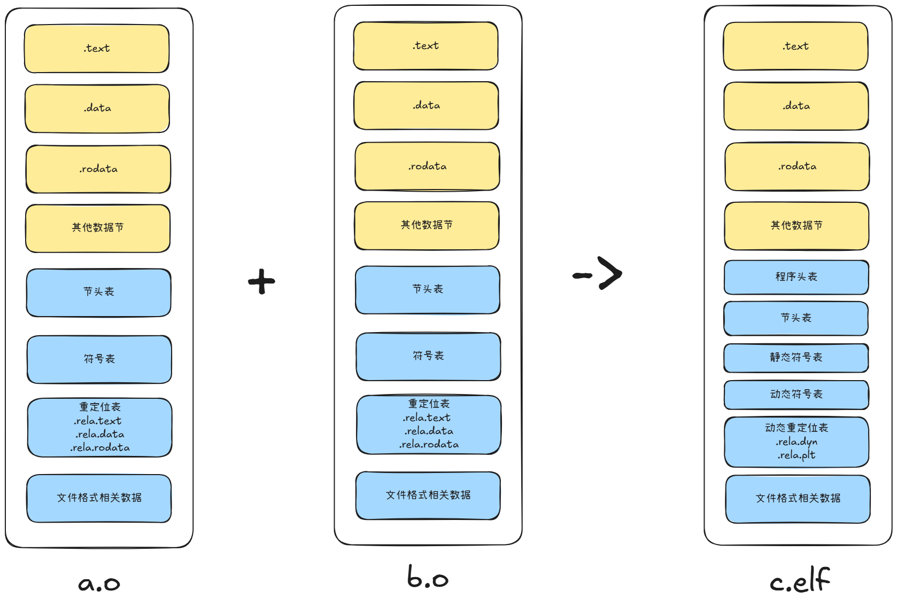

本章的内容所描述的链接若无特殊说明均表示静态链接，动态链接的链接过程会在下一章装载章节做具体描述。

在上一章编译章节中我们已经了解到，代码在编译时，每个.c文件会被编译成单独的对象文件.o，每个.o中记录了机器码、符号初始值以及未定义符号位置等内容。在链接阶段，这些内容会被融合并构成一个完整的程序。如下图所示。



从图中可以看到，链接前后发生了如下的变化：

- 多个对象文件的.text节，.data节，.rodata节被整合

- 新增程序头表，用于告知操作系统的加载器（Loader）怎么将程序加载到内存中运行。

- 符号表在图中区分为了静态符号表`.symtab`和动态符号表`.dynsym`，原因是静态符号表在完成链接后其实已经没有作用了，很多情况下程序为了减小大小，会使用strip将静态符号表移除（若被移除则perf、gdb等工具就看不到符号信息了，因此通常调试版本不会移除）。动态符号表则是因为调用动态库中的外部符号需要在程序加载时动态链接才能确定符号位置，因此还需要保留。

- 静态链接的重定位表项（如 `.rela.text`, `.rela.data`等）在最终elf文件中不存在，因为在链接阶段链接器从各个.o里面找到并完成了未定义符号的重定向，因此不再需要，但链接器如果是在.so里找到这个符号的定义，那么会在elf中创建动态链接时需要的结构（如`.got`、`.plt`）和相应的动态重定位表项（`.rela.dyn`, `.rela.plt`），因此这张表可改称为动态重定位表。

注：链接器之所以能够知道符号到底是静态的（.a或者其他.o）还是动态的（.so）并做出不同处理的原因，是因为链接器是站在全局的角度来分析——需要给链接器传入所有要链接的文件，这样他就可以遍历每个文件查找。所以这个符号是静态的还是动态的，编译器不知道也不会写入对象文件。

顺便一提，多个对象文件的.bss节的内容也将会被合并，体现在程序的.bss节Size基本是多个对象文件.bss节之和（但要考虑重复定义以及Algn的对齐要求），但它仍然不占用数据内容节的空间，只在程序加载阶段指导加载器去开辟这个大小的内存。

# 整合

## 数据内容节合并

我们直接以示例来展示通常链接器是怎么将两个对象文件的.text节、.data节、.rodata节进行合并的

```Java
[root@iZ2zeamih4tp4e8ya0gnukZ ~]# cat x.c
extern int y_foo(int a);

extern int y_var;
int x_global_var = 5;
int x_global_uninit_var;
const char *x_str = "123";

int main()
{
    int x_local = y_var;
    y_foo(x_global_var);
    return 0;
}
[root@iZ2zeamih4tp4e8ya0gnukZ ~]# cat y.c
int y_var = 2;
int y_global_var = 10;
int y_global_uninit_var;
const char *y_str = "abcd";

int y_foo(int var)
{
    return var;
}
[root@iZ2zeamih4tp4e8ya0gnukZ ~]# gcc -c x.c
[root@iZ2zeamih4tp4e8ya0gnukZ ~]# gcc -c y.c
[root@iZ2zeamih4tp4e8ya0gnukZ ~]# objdump -h x.o

x.o:     file format elf64-x86-64

Sections:
Idx Name          Size      VMA               LMA               File off  Algn
  0 .text         00000025  0000000000000000  0000000000000000  00000040  2**0
                  CONTENTS, ALLOC, LOAD, RELOC, READONLY, CODE
  1 .data         00000010  0000000000000000  0000000000000000  00000068  2**3
                  CONTENTS, ALLOC, LOAD, RELOC, DATA
  2 .bss          00000004  0000000000000000  0000000000000000  00000078  2**2
                  ALLOC
  3 .rodata       00000004  0000000000000000  0000000000000000  00000078  2**0
                  CONTENTS, ALLOC, LOAD, READONLY, DATA
  4 .comment      00000036  0000000000000000  0000000000000000  0000007c  2**0
                  CONTENTS, READONLY
  5 .note.GNU-stack 00000000  0000000000000000  0000000000000000  000000b2  2**0
                  CONTENTS, READONLY
  6 .eh_frame     00000038  0000000000000000  0000000000000000  000000b8  2**3
                  CONTENTS, ALLOC, LOAD, RELOC, READONLY, DATA
[root@iZ2zeamih4tp4e8ya0gnukZ ~]# objdump -h y.o

y.o:     file format elf64-x86-64

Sections:
Idx Name          Size      VMA               LMA               File off  Algn
  0 .text         0000000c  0000000000000000  0000000000000000  00000040  2**0
                  CONTENTS, ALLOC, LOAD, READONLY, CODE
  1 .data         00000010  0000000000000000  0000000000000000  00000050  2**3
                  CONTENTS, ALLOC, LOAD, RELOC, DATA
  2 .bss          00000004  0000000000000000  0000000000000000  00000060  2**2
                  ALLOC
  3 .rodata       00000005  0000000000000000  0000000000000000  00000060  2**0
                  CONTENTS, ALLOC, LOAD, READONLY, DATA
  4 .comment      00000036  0000000000000000  0000000000000000  00000065  2**0
                  CONTENTS, READONLY
  5 .note.GNU-stack 00000000  0000000000000000  0000000000000000  0000009b  2**0
                  CONTENTS, READONLY
  6 .eh_frame     00000038  0000000000000000  0000000000000000  000000a0  2**3
                  CONTENTS, ALLOC, LOAD, RELOC, READONLY, DATA
[root@iZ2zeamih4tp4e8ya0gnukZ ~]# gcc x.o y.o -o z.elf
[root@iZ2zeamih4tp4e8ya0gnukZ ~]# objdump -h z.elf

z.elf:     file format elf64-x86-64

Sections:
Idx Name          Size      VMA               LMA               File off  Algn
  0 .interp       0000001c  00000000004002a8  00000000004002a8  000002a8  2**0
                  CONTENTS, ALLOC, LOAD, READONLY, DATA
  1 .note.gnu.build-id 00000024  00000000004002c4  00000000004002c4  000002c4  2**2
                  CONTENTS, ALLOC, LOAD, READONLY, DATA
  2 .note.ABI-tag 00000020  00000000004002e8  00000000004002e8  000002e8  2**2
                  CONTENTS, ALLOC, LOAD, READONLY, DATA
  3 .gnu.hash     0000001c  0000000000400308  0000000000400308  00000308  2**3
                  CONTENTS, ALLOC, LOAD, READONLY, DATA
  4 .dynsym       00000048  0000000000400328  0000000000400328  00000328  2**3
                  CONTENTS, ALLOC, LOAD, READONLY, DATA
  5 .dynstr       00000038  0000000000400370  0000000000400370  00000370  2**0
                  CONTENTS, ALLOC, LOAD, READONLY, DATA
  6 .gnu.version  00000006  00000000004003a8  00000000004003a8  000003a8  2**1
                  CONTENTS, ALLOC, LOAD, READONLY, DATA
  7 .gnu.version_r 00000020  00000000004003b0  00000000004003b0  000003b0  2**3
                  CONTENTS, ALLOC, LOAD, READONLY, DATA
  8 .rela.dyn     00000030  00000000004003d0  00000000004003d0  000003d0  2**3
                  CONTENTS, ALLOC, LOAD, READONLY, DATA
  9 .init         0000001b  0000000000401000  0000000000401000  00001000  2**2
                  CONTENTS, ALLOC, LOAD, READONLY, CODE
 10 .text         00000195  0000000000401020  0000000000401020  00001020  2**4
                  CONTENTS, ALLOC, LOAD, READONLY, CODE
 11 .fini         0000000d  00000000004011b8  00000000004011b8  000011b8  2**2
                  CONTENTS, ALLOC, LOAD, READONLY, CODE
 12 .rodata       0000000d  0000000000402000  0000000000402000  00002000  2**2
                  CONTENTS, ALLOC, LOAD, READONLY, DATA
 13 .eh_frame_hdr 0000003c  0000000000402010  0000000000402010  00002010  2**2
                  CONTENTS, ALLOC, LOAD, READONLY, DATA
 14 .eh_frame     000000e0  0000000000402050  0000000000402050  00002050  2**3
                  CONTENTS, ALLOC, LOAD, READONLY, DATA
 15 .init_array   00000008  0000000000403e50  0000000000403e50  00002e50  2**3
                  CONTENTS, ALLOC, LOAD, DATA
 16 .fini_array   00000008  0000000000403e58  0000000000403e58  00002e58  2**3
                  CONTENTS, ALLOC, LOAD, DATA
 17 .dynamic      00000190  0000000000403e60  0000000000403e60  00002e60  2**3
                  CONTENTS, ALLOC, LOAD, DATA
 18 .got          00000010  0000000000403ff0  0000000000403ff0  00002ff0  2**3
                  CONTENTS, ALLOC, LOAD, DATA
 19 .got.plt      00000018  0000000000404000  0000000000404000  00003000  2**3
                  CONTENTS, ALLOC, LOAD, DATA
 20 .data         00000030  0000000000404018  0000000000404018  00003018  2**3
                  CONTENTS, ALLOC, LOAD, DATA
 21 .bss          00000010  0000000000404048  0000000000404048  00003048  2**2
                  ALLOC
 22 .comment      00000035  0000000000000000  0000000000000000  00003048  2**0
                  CONTENTS, READONLY
 23 .gnu.build.attributes 00001cf8  0000000000406058  0000000000406058  00003080  2**2
                  CONTENTS, READONLY, OCTETS
```

链接成程序后，objdump -h多了很多未见过的节，这是因为链接器帮我们补充了很多基本的内容，例如程序的.init初始化代码、.fini结束代码等等。因为程序的运行不仅需要包含了gcc链接对象文件中的代码，还需要根据系统平台，增加一些额外逻辑。

由于我们这一节重点关注.text,.data,.rodata,.bss是怎么融合的，因此可以使用`-nostdlib`和`-nostartfiles`编译选项来告知gcc不要为我们链接这些逻辑，先做最小化编译：

```Bash

[root@iZ2zeamih4tp4e8ya0gnukZ ~]# gcc -nostdlib -nostartfiles x.o y.o -o z_min.elf
/usr/bin/ld: warning: cannot find entry symbol _start; defaulting to 0000000000401000
[root@iZ2zeamih4tp4e8ya0gnukZ ~]# objdump -S z_min.elf

z_min.elf:     file format elf64-x86-64


Disassembly of section .text:

0000000000401000 <main>:
  401000:       55                      push   %rbp
  401001:       48 89 e5                mov    %rsp,%rbp
  401004:       48 83 ec 10             sub    $0x10,%rsp
  401008:       8b 05 02 30 00 00       mov    0x3002(%rip),%eax        # 404010 <y_var>
  40100e:       89 45 fc                mov    %eax,-0x4(%rbp)
  401011:       8b 05 e9 2f 00 00       mov    0x2fe9(%rip),%eax        # 404000 <x_global_var>
  401017:       89 c7                   mov    %eax,%edi
  401019:       e8 07 00 00 00          callq  401025 <y_foo>
  40101e:       b8 00 00 00 00          mov    $0x0,%eax
  401023:       c9                      leaveq 
  401024:       c3                      retq   

0000000000401025 <y_foo>:
  401025:       55                      push   %rbp
  401026:       48 89 e5                mov    %rsp,%rbp
  401029:       89 7d fc                mov    %edi,-0x4(%rbp)
  40102c:       8b 45 fc                mov    -0x4(%rbp),%eax
  40102f:       5d                      pop    %rbp
  401030:       c3                      retq   
[root@iZ2zeamih4tp4e8ya0gnukZ ~]# objdump -h z_min.elf

z_min.elf:     file format elf64-x86-64

Sections:
Idx Name          Size      VMA               LMA               File off  Algn
  0 .note.gnu.build-id 00000024  00000000004001c8  00000000004001c8  000001c8  2**2
                  CONTENTS, ALLOC, LOAD, READONLY, DATA
  1 .text         00000031  0000000000401000  0000000000401000  00001000  2**0
                  CONTENTS, ALLOC, LOAD, READONLY, CODE
  2 .rodata       00000009  0000000000402000  0000000000402000  00002000  2**0
                  CONTENTS, ALLOC, LOAD, READONLY, DATA
  3 .eh_frame_hdr 0000001c  000000000040200c  000000000040200c  0000200c  2**2
                  CONTENTS, ALLOC, LOAD, READONLY, DATA
  4 .eh_frame     00000058  0000000000402028  0000000000402028  00002028  2**3
                  CONTENTS, ALLOC, LOAD, READONLY, DATA
  5 .data         00000020  0000000000404000  0000000000404000  00003000  2**3
                  CONTENTS, ALLOC, LOAD, DATA
  6 .bss          00000008  0000000000404020  0000000000404020  00003020  2**2
                  ALLOC
  7 .comment      00000035  0000000000000000  0000000000000000  00003020  2**0
                  CONTENTS, READONLY
```

可以看到最小化编译后，每个节的Size是符合我们预期的：

- .text：0x31 = 0x25（main函数） + 0xc（y_foo函数）（1字节对齐）

- .data: 0x20 = 0x10 （x_global_var 4字节 + x_str指针 8字节 + 对齐填充4字节）+ 0x10（y_var 4字节 + y_global_var 4字节 + y_str指针 8字节）（8字节对齐）

- .rodata: 0x9 = 0x4 ("1" + "2" + "3" + "\0" 四个字节) + 0x5（"a" + "b" + "c" + "d" + "\0" 五个字节）（1字节对齐）

- .bss: 0x8 = 0x4（x_global_uninit_var 4个字节） + 0x4（y_global_uninit_var 4个字节）（1字节对齐）

## 符号重定向

上述代码中，x中声明并用到了外部函数y_foo和外部整型变量y_var，因此编译x.c时可以在符号表里看到这俩是UND状态，重定位表中也有它们对应的条目。.text节的数据也是用0先暂时填充，一切与预期相符。

```YAML
[root@iZ2zeamih4tp4e8ya0gnukZ ~]# objdump -t x.o

x.o:     file format elf64-x86-64

SYMBOL TABLE:
0000000000000000 l    df *ABS*  0000000000000000 x.c
0000000000000000 l    d  .text  0000000000000000 .text
0000000000000000 l    d  .data  0000000000000000 .data
0000000000000000 l    d  .bss   0000000000000000 .bss
0000000000000000 l    d  .rodata        0000000000000000 .rodata
0000000000000000 l    d  .note.GNU-stack        0000000000000000 .note.GNU-stack
0000000000000000 l    d  .eh_frame      0000000000000000 .eh_frame
0000000000000000 l    d  .comment       0000000000000000 .comment
0000000000000000 g     O .data  0000000000000004 x_global_var
0000000000000000 g     O .bss   0000000000000004 x_global_uninit_var
0000000000000008 g     O .data  0000000000000008 x_str
0000000000000000 g     F .text  0000000000000025 main
0000000000000000         *UND*  0000000000000000 y_var
0000000000000000         *UND*  0000000000000000 y_foo


[root@iZ2zeamih4tp4e8ya0gnukZ ~]# objdump -r x.o

x.o:     file format elf64-x86-64

RELOCATION RECORDS FOR [.text]:
OFFSET           TYPE              VALUE 
000000000000000a R_X86_64_PC32     y_var-0x0000000000000004
0000000000000013 R_X86_64_PC32     x_global_var-0x0000000000000004
000000000000001a R_X86_64_PLT32    y_foo-0x0000000000000004


RELOCATION RECORDS FOR [.data]:
OFFSET           TYPE              VALUE 
0000000000000008 R_X86_64_64       .rodata


RELOCATION RECORDS FOR [.eh_frame]:
OFFSET           TYPE              VALUE 
0000000000000020 R_X86_64_PC32     .text
[root@iZ2zeamih4tp4e8ya0gnukZ ~]# objdump -S x.o

x.o:     file format elf64-x86-64


Disassembly of section .text:

0000000000000000 <main>:
   0:   55                      push   %rbp
   1:   48 89 e5                mov    %rsp,%rbp
   4:   48 83 ec 10             sub    $0x10,%rsp
   8:   8b 05 00 00 00 00       mov    0x0(%rip),%eax        # e <main+0xe>
   e:   89 45 fc                mov    %eax,-0x4(%rbp)
  11:   8b 05 00 00 00 00       mov    0x0(%rip),%eax        # 17 <main+0x17>
  17:   89 c7                   mov    %eax,%edi
  19:   e8 00 00 00 00          callq  1e <main+0x1e>
  1e:   b8 00 00 00 00          mov    $0x0,%eax
  23:   c9                      leaveq 
  24:   c3                      retq
```

为什么x_global_var已经明确定义，但是仍会出现在重定位表里？

原因是因为在编译阶段默认开启了位置无关代码（PIC）编译选项，虽然x_global_var已经是明确定义在同一个文件中，但因为在编译阶段，编译器是不知道程序最后.data节的位置的，从而也没办法确定x_global_var的绝对虚拟内存地址（存放位置），因此编译器就只能先在重定位表里添加该条目，让链接器在链接阶段来做确认。

当我们将x.o与y.o进行链接后，链接器已经将所有符号在符号表内进行了分配，然后就可以开始根据x.o的重定位表内的表项开始填充原本.text中所需的内容了，首先我们先查看一下x.o的重定位表里的表项。

```Bash
[root@iZ2zeamih4tp4e8ya0gnukZ ~]# objdump -r x.o

x.o:     file format elf64-x86-64

RELOCATION RECORDS FOR [.text]:
OFFSET           TYPE              VALUE 
000000000000000a R_X86_64_PC32     y_var-0x0000000000000004
0000000000000013 R_X86_64_PC32     x_global_var-0x0000000000000004
000000000000001a R_X86_64_PLT32    y_foo-0x0000000000000004


RELOCATION RECORDS FOR [.data]:
OFFSET           TYPE              VALUE 
0000000000000008 R_X86_64_64       .rodata


RELOCATION RECORDS FOR [.eh_frame]:
OFFSET           TYPE              VALUE 
0000000000000020 R_X86_64_PC32     .text
```

可以看到y_var和x_global_var都是R_X86_64_PC32类型，y_foo是R_X86_64_PLT32类型，表示编译器认为要使用RIP相对寻址的方式计算偏移量来填充y_var和x_global_var相对.text的OFFSET位置的值，针对y_foo要填充PLT表的表项地址。

基于RIP相对寻址的方式计算偏移量的公式为：

$$偏移量 = 目标地址 - RIP = (S + A) - P$$

**S**（Symbol）：符号的最终地址

**A**（Addend）：重定位项中的加数（重定位表VALUE字段中的数字，例如y_var-0x0000000000000004，则加数为-0x0000000000000004）

**P**（Place）：被修正的位置的地址（指令中偏移字段的地址）， P = 段基址(.text的VMA) + OFFSET

带入实际程序进行验证：

```YAML
[root@iZ2zeamih4tp4e8ya0gnukZ ~]#  objdump -t z_min.elf 

z_min.elf:     file format elf64-x86-64

SYMBOL TABLE:
00000000004001c8 l    d  .note.gnu.build-id     0000000000000000 .note.gnu.build-id
0000000000401000 l    d  .text  0000000000000000 .text
0000000000402000 l    d  .rodata        0000000000000000 .rodata
000000000040200c l    d  .eh_frame_hdr  0000000000000000 .eh_frame_hdr
0000000000402028 l    d  .eh_frame      0000000000000000 .eh_frame
0000000000404000 l    d  .data  0000000000000000 .data
0000000000404020 l    d  .bss   0000000000000000 .bss
0000000000000000 l    d  .comment       0000000000000000 .comment
0000000000000000 l    df *ABS*  0000000000000000 x.c
0000000000000000 l    df *ABS*  0000000000000000 y.c
0000000000000000 l    df *ABS*  0000000000000000 
000000000040200c l       .eh_frame_hdr  0000000000000000 __GNU_EH_FRAME_HDR
0000000000404018 g     O .data  0000000000000008 y_str
0000000000404020 g     O .bss   0000000000000004 x_global_uninit_var
0000000000000000         *UND*  0000000000000000 _start
0000000000404014 g     O .data  0000000000000004 y_global_var
0000000000404010 g     O .data  0000000000000004 y_var
0000000000404020 g       .bss   0000000000000000 __bss_start
0000000000401000 g     F .text  0000000000000025 main
0000000000404000 g     O .data  0000000000000004 x_global_var
0000000000404024 g     O .bss   0000000000000004 y_global_uninit_var
0000000000404008 g     O .data  0000000000000008 x_str
0000000000404020 g       .data  0000000000000000 _edata
0000000000404028 g       .bss   0000000000000000 _end
0000000000401025 g     F .text  000000000000000c y_foo
        
[root@iZ2zeamih4tp4e8ya0gnukZ ~]# objdump -S z_min.elf 

z_min.elf:     file format elf64-x86-64


Disassembly of section .text:

0000000000401000 <main>:
  401000:       55                      push   %rbp
  401001:       48 89 e5                mov    %rsp,%rbp
  401004:       48 83 ec 10             sub    $0x10,%rsp
  401008:       8b 05 02 30 00 00       mov    0x3002(%rip),%eax        # 404010 <y_var>
  40100e:       89 45 fc                mov    %eax,-0x4(%rbp)
  401011:       8b 05 e9 2f 00 00       mov    0x2fe9(%rip),%eax        # 404000 <x_global_var>
  401017:       89 c7                   mov    %eax,%edi
  401019:       e8 07 00 00 00          callq  401025 <y_foo>
  40101e:       b8 00 00 00 00          mov    $0x0,%eax
  401023:       c9                      leaveq 
  401024:       c3                      retq   

0000000000401025 <y_foo>:
  401025:       55                      push   %rbp
  401026:       48 89 e5                mov    %rsp,%rbp
  401029:       89 7d fc                mov    %edi,-0x4(%rbp)
  40102c:       8b 45 fc                mov    -0x4(%rbp),%eax
  40102f:       5d                      pop    %rbp
  401030:       c3                      retq
```

通过计算可以发现：

y_var的偏移量 = 绝对虚拟内存地址0x404010(S) + -0x4(A) - (0x401000 + 0xa)(P) = 0x3002

x_global_var的偏移量 = 绝对虚拟内存地址0x404000(S) + -0x4(A) - (0x401000 + 0x13) = 0x2fe9

可以观察到y_foo的偏移量 = 绝对虚拟地址0x401025(S) + -0x4(A) - (0x401000 + 0x1a) = 0x7，当0x401019加上7后，刚好就是y_foo函数在.text中的起始地址。

事实上对于函数来说，不论是RIP相对寻址、GOT相对寻址还是PLT相对寻址，其实都是计算了一个偏移量

RIP相对寻址指的是偏移量的地址处直接就是函数逻辑

GOT相对寻址、PLT相对寻址偏移量的地址处实际上执行的是GOT查找、PLT查找逻辑

对于CPU来说，都是取指执行，并无本质区别。

因此在链接完成后，y_foo的调用实际上是RIP寻址，和原本x.o中的R_X86_64_PLT32类型不一致。原因是因为在编译阶段，编译器并不知道原来y_foo是自己程序里面的静态代码，所以他采用最灵活的方式认为这个函数需要间接访问（保守做法）。而链接器从全局的角度发现了y_foo与main均是自己.text节的静态函数，因此PLT访问就没有必要了，改为了RIP相对寻址（优化）。

# 程序表头

当程序链接完毕后，链接器就会给程序添加程序表头，可以使用`readelf -l`查看。

```Bash
[root@iZ2zeamih4tp4e8ya0gnukZ ~]# readelf -l z_min.elf 

Elf file type is EXEC (Executable file)
Entry point 0x401000
There are 7 program headers, starting at offset 64

Program Headers:
  Type           Offset             VirtAddr           PhysAddr
                 FileSiz            MemSiz              Flags  Align
  LOAD           0x0000000000000000 0x0000000000400000 0x0000000000400000
                 0x00000000000001ec 0x 00000000000001ec  R      0x1000
  LOAD           0x0000000000001000 0x0000000000401000 0x0000000000401000
                 0x0000000000000031 0x0000000000000031  R E    0x1000
  LOAD           0x0000000000002000 0x0000000000402000 0x0000000000402000
                 0x0000000000000080 0x0000000000000080  R      0x1000
  LOAD           0x0000000000003000 0x0000000000404000 0x0000000000404000
                 0x0000000000000020 0x0000000000000028  RW     0x1000
  NOTE           0x00000000000001c8 0x00000000004001c8 0x00000000004001c8
                 0x0000000000000024 0x0000000000000024  R      0x4
  GNU_EH_FRAME   0x000000000000200c 0x000000000040200c 0x000000000040200c
                 0x000000000000001c 0x000000000000001c  R      0x4
  GNU_STACK      0x0000000000000000 0x0000000000000000 0x0000000000000000
                 0x0000000000000000 0x0000000000000000  RW     0x10

 Section to Segment mapping:
  Segment Sections...
   00     .note.gnu.build-id 
   01     .text 
   02     .rodata .eh_frame_hdr .eh_frame 
   03     .data .bss 
   04     .note.gnu.build-id 
   05     .eh_frame_hdr 
   06     
```

从这个程序表头我们可以看到：

- z_min.elf的文件类型是“EXEC”，是一个可执行文件。

- 程序的入口第一条机器码的地址是0x401000

- 存在7个程序头（4个LOAD + NOTE + GNU_EH_FRAME + GNU_STACK），程序头表开始的位置是64字节处：
  
  - 第一个LOAD包含的节是.note.gnu.build-id，虚拟地址是0X400000，大小为0x1ec，权限是可读（R），对齐大小是0x1000
  
  - 第二个LOAD包含的节是.text，虚拟地址起始是0x401000，大小为0x31（.text的Size），权限是可读（R）可执行（E），对齐大小是0x1000
  
  - 第三个LOAD包含的节是.rodata .eh_frame_hdr .eh_frame，虚拟地址起始是0x402000，大小为0x80,权限是可读（R），对齐大小是0x1000
  
  - 第四个LOAD包含的节是.data .bss ，虚拟地址起始是0x403000，大小为0x28（.data的Size + .bss的Size），权限是可读（R）可写（W），对齐大小是0x1000
  
  - ...

可以看到每个程序头虽然大小都很小，但是对齐大小总是0x1000，是因为4096字节（4KB）是一张内存页的大小。为了与操作系统的内存管理机制配合，程序需要做到页对齐。关于这个页的大小以及用处，也将在下一篇讲述程序加载过程的文章中进行具体介绍。

# 动态重定位表

上文提到编译器在编译单个.c文件时，无法找到外部声明的符号，因此需要将这个符号记录在重定位表中，例如`.rela.text`或`.rela.data`或`.rela.rodata`，告知编译器帮忙进行地址修正。而当链接器找到这个符号后会帮忙修正地址并且不再需要这个表项，但是若链接器发现这个符号的定义是在.so（动态库）文件中时，由于动态库的符号是在程序运行时才将进行地址修正，因此链接阶段就需要将这个符号再次记录为需要重定位，只是这次表项记录的位置是在`.rela.dyn`或 `.rela.plt`中，告知动态加载器这些符号需要在运行时进行修正。

`.rela.dyn`用于数据符号（全局变量）的重定位，以及部分立即数寻址相关的重定位。`.rela.plt`用于函数符号的过程链接表（PLT）相关重定位。（位置无关代码）

同样我们通过例子来验证：

```SQL
[root@iZ2zeamih4tp4e8ya0gnukZ ~]# cat dyn.c
int x = 10;
int foo(void)
{
    return 1;
}
[root@iZ2zeamih4tp4e8ya0gnukZ ~]# cat main.c
#include <stdio.h>

extern int x;
extern int foo(void);

int main(void)
{
    printf("x: %d, foo: %d\n", x, foo());
    return 0;
}
[root@iZ2zeamih4tp4e8ya0gnukZ ~]# gcc -shared -fPIC -o dyn.so dyn.c
[root@iZ2zeamih4tp4e8ya0gnukZ ~]# gcc -c main.c
[root@iZ2zeamih4tp4e8ya0gnukZ ~]# gcc dyn.so main.o -o dyn.elf -nostartfiles
/usr/bin/ld: warning: cannot find entry symbol _start; defaulting to 0000000000401030
[root@iZ2zeamih4tp4e8ya0gnukZ ~]# readelf -r dyn.elf

Relocation section '.rela.dyn' at offset 0x3c8 contains 1 entry:
  Offset          Info           Type           Sym. Value    Sym. Name + Addend
000000404028  000300000005 R_X86_64_COPY     0000000000404028 x + 0

Relocation section '.rela.plt' at offset 0x3e0 contains 2 entries:
  Offset          Info           Type           Sym. Value    Sym. Name + Addend
000000404018  000100000007 R_X86_64_JUMP_SLO 0000000000000000 printf@GLIBC_2.2.5 + 0
000000404020  000200000007 R_X86_64_JUMP_SLO 0000000000000000 foo + 0
[root@iZ2zeamih4tp4e8ya0gnukZ ~]# objdump -S dyn.elf

dyn.elf:     file format elf64-x86-64


Disassembly of section .plt:

0000000000401000 <.plt>:
  401000:       ff 35 02 30 00 00       pushq  0x3002(%rip)        # 404008 <_GLOBAL_OFFSET_TABLE_+0x8>
  401006:       ff 25 04 30 00 00       jmpq   *0x3004(%rip)        # 404010 <_GLOBAL_OFFSET_TABLE_+0x10>
  40100c:       0f 1f 40 00             nopl   0x0(%rax)

0000000000401010 <printf@plt>:
  401010:       ff 25 02 30 00 00       jmpq   *0x3002(%rip)        # 404018 <printf@GLIBC_2.2.5>
  401016:       68 00 00 00 00          pushq  $0x0
  40101b:       e9 e0 ff ff ff          jmpq   401000 <.plt>

0000000000401020 <foo@plt>:
  401020:       ff 25 fa 2f 00 00       jmpq   *0x2ffa(%rip)        # 404020 <foo>
  401026:       68 01 00 00 00          pushq  $0x1
  40102b:       e9 d0 ff ff ff          jmpq   401000 <.plt>

Disassembly of section .text:

0000000000401030 <main>:
  401030:       55                      push   %rbp
  401031:       48 89 e5                mov    %rsp,%rbp
  401034:       e8 e7 ff ff ff          callq  401020 <foo@plt>
  401039:       89 c2                   mov    %eax,%edx
  40103b:       8b 05 e7 2f 00 00       mov    0x2fe7(%rip),%eax        # 404028 <x>
  401041:       89 c6                   mov    %eax,%esi
  401043:       bf 00 20 40 00          mov    $0x402000,%edi
  401048:       b8 00 00 00 00          mov    $0x0,%eax
  40104d:       e8 be ff ff ff          callq  401010 <printf@plt>
  401052:       b8 00 00 00 00          mov    $0x0,%eax
  401057:       5d                      pop    %rbp
  401058:       c3                      retq 
```

可以看到动态库中定义的foo函数在最终程序中的.rela.plt中有设置类型为R_X86_64_JUMP_SLO，offset的地址为0x0x404020。

我们需要先实际观察一下程序`.got.plt`节的内容，里面存储的是用于函数重定位的信息。

```Bash
[root@iZ2zeamih4tp4e8ya0gnukZ ~]# objdump -s -j .got.plt dyn.elf

dyn.elf:     file format elf64-x86-64

Contents of section .got.plt:
 404000 803e4000 00000000 00000000 00000000  .>@.............
 404010 00000000 00000000 16104000 00000000  ..........@.....
 404020 26104000 00000000                    &.@.....
 
GOT表的结构
地址        内容               含义
0x404000  0x3e80              .dynamic 节地址
0x404008  link_map 地址       GOT[1]，动态链接信息
0x404010  _dl_runtime_resolve GOT[2]，动态链接器入口
0x404018  printf 解析相关      GOT[3]，第一个函数
0x404020  foo 解析相关         GOT[4]，第二个函数
```

从二进制内容对应来看:

- 0x404008和0x404010的值都是0，原因是这块的值需要在程序加载到内存后，由动态链接器进行填充。

- 0x404020的初始值是26104000（小端序）：0x401026，可以对应到.plt节foo函数的`pushq $0x1`这个机器码。

我们从main函数的机器码中对foo函数的调用可以看到执行的是call操作，这个地址是一个RIP相对地址计算出来是0x404020(0x401026 + 0x2ffa)。因此程序的执行跳转到了.plt节foo函数的`pushq $0x1`开始执行，这里将数值1压栈，接着下一条机器码跳转到了0x401000执行plt函数逻辑：

- plt函数将0x404008也压入了栈中（GOT[1]， 动态链接信息）

- 接着跳转到了0x404010，0x404010在程序实际加载到内存后，实际上是动态链接器入口的函数地址（GOT[2]）

- 动态链接器函数会基于刚才推入栈的索引1（索引0是printf函数，索引1是foo函数）解析 `foo`函数的实际地址，并写入offset`0x404020`（GOT[4]）

- 动态链接器函数最后会将程序跳转到foo函数的实际地址

- foo函数开始执行

当完成了上述plt函数的逻辑，之后程序再`call 0x401020`地址时，这个`jmpq *0x2ffa`操作跳转的已经是foo函数真实的入口地址而不是第一次的plt函数地址，因此不会再跳到plt函数的跳转、压栈、链接等操作。这种第一次调用时去动态链接，后续变成直接调用的操作被称为延迟绑定（lazy binding），这样在函数没有被程序实际调用时，程序就不需要调用动态链接器去链接这个函数，避免了程序启动时首先要链接一堆符号的情况，实际加快了程序的启动速度。

补充说明：GOT和PLT指的是同一个东西？

其实并不是：

GOT（GLOBAL OFFSET TABLE）：内部存储的是各个动态符号的VMA地址，这个地址可以被修订。

PLT（PROCESS LINK TABLE）：本身对应的是存储在.plt节中的代码段，这段代码的作用是触发对应动态函数的动态链接。

两者是相互协同来完成一个动态链接函数的重定位：由主程序触发PLT代码，PLT代码触发GOT的修订
