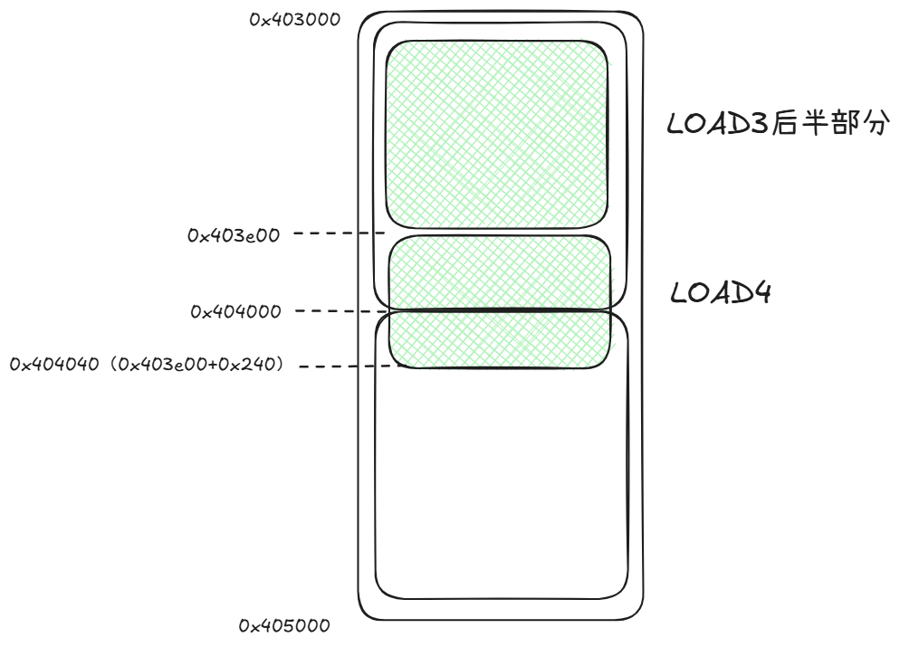

Header:

致力于通过费曼学习将个人学习到的知识用简单浅显的说法让所有人都能看得懂，难免会出现因为个人理解不正确而对他人产生误导的情况，提前感谢帮忙指正的大佬们~

前后相关文章可查看专栏[Linux程序原理学习](https://www.zhihu.com/column/c_2012836242115559468)

对应文章：

本篇示例：

1. 查看程序的内存页映射
2. 确认动态库的部分物理页可以被多个程序共享
3. 确认写时拷贝

# 程序内存页映射

我们采用一个简单的动态库与一个简单的主程序查看程序运行时的内存页映射情况

```
[root@iZ2zeamih4tp4e8ya0gnukZ ~]# cat dyn.c
int x = 10;
int foo(void)
{
    return 1;
}
[root@iZ2zeamih4tp4e8ya0gnukZ example]# cat main.c
#include <stdio.h>

extern int x;
extern int foo(void);

int main(void)
{
    printf("x: %d, foo: %d\n", x, foo());
    while(1){}
    return 0;
}

[root@iZ2zeamih4tp4e8ya0gnukZ example]# gcc -shared -fPIC -o dyn.so dyn.c
[root@iZ2zeamih4tp4e8ya0gnukZ example]# gcc -c main.c
[root@iZ2zeamih4tp4e8ya0gnukZ example]# gcc -o dyn.elf dyn.so main.o
```

预期的情况是：

1. 程序会基于程序头的信息被加载到多个虚拟页中,虚拟页的数量和程序头里要LOAD占用的页数量要相同

2. 动态库也会被加载到程序的虚拟内存中，虚拟页的数量也要和动态库的程序头描述的LOAD页数量要相同

先来看看两者的程序头里都说有多少页

```
[root@iZ2zeamih4tp4e8ya0gnukZ example]# readelf -l dyn.elf

Elf file type is EXEC (Executable file)
Entry point 0x401050
There are 11 program headers, starting at offset 64

Program Headers:
  Type           Offset             VirtAddr           PhysAddr
                 FileSiz            MemSiz              Flags  Align
  PHDR           0x0000000000000040 0x0000000000400040 0x0000000000400040
                 0x0000000000000268 0x0000000000000268  R      0x8
  INTERP         0x00000000000002a8 0x00000000004002a8 0x00000000004002a8
                 0x000000000000001c 0x000000000000001c  R      0x1
      [Requesting program interpreter: /lib64/ld-linux-x86-64.so.2]
  LOAD           0x0000000000000000 0x0000000000400000 0x0000000000400000
                 0x00000000000004b0 0x00000000000004b0  R      0x1000
  LOAD           0x0000000000001000 0x0000000000401000 0x0000000000401000
                 0x00000000000001e5 0x00000000000001e5  R E    0x1000
  LOAD           0x0000000000002000 0x0000000000402000 0x0000000000402000
                 0x0000000000000138 0x0000000000000138  R      0x1000
  LOAD           0x0000000000002e00 0x0000000000403e00 0x0000000000403e00
                 0x0000000000000238 0x0000000000000240  RW     0x1000
  DYNAMIC        0x0000000000002e10 0x0000000000403e10 0x0000000000403e10
                 0x00000000000001e0 0x00000000000001e0  RW     0x8
  NOTE           0x00000000000002c4 0x00000000004002c4 0x00000000004002c4
                 0x0000000000000044 0x0000000000000044  R      0x4
  GNU_EH_FRAME   0x0000000000002014 0x0000000000402014 0x0000000000402014
                 0x000000000000003c 0x000000000000003c  R      0x4
  GNU_STACK      0x0000000000000000 0x0000000000000000 0x0000000000000000
                 0x0000000000000000 0x0000000000000000  RW     0x10
  GNU_RELRO      0x0000000000002e00 0x0000000000403e00 0x0000000000403e00
                 0x0000000000000200 0x0000000000000200  R      0x1

 Section to Segment mapping:
  Segment Sections...
   00     
   01     .interp 
   02     .interp .note.gnu.build-id .note.ABI-tag .gnu.hash .dynsym .dynstr .gnu.version .gnu.version_r .rela.dyn .rela.plt 
   03     .init .plt .text .fini 
   04     .rodata .eh_frame_hdr .eh_frame 
   05     .init_array .fini_array .dynamic .got .got.plt .data .bss 
   06     .dynamic 
   07     .note.gnu.build-id .note.ABI-tag 
   08     .eh_frame_hdr 
   09     
   10     .init_array .fini_array .dynamic .got 
[root@iZ2zeamih4tp4e8ya0gnukZ example]# 
[root@iZ2zeamih4tp4e8ya0gnukZ example]# readelf -l dyn.so

Elf file type is DYN (Shared object file)
Entry point 0x1040
There are 9 program headers, starting at offset 64

Program Headers:
  Type           Offset             VirtAddr           PhysAddr
                 FileSiz            MemSiz              Flags  Align
  LOAD           0x0000000000000000 0x0000000000000000 0x0000000000000000
                 0x0000000000000490 0x0000000000000490  R      0x1000
  LOAD           0x0000000000001000 0x0000000000001000 0x0000000000001000
                 0x0000000000000111 0x0000000000000111  R E    0x1000
  LOAD           0x0000000000002000 0x0000000000002000 0x0000000000002000
                 0x0000000000000084 0x0000000000000084  R      0x1000
  LOAD           0x0000000000002e10 0x0000000000003e10 0x0000000000003e10
                 0x000000000000021c 0x0000000000000220  RW     0x1000
  DYNAMIC        0x0000000000002e20 0x0000000000003e20 0x0000000000003e20
                 0x00000000000001c0 0x00000000000001c0  RW     0x8
  NOTE           0x0000000000000238 0x0000000000000238 0x0000000000000238
                 0x0000000000000024 0x0000000000000024  R      0x4
  GNU_EH_FRAME   0x0000000000002000 0x0000000000002000 0x0000000000002000
                 0x000000000000001c 0x000000000000001c  R      0x4
  GNU_STACK      0x0000000000000000 0x0000000000000000 0x0000000000000000
                 0x0000000000000000 0x0000000000000000  RW     0x10
  GNU_RELRO      0x0000000000002e10 0x0000000000003e10 0x0000000000003e10
                 0x00000000000001f0 0x00000000000001f0  R      0x1

 Section to Segment mapping:
  Segment Sections...
   00     .note.gnu.build-id .gnu.hash .dynsym .dynstr .gnu.version .gnu.version_r .rela.dyn .rela.plt 
   01     .init .plt .text .fini 
   02     .eh_frame_hdr .eh_frame 
   03     .init_array .fini_array .dynamic .got .got.plt .data .bss 
   04     .dynamic 
   05     .note.gnu.build-id 
   06     .eh_frame_hdr 
   07     
   08     .init_array .fini_array .dynamic .got
```

计算主程序的4个LOAD页的大小，最后一个LOAD页的起始地址是0x403e00，大小是0x240（MemSiz），那么LOAD页的结束的地址是0x404040，一页的大小是0x1000，因此还需要单独分配一个虚拟内存页（根据操作系统的惰性加载机制，没用到的话不会分配实际的物理内存页），但是只用到了0x40的大小，示意图如下：



动态库算下来也是同理，也需要5页。

按示意图来看，dyn.elf的虚拟内存页起码有10页（5页主程序+5页动态库），接下来我们将程序加载到内存中，并进行结果验证。

这里采用Linux上通用的方法查看，实际上专业的工具还有很多。

## 使用cat /proc/进程号/maps查看

```
[root@iZ2zeamih4tp4e8ya0gnukZ example]# ./dyn.elf &
[1] 271585
[root@iZ2zeamih4tp4e8ya0gnukZ example]# x: 10, foo: 1

[root@iZ2zeamih4tp4e8ya0gnukZ example]# cat /proc/271585/maps
00400000-00401000 r--p 00000000 fd:03 962431                             /root/03/example/dyn.elf
00401000-00402000 r-xp 00001000 fd:03 962431                             /root/03/example/dyn.elf
00402000-00403000 r--p 00002000 fd:03 962431                             /root/03/example/dyn.elf
00403000-00404000 r--p 00002000 fd:03 962431                             /root/03/example/dyn.elf
00404000-00405000 rw-p 00003000 fd:03 962431                             /root/03/example/dyn.elf
008c7000-008e8000 rw-p 00000000 00:00 0                                  [heap]
7f15c2a9d000-7f15c2aa0000 rw-p 00000000 00:00 0 
7f15c2aa0000-7f15c2ac6000 r--p 00000000 fd:03 657362                     /usr/lib64/libc-2.32.so
7f15c2ac6000-7f15c2c25000 r-xp 00026000 fd:03 657362                     /usr/lib64/libc-2.32.so
7f15c2c25000-7f15c2c72000 r--p 00185000 fd:03 657362                     /usr/lib64/libc-2.32.so
7f15c2c72000-7f15c2c75000 r--p 001d1000 fd:03 657362                     /usr/lib64/libc-2.32.so
7f15c2c75000-7f15c2c78000 rw-p 001d4000 fd:03 657362                     /usr/lib64/libc-2.32.so
7f15c2c78000-7f15c2c7c000 rw-p 00000000 00:00 0 
7f15c2c7c000-7f15c2c7d000 r--p 00000000 fd:03 654100                     /usr/lib64/dyn.so
7f15c2c7d000-7f15c2c7e000 r-xp 00001000 fd:03 654100                     /usr/lib64/dyn.so
7f15c2c7e000-7f15c2c7f000 r--p 00002000 fd:03 654100                     /usr/lib64/dyn.so
7f15c2c7f000-7f15c2c80000 r--p 00002000 fd:03 654100                     /usr/lib64/dyn.so
7f15c2c80000-7f15c2c81000 rw-p 00003000 fd:03 654100                     /usr/lib64/dyn.so
7f15c2c81000-7f15c2c83000 rw-p 00000000 00:00 0 
7f15c2c90000-7f15c2c91000 r--p 00000000 fd:03 658268                     /usr/lib64/ld-2.32.so
7f15c2c91000-7f15c2cb3000 r-xp 00001000 fd:03 658268                     /usr/lib64/ld-2.32.so
7f15c2cb3000-7f15c2cbc000 r--p 00023000 fd:03 658268                     /usr/lib64/ld-2.32.so
7f15c2cbc000-7f15c2cbd000 r--p 0002b000 fd:03 658268                     /usr/lib64/ld-2.32.so
7f15c2cbd000-7f15c2cbf000 rw-p 0002c000 fd:03 658268                     /usr/lib64/ld-2.32.so
7ffdd4af9000-7ffdd4b1a000 rw-p 00000000 00:00 0                          [stack]
7ffdd4b6e000-7ffdd4b72000 r--p 00000000 00:00 0                          [vvar]
7ffdd4b72000-7ffdd4b74000 r-xp 00000000 00:00 0                          [vdso]
ffffffffff600000-ffffffffff601000 r-xp 00000000 00:00 0                  [vsyscall]
```

验证结果非常令人满意，主程序的虚拟页确实是从0x400000到0x405000，一共5页。动态库也是5页。

---

# 动态库物理页共享

在理论章节中我们基于理论合理推测和实际打印了动态库的程序头得知，动态库dyn.so的部分LOAD（例如.text节）是只读的，内容在被加载到内存后不会改变，那么理论上它只需要在物理内存中加载一次然后映射给每个需要的进程，这样便减少了整个操作系统的内存占用。

注：并不是说所有的动态库.text节都不会变化，要根据每个动态库程序头表中的属性来确定。

接下来我们启动3个程序

```
[root@iZ2zeamih4tp4e8ya0gnukZ example]# ./dyn.elf &
[1] 274110
[root@iZ2zeamih4tp4e8ya0gnukZ example]# x: 10, foo: 1
./dyn.elf &
[2] 274182
[root@iZ2zeamih4tp4e8ya0gnukZ example]# x: 10, foo: 1
[root@iZ2zeamih4tp4e8ya0gnukZ example]# ./dyn.elf &
[3] 274187
[root@iZ2zeamih4tp4e8ya0gnukZ example]# x: 10, foo: 1
[root@iZ2zeamih4tp4e8ya0gnukZ example]# ps aux | grep dyn
root      274110 79.7  0.0   2440   744 pts/1    R    11:45   0:24 ./dyn.elf
root      274182 62.6  0.0   2440   848 pts/1    R    11:45   0:16 ./dyn.elf
root      274187 60.7  0.0   2440   744 pts/1    R    11:45   0:14 ./dyn.elf
root      274256  0.0  0.0 221524   868 pts/1    R+   11:46   0:00 grep --color=auto dyn
```

由于通常Linux下没有直接可以看到多个程序共享一个动态库的例子，因此我们通过内存分配的方式来证明，先使用pmap查看一下

```
[root@iZ2zeamih4tp4e8ya0gnukZ example]# pmap -X $(pgrep dyn.elf)
274110:   ./dyn.elf
         Address Perm   Offset Device  Inode Size  Rss Pss Referenced Anonymous LazyFree ShmemPmdMapped FilePmdMapped Shared_Hugetlb Private_Hugetlb Swap SwapPss Locked DupText THPeligible Mapping
......
    7f1c29bda000 r--p 00000000  fd:03 654100    4    4   1          4         0        0              0             0              0               0    0       0      0       0           0 dyn.so
    7f1c29bdb000 r-xp 00001000  fd:03 654100    4    4   1          4         0        0              0             0              0               0    0       0      0       0           0 dyn.so
    7f1c29bdc000 r--p 00002000  fd:03 654100    4    0   0          0         0        0              0             0              0               0    0       0      0       0           0 dyn.so
    7f1c29bdd000 r--p 00002000  fd:03 654100    4    4   4          0         4        0              0             0              0               0    0       0      0       0           0 dyn.so
    7f1c29bde000 rw-p 00003000  fd:03 654100    4    4   4          0         4        0              0             0              0               0    0       0      0       0           0 dyn.so
......
                                             ==== ==== === ========== ========= ======== ============== ============= ============== =============== ==== ======= ====== ======= ===========
                                             2444 1448 134       1400        88        0              0             0              0               0    0       0      0       0           0 KB
274182:   ./dyn.elf
         Address Perm   Offset Device  Inode Size  Rss Pss Referenced Anonymous LazyFree ShmemPmdMapped FilePmdMapped Shared_Hugetlb Private_Hugetlb Swap SwapPss Locked DupText THPeligible Mapping
......
    7f5bbbe90000 r--p 00000000  fd:03 654100    4    4   1          4         0        0              0             0              0               0    0       0      0       0           0 dyn.so
    7f5bbbe91000 r-xp 00001000  fd:03 654100    4    4   1          4         0        0              0             0              0               0    0       0      0       0           0 dyn.so
    7f5bbbe92000 r--p 00002000  fd:03 654100    4    0   0          0         0        0              0             0              0               0    0       0      0       0           0 dyn.so
    7f5bbbe93000 r--p 00002000  fd:03 654100    4    4   4          4         4        0              0             0              0               0    0       0      0       0           0 dyn.so
    7f5bbbe94000 rw-p 00003000  fd:03 654100    4    4   4          4         4        0              0             0              0               0    0       0      0       0           0 dyn.so
......
                                             ==== ==== === ========== ========= ======== ============== ============= ============== =============== ==== ======= ====== ======= ===========
                                             4888 2952 274       2900       180        0              0             0              0               0    0       0      0       0           0 KB
274187:   ./dyn.elf
         Address Perm   Offset Device  Inode Size  Rss Pss Referenced Anonymous LazyFree ShmemPmdMapped FilePmdMapped Shared_Hugetlb Private_Hugetlb Swap SwapPss Locked DupText THPeligible Mapping
......
    7f7965cfa000 r--p 00000000  fd:03 654100    4    4   1          4         0        0              0             0              0               0    0       0      0       0           0 dyn.so
    7f7965cfb000 r-xp 00001000  fd:03 654100    4    4   1          4         0        0              0             0              0               0    0       0      0       0           0 dyn.so
    7f7965cfc000 r--p 00002000  fd:03 654100    4    0   0          0         0        0              0             0              0               0    0       0      0       0           0 dyn.so
    7f7965cfd000 r--p 00002000  fd:03 654100    4    4   4          4         4        0              0             0              0               0    0       0      0       0           0 dyn.so
    7f7965cfe000 rw-p 00003000  fd:03 654100    4    4   4          0         4        0              0             0              0               0    0       0      0       0           0 dyn.so
......
                                             ==== ==== === ========== ========= ======== ============== ============= ============== =============== ==== ======= ====== ======= ===========
                                             7332 4400 407       4328       268        0              0             0              0               0    0       0      0       0           0 KB
```

这个结果有很多可以讨论的地方，我们先看关注的部分——Rss和Pss

Rss（Resident Set Size）: 常驻内存大小，对应的是程序实际占用的内存大小，不考虑内存是否共享，所以启动1个程序和启动10个程序，每个程序看到的Rss都不会有变化。

Pss（Proportional Set Size）: 比例分摊内存，体现的是对应的物理页被多个程序分摊后的大小，计算公式为

$$(私有内存) + (共享内存 ÷ 共享该内存的进程数)$$

所以启动1个程序，可能部分页的Pss是4，但是启动4个，就变成1了（启动3个也是1的原因是1.33KB四舍五入显示为1KB）

到此，我们也可以证明只读的物理内存页是可以被共享的。

另外就是为啥程序都一样，动态库也一样，动态库被加载的虚拟内存位置却不一样呢？原因是为了保证程序的安全，现代编译器和操作系统配合采用了地址空间布局随机化（ALSR，Address Space Layout Randomization）的方式来加载程序，每次加载程序时程序加载的内存地址都是随机的，然后由动态加载器来完成重定向，这样攻击者就不会因为知道程序的起始地址从而使用偏移量来读写一些特殊内存地址达到攻击的目的。

还有一个奇怪的地方，为什么动态库的0x2000内存被映射了两次，第一个的Rss和Pss都是0，第二次映射的又都是4和4？这个确实难住了目前的我，但是从现象上看，操作系统认为0x2000需要存在两份副本，其中一份目前是惰性加载，因此不需要Rss与Pss。另一份副本是程序私有（触发了写时拷贝），因此Rss和Pss都是4。

---

# 写时拷贝

由于正好上一个例子可以验证写时拷贝，但是过程过于复杂，这里用一个更加明显的例子来看**（本例子由AI生成）**

```
[root@iZ2zeamih4tp4e8ya0gnukZ example]# cat cow.c
#include <stdio.h>
#include <stdlib.h>
#include <unistd.h>
#include <sys/types.h>
#include <sys/wait.h>
#include <string.h>

#define ARRAY_SIZE (1024 * 1024)  // 1MB 数组

// 全局变量，位于.data节
char big_array[ARRAY_SIZE];

int main() {
    // 初始化全局数组
    for (int i = 0; i < ARRAY_SIZE; i++) {
        big_array[i] = 'A';  // 全部填充为 'A'
    }

    printf("主进程 PID: %d\n", getpid());
    printf("数组前10字节: ");
    for (int i = 0; i < 10; i++) {
        printf("0x%02x ", big_array[i]);
    }
    printf("\n");

    // 等待10秒
    printf("\n等待10秒后fork...\n");
    sleep(10);

    pid_t pid = fork();

    if (pid == 0) {
        // 子进程
        printf("\n[子进程] PID: %d\n", getpid());
        printf("[子进程] 数组地址: %p\n", (void*)big_array);

        // 检查数据
        printf("[子进程] fork后数组前10字节: ");
        for (int i = 0; i < 10; i++) {
            printf("0x%02x ", big_array[i]);
        }
        printf("\n");

        // 等待10秒
        sleep(10);

        // 修改数组的前256KB
        printf("\n[子进程] 开始修改数组前256KB数据...\n");
        for (int i = 0; i < ARRAY_SIZE / 4; i++) {
            big_array[i] = 'B';  // 修改为 'B'
        }

        printf("[子进程] 修改后数组前10字节: ");
        for (int i = 0; i < 10; i++) {
            printf("0x%02x ", big_array[i]);
        }
        printf("\n");

        // 验证修改
        printf("[子进程] 验证: big_array[0] = '%c' (0x%02x)\n", 
               big_array[0], big_array[0]);
        printf("[子进程] 验证: big_array[%d] = '%c' (未修改区域应仍为'A')\n", 
               ARRAY_SIZE/2, big_array[ARRAY_SIZE/2]);

        printf("[子进程] 结束\n");

    } else if (pid > 0) {
        // 父进程
        printf("\n[父进程] 继续运行\n");

        // 等待子进程结束
        wait(NULL);

        printf("\n[父进程] 结束\n");

    } else {
        perror("fork失败");
        return 1;
    }
    while(1){}
}
```

通过三次调用pmap查看

1. 第一次pmap查看父进程的内存页信息

2. 第二次pmap查看子进程的内存页信息（数组未修订前）

3. 第三次pmap查看子进程的内存页信息（数组未修订后）

```
[root@iZ2zeamih4tp4e8ya0gnukZ example]# ./cow.elf &
[4] 278230
[root@iZ2zeamih4tp4e8ya0gnukZ example]# 主进程 PID: 278230
数组地址: 0x4040a0
数组前10字节: 0x41 0x41 0x41 0x41 0x41 0x41 0x41 0x41 0x41 0x41

等待10秒后fork...

[root@iZ2zeamih4tp4e8ya0gnukZ example]# pmap -X 278230
278230:   ./cow.elf
         Address Perm   Offset Device  Inode Size  Rss  Pss Referenced Anonymous LazyFree ShmemPmdMapped FilePmdMapped Shared_Hugetlb Private_Hugetlb Swap SwapPss Locked DupText THPeligible Mapping
        00400000 r--p 00000000  fd:03 962425    4    4    4          4         0        0              0             0              0               0    0       0      0       0           0 cow.elf
        00401000 r-xp 00001000  fd:03 962425    4    4    4          4         0        0              0             0              0               0    0       0      0       0           0 cow.elf
        00402000 r--p 00002000  fd:03 962425    4    4    4          4         0        0              0             0              0               0    0       0      0       0           0 cow.elf
        00403000 r--p 00002000  fd:03 962425    4    4    4          4         4        0              0             0              0               0    0       0      0       0           0 cow.elf
        00404000 rw-p 00003000  fd:03 962425    4    4    4          4         4        0              0             0              0               0    0       0      0       0           0 cow.elf
        00405000 rw-p 00000000  00:00      0 1024 1024 1024       1024      1024        0              0             0              0               0    0       0      0       0           0
        00866000 rw-p 00000000  00:00      0  132    4    4          4         4        0              0             0              0               0    0       0      0       0           0 [heap]
    7f7cf3917000 rw-p 00000000  00:00      0    8    4    4          4         4        0              0             0              0               0    0       0      0       0           0
    7f7cf3919000 r--p 00000000  fd:03 657362  152  152    8        152         0        0              0             0              0               0    0       0      0       0           0 libc-2.32.so
    7f7cf393f000 r-xp 00026000  fd:03 657362 1404  892   22        892         0        0              0             0              0               0    0       0      0       0           0 libc-2.32.so
    7f7cf3a9e000 r--p 00185000  fd:03 657362  308   64    1         64         0        0              0             0              0               0    0       0      0       0           0 libc-2.32.so
    7f7cf3aeb000 r--p 001d1000  fd:03 657362   12   12   12         12        12        0              0             0              0               0    0       0      0       0           0 libc-2.32.so
    7f7cf3aee000 rw-p 001d4000  fd:03 657362   12   12   12         12        12        0              0             0              0               0    0       0      0       0           0 libc-2.32.so
    7f7cf3af1000 rw-p 00000000  00:00      0   24   16   16         16        16        0              0             0              0               0    0       0      0       0           0
    7f7cf3b04000 r--p 00000000  fd:03 658268    4    4    0          4         0        0              0             0              0               0    0       0      0       0           0 ld-2.32.so
    7f7cf3b05000 r-xp 00001000  fd:03 658268  136  136    2        136         0        0              0             0              0               0    0       0      0       0           0 ld-2.32.so
    7f7cf3b27000 r--p 00023000  fd:03 658268   36   36    2         36         0        0              0             0              0               0    0       0      0       0           0 ld-2.32.so
    7f7cf3b30000 r--p 0002b000  fd:03 658268    4    4    4          4         4        0              0             0              0               0    0       0      0       0           0 ld-2.32.so
    7f7cf3b31000 rw-p 0002c000  fd:03 658268    8    8    8          8         8        0              0             0              0               0    0       0      0       0           0 ld-2.32.so
    7ffec75c9000 rw-p 00000000  00:00      0  132   12   12         12        12        0              0             0              0               0    0       0      0       0           0 [stack]
    7ffec75eb000 r--p 00000000  00:00      0   16    0    0          0         0        0              0             0              0               0    0       0      0       0           0 [vvar]
    7ffec75ef000 r-xp 00000000  00:00      0    8    4    0          4         0        0              0             0              0               0    0       0      0       0           0 [vdso]
ffffffffff600000 r-xp 00000000  00:00      0    4    0    0          0         0        0              0             0              0               0    0       0      0       0           0 [vsyscall]
                                             ==== ==== ==== ========== ========= ======== ============== ============= ============== =============== ==== ======= ====== ======= ===========
                                             3444 2404 1151       2404      1104        0              0             0              0               0    0       0      0       0           0 KB
[root@iZ2zeamih4tp4e8ya0gnukZ example]#

[父进程] 继续运行

[子进程] PID: 278261
[子进程] 数组地址: 0x4040a0
[子进程] fork后数组前10字节: 0x41 0x41 0x41 0x41 0x41 0x41 0x41 0x41 0x41 0x41
[root@iZ2zeamih4tp4e8ya0gnukZ example]# pmap -X 278261
278261:   ./cow.elf
         Address Perm   Offset Device  Inode Size  Rss Pss Referenced Anonymous LazyFree ShmemPmdMapped FilePmdMapped Shared_Hugetlb Private_Hugetlb Swap SwapPss Locked DupText THPeligible Mapping
        00400000 r--p 00000000  fd:03 962425    4    0   0          0         0        0              0             0              0               0    0       0      0       0           0 cow.elf
        00401000 r-xp 00001000  fd:03 962425    4    4   2          4         0        0              0             0              0               0    0       0      0       0           0 cow.elf
        00402000 r--p 00002000  fd:03 962425    4    4   2          4         0        0              0             0              0               0    0       0      0       0           0 cow.elf
        00403000 r--p 00002000  fd:03 962425    4    4   2          0         4        0              0             0              0               0    0       0      0       0           0 cow.elf
        00404000 rw-p 00003000  fd:03 962425    4    4   4          4         4        0              0             0              0               0    0       0      0       0           0 cow.elf
        00405000 rw-p 00000000  00:00      0 1024 1024 512          0      1024        0              0             0              0               0    0       0      0       0           0
        00866000 rw-p 00000000  00:00      0  132    4   4          4         4        0              0             0              0               0    0       0      0       0           0 [heap]
    7f7cf3917000 rw-p 00000000  00:00      0    8    4   2          0         4        0              0             0              0               0    0       0      0       0           0
    7f7cf3919000 r--p 00000000  fd:03 657362  152    0   0          0         0        0              0             0              0               0    0       0      0       0           0 libc-2.32.so
    7f7cf393f000 r-xp 00026000  fd:03 657362 1404  576  13        576         0        0              0             0              0               0    0       0      0       0           0 libc-2.32.so
    7f7cf3a9e000 r--p 00185000  fd:03 657362  308   64   1         64         0        0              0             0              0               0    0       0      0       0           0 libc-2.32.so
    7f7cf3aeb000 r--p 001d1000  fd:03 657362   12   12   6          8        12        0              0             0              0               0    0       0      0       0           0 libc-2.32.so
    7f7cf3aee000 rw-p 001d4000  fd:03 657362   12   12   8          8        12        0              0             0              0               0    0       0      0       0           0 libc-2.32.so
    7f7cf3af1000 rw-p 00000000  00:00      0   24   16  12          8        16        0              0             0              0               0    0       0      0       0           0
    7f7cf3b04000 r--p 00000000  fd:03 658268    4    0   0          0         0        0              0             0              0               0    0       0      0       0           0 ld-2.32.so
    7f7cf3b05000 r-xp 00001000  fd:03 658268  136    0   0          0         0        0              0             0              0               0    0       0      0       0           0 ld-2.32.so
    7f7cf3b27000 r--p 00023000  fd:03 658268   36    0   0          0         0        0              0             0              0               0    0       0      0       0           0 ld-2.32.so
    7f7cf3b30000 r--p 0002b000  fd:03 658268    4    4   2          0         4        0              0             0              0               0    0       0      0       0           0 ld-2.32.so
    7f7cf3b31000 rw-p 0002c000  fd:03 658268    8    8   6          4         8        0              0             0              0               0    0       0      0       0           0 ld-2.32.so
    7ffec75c9000 rw-p 00000000  00:00      0  132   12  10          8        12        0              0             0              0               0    0       0      0       0           0 [stack]
    7ffec75eb000 r--p 00000000  00:00      0   16    0   0          0         0        0              0             0              0               0    0       0      0       0           0 [vvar]
    7ffec75ef000 r-xp 00000000  00:00      0    8    0   0          0         0        0              0             0              0               0    0       0      0       0           0 [vdso]
ffffffffff600000 r-xp 00000000  00:00      0    4    0   0          0         0        0              0             0              0               0    0       0      0       0           0 [vsyscall]
                                             ==== ==== === ========== ========= ======== ============== ============= ============== =============== ==== ======= ====== ======= ===========
                                             3444 1752 586        692      1104        0              0             0              0               0    0       0      0       0           0 KB
[root@iZ2zeamih4tp4e8ya0gnukZ example]#
[子进程] 开始修改数组前256KB数据...
[子进程] 修改后数组前10字节: 0x42 0x42 0x42 0x42 0x42 0x42 0x42 0x42 0x42 0x42
[root@iZ2zeamih4tp4e8ya0gnukZ example]# pmap -X 278261
278261:   ./cow.elf
         Address Perm   Offset Device  Inode Size  Rss Pss Referenced Anonymous LazyFree ShmemPmdMapped FilePmdMapped Shared_Hugetlb Private_Hugetlb Swap SwapPss Locked DupText THPeligible Mapping
        00400000 r--p 00000000  fd:03 962425    4    0   0          0         0        0              0             0              0               0    0       0      0       0           0 cow.elf
        00401000 r-xp 00001000  fd:03 962425    4    4   2          4         0        0              0             0              0               0    0       0      0       0           0 cow.elf
        00402000 r--p 00002000  fd:03 962425    4    4   2          4         0        0              0             0              0               0    0       0      0       0           0 cow.elf
        00403000 r--p 00002000  fd:03 962425    4    4   2          0         4        0              0             0              0               0    0       0      0       0           0 cow.elf
        00404000 rw-p 00003000  fd:03 962425    4    4   4          4         4        0              0             0              0               0    0       0      0       0           0 cow.elf
        00405000 rw-p 00000000  00:00      0 1024 1024 640        260      1024        0              0             0              0               0    0       0      0       0           0
        00866000 rw-p 00000000  00:00      0  132    4   4          4         4        0              0             0              0               0    0       0      0       0           0 [heap]
    7f7cf3917000 rw-p 00000000  00:00      0    8    4   2          0         4        0              0             0              0               0    0       0      0       0           0
    7f7cf3919000 r--p 00000000  fd:03 657362  152    0   0          0         0        0              0             0              0               0    0       0      0       0           0 libc-2.32.so
    7f7cf393f000 r-xp 00026000  fd:03 657362 1404  576  13        576         0        0              0             0              0               0    0       0      0       0           0 libc-2.32.so
    7f7cf3a9e000 r--p 00185000  fd:03 657362  308   64   1         64         0        0              0             0              0               0    0       0      0       0           0 libc-2.32.so
    7f7cf3aeb000 r--p 001d1000  fd:03 657362   12   12   6          8        12        0              0             0              0               0    0       0      0       0           0 libc-2.32.so
    7f7cf3aee000 rw-p 001d4000  fd:03 657362   12   12   8          8        12        0              0             0              0               0    0       0      0       0           0 libc-2.32.so
    7f7cf3af1000 rw-p 00000000  00:00      0   24   16  12          8        16        0              0             0              0               0    0       0      0       0           0
    7f7cf3b04000 r--p 00000000  fd:03 658268    4    0   0          0         0        0              0             0              0               0    0       0      0       0           0 ld-2.32.so
    7f7cf3b05000 r-xp 00001000  fd:03 658268  136    0   0          0         0        0              0             0              0               0    0       0      0       0           0 ld-2.32.so
    7f7cf3b27000 r--p 00023000  fd:03 658268   36    0   0          0         0        0              0             0              0               0    0       0      0       0           0 ld-2.32.so
    7f7cf3b30000 r--p 0002b000  fd:03 658268    4    4   2          0         4        0              0             0              0               0    0       0      0       0           0 ld-2.32.so
    7f7cf3b31000 rw-p 0002c000  fd:03 658268    8    8   6          4         8        0              0             0              0               0    0       0      0       0           0 ld-2.32.so
    7ffec75c9000 rw-p 00000000  00:00      0  132   12  10          8        12        0              0             0              0               0    0       0      0       0           0 [stack]
    7ffec75eb000 r--p 00000000  00:00      0   16    0   0          0         0        0              0             0              0               0    0       0      0       0           0 [vvar]
    7ffec75ef000 r-xp 00000000  00:00      0    8    0   0          0         0        0              0             0              0               0    0       0      0       0           0 [vdso]
ffffffffff600000 r-xp 00000000  00:00      0    4    0   0          0         0        0              0             0              0               0    0       0      0       0           0 [vsyscall]
                                             ==== ==== === ========== ========= ======== ============== ============= ============== =============== ==== ======= ====== ======= ===========
                                             3444 1752 714        952      1104        0              0             0              0               0    0       0      0       0           0 KB
```

通过上面的例子来观察内存页共享以及写时拷贝机制：

1. 父进程启动后，heap的Pss值是1024（一个进程使用），Pss = 1024(私有)  + 0（共用）

2. 子进程启动后，子进程的数组地址也是0x4040a0，子进程的heap的Pss值是512（父子进程共用），Pss = 0(私有) + (1024 / 2)（共用）（此时父进程的Pss也会从1024变成512）

3. 子进程修订数组后，heap的Pss值变成了640，原因是数组.data中的256KB（64个虚拟内存页）被子进程修订，因此Pss的值的计算是256(私有) + (1024 - 256) / 2 （共用）= 640

以上便是Linux程序原理学习03-装载中，本人对应的学习实践示例。
