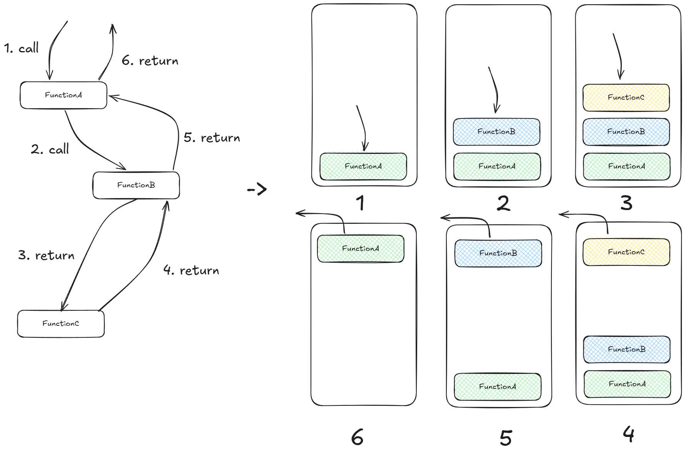
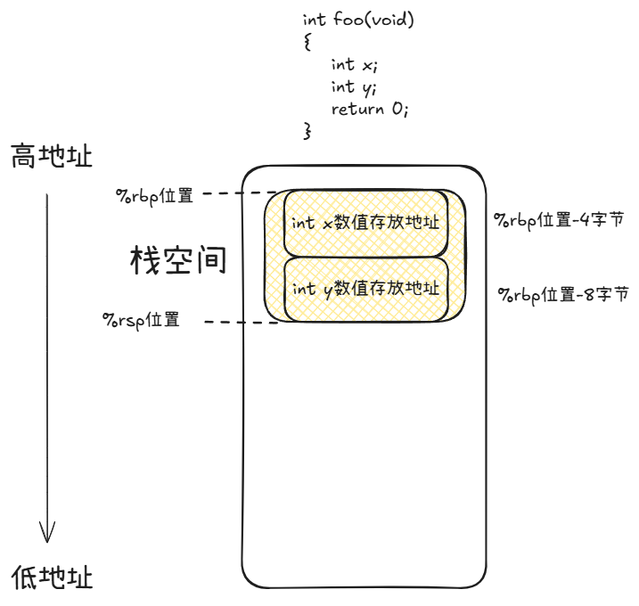
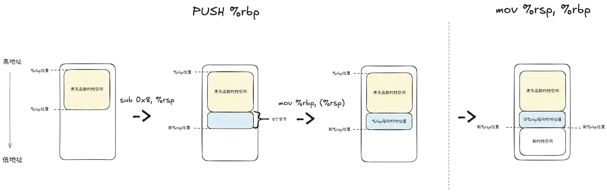
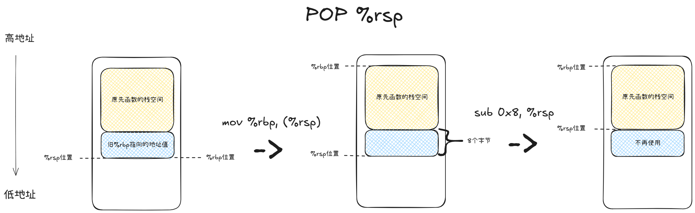
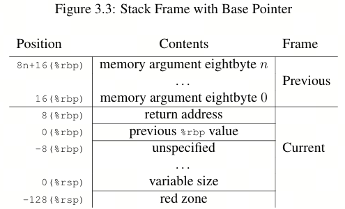
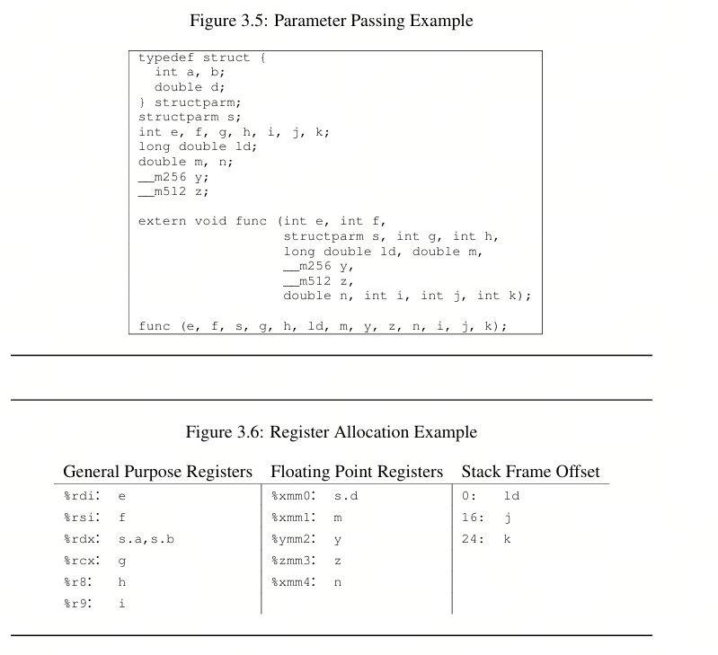

[cs61.seas.harvard.edu/site/pdf/x86-64-abi-20210928.pdf](https://cs61.seas.harvard.edu/site/pdf/x86-64-abi-20210928.pdf)

# 函数

函数（Function）是什么本文就不用介绍了，能看到这篇文章的同学肯定都有一定的了解。

当一段代码考虑可重用性、可维护性等质量属性的时候就可以将其封装实现为函数，提供给其他代码调用。

本篇文章总结的内容是函数调用的相关知识，为后续计划学习的系统调做铺垫。

## 调用

对于高级语言来说，除了可能要阅读他人为API函数写的注释之外，调用（call）就是顺手的事情。

以C语言为例:

1. 先把函数名写一下

2. 有参数就往括号里写要传的参数

3. 行末补一个分号（；）

然后我们就完成了一次函数调用，朴实无华，光从这个角度我甚至水不出多少字数。

那么在如此简单的表象之下的情况是怎么样的呢？我们用先看一下在函数调用时，机器码做了什么：

```
[root@iZ2zeamih4tp4e8ya0gnukZ 04]# gcc -o func_call.elf func_call.c
[root@iZ2zeamih4tp4e8ya0gnukZ 04]# objdump -S func_call.elf

func_call.elf:     file format elf64-x86-64

......

0000000000401106 <foo>:
  401106:       55                      push   %rbp
  401107:       48 89 e5                mov    %rsp,%rbp
  40110a:       89 7d fc                mov    %edi,-0x4(%rbp)
  40110d:       8b 45 fc                mov    -0x4(%rbp),%eax
  401110:       83 c0 01                add    $0x1,%eax
  401113:       5d                      pop    %rbp
  401114:       c3                      retq

0000000000401115 <main>:
  401115:       55                      push   %rbp
  401116:       48 89 e5                mov    %rsp,%rbp
  401119:       48 83 ec 10             sub    $0x10,%rsp
  40111d:       bf 01 00 00 00          mov    $0x1,%edi
  401122:       e8 df ff ff ff          callq  401106 <foo>
  401127:       89 45 fc                mov    %eax,-0x4(%rbp)
  40112a:       8b 45 fc                mov    -0x4(%rbp),%eax
  40112d:       c9                      leaveq
  40112e:       c3                      retq
  40112f:       90                      nop

......
```

即使从来没有学习过汇编代码，应该也可以通过C代码的比对看出函数调用发生在main函数的0x40111d这条语句。

为什么我这么认为？因为从objdump的翻译中我们可以看到机器码地址0x401122就是对foo函数符号地址的callq（调用）操作了，那从常识的角度来看之前肯定已经把常数1——参数给准备好了。

可以看到机器码`mov $0x1,%edi`也确实是将0x1写入了寄存器`edi`中的意思。

所以函数调用时，程序会将参数存到寄存器中，然后使用call命令跳转到对应的地址开始执行代码。

可以说这个就是函数调用的流程了，但是还是有一些细节需要深究一下：

1. 函数参数都是写入寄存器`edi`吗？所需的参数如果有多个怎么办？
2. foo函数除了对参数进行相加的逻辑外，开头和结束的、和main函数都有的push、pop、retq机器码是什么意思？

要回答这两个问题，需要学习“函数调用栈”的概念和编译器对函数传参的处理方法。

这两部分内容应该从哪里学习呢？实际上在各个架构的应用二进制接口（Application Binary Interface， ABI）中有详细的介绍说明。

> 引用自百度百科：ABI包含了应用程序在这个系统下运行时必须遵守的编程约定。ABI总是包含一系列的系统调用和使用这些系统调用的方法，以及关于程序可以使用的内存地址和使用机器寄存器的规定。

因为我的编译器是x86-64架构，因此我将根据x86-64的ABI文档（20210928）3.2 Function Calling Sequence章节内容的进行描述。

## 函数调用栈

阅读这篇文章的同学对于栈（Stack）的定义以及用法应该都不陌生，因此不再对栈的概念做介绍。栈是一个先进后出（First in last out, FILO）的数据结构。

为什么都说是函数调用栈，而不是函数调用队列什么的呢？

以一个很简单的例子来说明，函数a调用函数b希望获取函数b的返回值，而函数b又要调用函数c来获取数据。那么形成了函数a调用函数b，而函数b调用函数c的调用链，若想完成这个调用链，那么自然就需要函数c先处理并返回，然后函数b处理并返回，最后函数a完成处理。在这个情况下，函数c最后被调用，但是却要第一个完成，这就符合了先进后出的原则，因此我们形容函数调用的调用链条实际上是一个栈，符合入栈和出栈的操作原则。



想象成这样，实际上实现也确实是这样。每当一个函数被调用时，程序的栈空间就会分配一块区域提供给新的函数，并且将栈顶指向新的函数。当新的函数执行完毕后，栈顶指针收缩，指向前一个函数。到了机器码级别，就是上文中机器码里的`push %rbp`与`pop %rbp`指令。

在01-编译中就有提到，%rbp和%rsp寄存器是专门用于维护程序栈空间的寄存器。

%rbp：基址指针寄存器（Base Pointer），它会指向当前栈的基址，即当前栈的起始位置

%rsp： 栈指针寄存器（Stack Pointer），它存储了当前栈顶的地址，即当前栈顶的位置

而每个被调用的函数中需要使用的参数、声明的临时变量都会被保存在%rbp到%rsp两个位置之间，内存布局示意图如下：



注：此处的int x由于是4字节，所以在示意图中按4字节来排布。有可能有的架构可能会将高32位填充为0，将int按8字节进行排布。

那么每个函数开头的PUSH和POP是在做什么呢？

这两个指令在**不同架构实现有所不同**，分为满栈和空栈：

满栈（Full Stack）：x86架构，PUSH是先移动指针，再保存数据。

空栈（Empty Stack）：ARM等架构，PUSH是先保存数据，再移动指针。

下文默认以x86架构来介绍，x86中的PUSH指令就是先将栈顶向下移动8个字节，然后将值保存到栈顶的位置。

PUSH %rbp的机器码行为相当于sub 0x8, %rsp + mov %rbp, (%rsp)。相当于把上一个函数栈的基址存到了当前的栈顶，然后栈顶%rsp向下移动8个字节后，把栈顶设置成新的基址。

而POP正好相反:读取栈顶的值到指定寄存器,然后栈顶向上移动8个字节。

POP %rbp的机器码行为相当于mov (%rsp), %rbp +add 0x8, %rsp。相当于将栈顶的值（原本的上一个栈的基址地址）读取到%rbp中，然后栈顶向上移动8个字节(相当于 add 0x8, %rsp)。

这两个操作的示意图如下：





如果理解了这两张图（可能画的还是很抽象）想要表达的意思，那么就可以理解为何每个函数都有开头的PUSH和结尾POP操作。每当函数（包括入口函数main函数）被调用时，通过更新%rbp和%rsp两个指针开辟了自己的栈空间，并在其中对临时变量等做初始化，使得函数调用井然有序，不会破坏原先的内存数据。

### 栈溢出

既然我们都说到开辟栈内存空间了，那可以开辟多大呢？我们可能时常能听到一个词“栈溢出（Stack overflow）”，这个甚至是著名的程序员交流论坛的名称。栈溢出正是由于程序运行时函数嵌套调用过多，或有函数因为有极其大的临时变量因此需要开辟很大一块栈空间（%rsp指针要往下移动超多个字节），导致操作系统装载时提供的虚拟内存空间都不够新函数开辟了（%rsp指针都碰到堆空间了），于是操作系统就抛出了Stack overflow的异常。

### ABI文档对栈的约定

关于函数调用栈的知识实际上属于计算机科学的基本知识，而ABI文档中则是基于这些共识下提出的一些希望编译器遵守的规则，内容如下：

>     In addition to registers, each function has a frame on the run-time stack. This stack grows downwards from high addresses. Figure 3.3 shows the stack organization.
>     The end of the input argument area shall be aligned on a 16 (32 or 64, if `__m256` or `__m512` is passed on stack) byte boundary. In other words, the stack needs to be 16 (32 or 64) byte aligned immediately before the call instruction is executed. Once control has been transferred to the function entry point, i.e. immediately after the return address has been pushed, %rsp points to the return address, and the value of (%rsp +8) is a multiple of 16 (32 or 64). The 128-byte area beyond the location pointed to by %rsp is considered to be reserved and shall not be modified by signal or interrupt handlers. Therefore, functions may use this area for temporary data that is not needed across function calls. In particular, leaf functions may use this area for their entire stack frame, rather than adjusting the stack pointer in the prologue and epilogue. This area is known as the red zone.



文档中要求：

1. 调用者需要负责将栈指针%rsp的地址对齐到内存16字节后再执行call指令调用函数（栈对齐），这个主要是为了程序的性能优化。
2. 调用者会先在自己的栈内存中预留128字节大小的区域，并且这块区域完全提供给被调用者使用，由于这个很明显是编译器的行为，因此可以看得出来应该是与程序性能优化相关。而文档特别表示这块区域不允许被信号处理或中断处理更改（红区），这个在后续针对信号、中断的学习章节或许也会关联介绍。

## 参数存储与调用约定

先跳过所有中间过程，我们在给出结论：调用者可能会将参数存放在寄存器中，也可能放在栈中，也有可能同时使用寄存器和栈。

千万不能萌生出“那函数怎么知道调用者怎么传参数的”这个问题，因为我们之前的文章已经讲过编译的原理了，编译器在将C代码翻译成机器码时，就已经得知函数的信息，因此可以直接决定调用者的参数传递方式以及函数对参数的使用方式。

只要编译器遵守的规则是相同的，那么无论是在同一个文件中实现的函数还是声明的外部函数，都可以正确的对接成功。这套规则在ABI文档中有相关的内容介绍：

- 寄存器的使用

- 参数传递

- 返回值传递

### 寄存器的使用

>     ​This subsection discusses usage of each register. Registers %rbp, %rbx and %r12 through %r15 “belong” to the calling function and the called function is required to preserve their values. In other words, a called function must preserve these registers’ values for its caller. Remaining registers “belong” to the called function. If a calling function wants to preserve such a register value across a function call, it must save the value in its local stack frame.

这段话解释了调用者和被调用者在函数调用时对于寄存器使用的约定，它将寄存器分为了两类：

- Callee-saved类：被调用者使用后要恢复原本值的寄存器
  
  - 寄存器名称：%rbp，%rbx，%r12，%r13，%r14，%r15
  
  - 约定：这些寄存器的值在函数调用前后不会变化。如果函数中需要用到，则需要先保存寄存器原本的值，然后在函数返回前还原这些值。
  
  - 用途：例如上文机器码里的%rbp寄存器，这个寄存器用于维护函数调用栈的地址，被调用者会先使用PUSH将调用者的%rbp值保存，并在返回结束时使用POP还原调用者的%rbp。（这一过程将在“函数调用栈”节进行具体描述）

- Caller-saved类：调用者要注意保存原本值的寄存器
  
  - 寄存器名称：除了Callee-saved提到的之外的寄存器（如 %rax，%rcx，%rdx，%rsi，%rdi，%r8–%r11等）
  
  - 约定：被调用者可以随意修改寄存器存储的值。如果调用者希望这些寄存器的值在函数调用后不变，就得在函数调用前自己把寄存器的值先保存在本地（栈内存），然后函数调用后再给寄存器赋值恢复。
  
  - 用途：可以用于函数临时参数的传递，例如上文机器码里就将常数存放在了%rdi寄存器中。

### 参数传递

注：本节反复修改了好几遍，总是觉得没有将这块讲明白。想了下还是需要用原文内容做整体讲解比较合适。

#### 参数类型

> **Definitions** We first define a number of classes to classify arguments. The classes are corresponding to AMD64 register classes and defined as:
> **INTEGER** This class consists of integral types that fit into one of the general purpose registers.
> **SSE** The class consists of types that fit into a vector register.
> ......
> **NO_CLASS** This class is used as initializer in the algorithms. It will be used for padding and empty structures and unions.
> **MEMORY** This class consists of types that will be passed and returned in memory via the stack

ABI文档中首先定义了参数的类型，不同类型对应了不同的传参方式，本文只选择部分比较容易理解的类型来介绍:

- INTEGER:该类型使用通用寄存器传递参数值

- SSE:该类型使用向量寄存器传递参数值

- ......（略过SSEUP、X87, X87UP、COMPLEX_X87类型）

- NO_CLASS:在聚合算法中，作为初始化值使用（在聚合算法中，会与其他类型进行运算变为其他类型）。内存对齐所填充的数据、空结构体和空联合体的类型也是NO_CLASS。

- MEMORY:该类型使用栈内存传递参数值

#### 分类方法

> **Classification** The size of each argument gets rounded up to eightbytes.
> The basic types are assigned their natural classes:
> • Arguments of types (signed and unsigned) _Bool, char, short, int, long, long long, and pointers are in the INTEGER class.
> • Arguments of types _Float16, float, double, _Decimal32, _Decimal64 and __m64 are in class SSE
> 
> ......

在编译器将C代码中的变量类型对应到上面的参数类型前，非常重要的前提是**要将所有参数都是按照8字节来分类**，因此就存在三种情况：

1. 传参的类型本身小于8字节：填充到8字节后进行分类

2. 传参的类型等于8字节：无处理，直接进行分类

3. 传参的类型大于8字节：划分成多个8字节后对每个部分进行分类

分类规则如下：

- 有符号（signed）与无符号（unsigned）的`_Bool`，`char`，`short`，`int`，`long` ， `long long`类型（实际上就是int8_t到int64_t，uint8_t到uint64_t）将被分类为INTEGER。

- SSE：`_Float16`，`float`，`double`，`_Decimal32`，`_Decimal64`，`__m64`等浮点数将被分类为SSE。

- ……（略过SSEUP、X87UP、 COMPLEX_X87类型)

那么结构体（struct）、联合体（union）以及数组（array）这种的参数怎么办？这里就对应了上面所说的聚合算法:

1. 如果数据结构大于64字节或者包含未内存对齐的字段，则分类为MEMORY

2. 将数据结构按8字节进行分块，然后对每个块中内部的成员使用聚合算法来决定这个块的类型，聚合的规则为：
   
   - 如果类型相同则类型不变。例如：8字节中有int32_t x与int32_t y两个4字节的成员，两者分类都是INTEGER，因此这个块的类型就是INTEGER。
   
   - 类型与NO_CLASS计算：结果保持原先的类型。例如：8字节中，只有一个int32_t x，但是由于CPU按8字节进行对齐，所以后4个字节是填充（padding）数据，因此这个块的类型就是INTEGER。
   
   - 类型与MEMORY计算：结果设置为 `MEMORY`。
   
   - 类型与INTEGER计算：如果类型是NO_CLASS，那结果是INTEGER。如果不是，那么结果就是MEMORY。例如：8字节中前4个字节是float x，后4个字节是int32_t y，则这个块的类型是MEMORY（想来也正常，因为也没法把浮点数和整型放在同一个寄存器中）
   
   - ......（还有部分规则涉及略过的类型，此处也不提及）

#### 传参方法

当编译器分析出来每个块的参数类型后，将按照参数类型分配寄存器进行传参。

- 如果参数类型是INTEGER，那就按顺序从寄存器 %rdi、%rsi、%rdx、%rcx、%r8、%r9找到第一个空闲的寄存器并写入。

- 如果参数类型是SSE，则会按顺序使用寄存器%xmm0到%xmm7中找到第一个空闲的寄存器并写入。

- ......

- 如果是MEMORY类型，就不用寄存器了，直接将参数写入栈中。

举个例子的话：

```
typedef struct {
    int  a[8];
} obj_t;

int foo(int x, int y, double f, obj_t obj)
{
    return 1;
}

int main(void)
{
    int result;
    obj_t obj = {0,1,2,3,4,5,6,7};

    result = foo(1, 2, 0, obj); 
    return 0;
}
```

我们可以预期的是在x86-64架构下编译出的机器码,foo函数调用时，1应该存在%rdi寄存器，2存在%rsi寄存器，浮点数0存在%xmm0寄存器，obj结构体被存入栈中。

编译机器码进行验证：

```
000000000040111c <main>:
  40111c:       55                      push   %rbp
  40111d:       48 89 e5                mov    %rsp,%rbp
  401120:       48 83 ec 30             sub    $0x30,%rsp         // 栈顶指针向下移动30个字节
  401124:       c7 45 d0 00 00 00 00    movl   $0x0,-0x30(%rbp)   // 临时变量开始初始化
  40112b:       c7 45 d4 01 00 00 00    movl   $0x1,-0x2c(%rbp)
  401132:       c7 45 d8 02 00 00 00    movl   $0x2,-0x28(%rbp)
  401139:       c7 45 dc 03 00 00 00    movl   $0x3,-0x24(%rbp)
  401140:       c7 45 e0 04 00 00 00    movl   $0x4,-0x20(%rbp)
  401147:       c7 45 e4 05 00 00 00    movl   $0x5,-0x1c(%rbp)
  40114e:       c7 45 e8 06 00 00 00    movl   $0x6,-0x18(%rbp)
  401155:       c7 45 ec 07 00 00 00    movl   $0x7,-0x14(%rbp)
  40115c:       ff 75 e8                pushq  -0x18(%rbp)        // 对应将数据推入新开辟的内存的操作
  40115f:       ff 75 e0                pushq  -0x20(%rbp)
  401162:       ff 75 d8                pushq  -0x28(%rbp)
  401165:       ff 75 d0                pushq  -0x30(%rbp)
  401168:       66 0f ef c0             pxor   %xmm0,%xmm0
  40116c:       be 02 00 00 00          mov    $0x2,%esi
  401171:       bf 01 00 00 00          mov    $0x1,%edi
  401176:       e8 8b ff ff ff          callq  401106 <foo>
  40117b:       48 83 c4 20             add    $0x20,%rsp
  40117f:       89 45 fc                mov    %eax,-0x4(%rbp)
  401182:       b8 00 00 00 00          mov    $0x0,%eax
  401187:       c9                      leaveq 
  401188:       c3                      retq   
  401189:       0f 1f 80 00 00 00 00    nopl   0x0(%rax)
```

可以看到从0x401128-0x40114c都是main函数的参数准备流程：

1. 在main函数的栈内存内初始化obj对象，然后从a[7]地址开始依次按8字节推入函数调用栈中。

2. 通过异或xmm0寄存器自身，将寄存器的值清零（因为传参的浮点数的值就是0）

3. 将常数2存入寄存器%esi

4. 将常数1存入寄存器%edi

发生了两个意料之外的情况：

1. 寄存器的名字不是%rdi、%rsi而是%edi和%esi

2. a数组不是从a[0]开始调用PUSH而是从a[7]开始反着来的

其他和我们的推测则完全一样。

关于寄存器为什么不是预期的%rdi和%rsi反而是%edi和%esi的问题，以%edi为例子，实际上%edi是%rdi寄存器的一个别名，用于指代%rdi的低32位。对%edi进行写入时，%rdi的高32位会被自动清零（注意这个机制只有32位的别名才有）。同理，%esi，%edx都是对应寄存器低32位的别名。而有时候还能看到%di和%dil，分别是低16位和低8位的意思，对这两个寄存器%rdi的别名进行写入时，**并不会自动把高48位和高56位清零**。

为什么数组的推入顺序是从a[7]开始呢？基于上一节对函数调用栈的了解，我们其实可以明白，因为从a[7]开始PUSH，则意味着最后%rsp指针（栈顶）指向的是a[0]的值。则函数就可以很方便的基于%rsp的地址通过偏移量访问a[1]、a[2]、a[3]等。

到这里我们必须要直面一个问题：INTEGER类型可以使用的通用寄存器最多也只有6个，如果参数个数比可用寄存器还多怎么办？实在不知道此处应该说些什么，因此直接上原文：

> ​    If there are no registers available for any eightbyte of an argument, the whole argument is passed on the stack. If registers have already been assigned for some eightbytes of such an argument, the assignments get reverted.
> 
> ​    Once registers are assigned, the arguments passed in memory are pushed on the stack in reversed (right-to-left) order.

原文告知了编译器当寄存器不够用的时候应该怎么做：

1. 把剩下的参数按从右到左的顺序写入栈中

2. 如果是在传递结构体的每个块的中途发现没有寄存器可以分配了，那么要把已经分配出去的寄存器全部回退，然后结构体就按照块（还是8字节对齐）的顺序写入栈中

从右到左的顺序写入？为什么要特地这样反过来存而不是直接按第一个先写入的顺序呢？其实与上文a数组PUSH的顺序原因相同，这样可以确保第一个参数就在%rsp指向的地址附近（它们之间可能有函数的临时变量数据），可以更方便地从%rsp开始访问第一个参数，从而更好地支持可变参函数的实现（将在下文介绍）。

文档中有给出一个很好的例子总结了上面所有的内容：

由于我们跳过了一些类型的原文内容，因此我们只看INTEGER部分来应证我们的理解：

1. int e和int f都是INTEGER，因此按顺序放入%rdi和%rsi（在我们x86-64的架构下，应该是%edi和%esi，下同）

2. structparm s是一个结构体并且大小大于8字节，因此要按8字节一块的方式来看，int a和int b是第一个8字节，4字节的INTEGER和4字节的INTEGER还是INTEGER，所以一个寄存器%rdx就可以存下这个8字节的块。（double d是另一个块，因此被放入了%xmm0向量寄存器里）

3. int g, int h, int i也都是INTEGER，按顺序放入%rcx和%r8、%r9

4. 此时，可以用来放INTEGER类型的通用寄存器算是全部用完了，因此后面的int j和int k就只能存入栈中。基于从右向左的规则，所以先执行了PUSH K，然后PUSH J，向左后发现还有一个long double ld需要PUSH（long double通常需要16字节）最后的结果就是从%rsp的地址来看，ld在offset = 0的位置，j在offset = 16字节的位置，k在offset = 24字节的位置。

### 返回值传递

> **Returning of Values** The returning of values is done according to the following algo rithm:
> 
> 1. Classify the return type with the classification algorithm.
> 2. If the type has class MEMORY, then the caller provides space for the return value and passes the address of this storage in %rdi as if it were the first argument to the function. In effect, this address becomes a “hidden” first argument. This storage must not overlap any data visible to the callee through other names than this argument.
>    On return %rax will contain the address that has been passed in by the caller in %rdi.
> 3. If the class is INTEGER, the next available register of the sequence %rax, %rdx is used.
> 4. If the class is SSE, the next available vector register of the sequence %xmm0, %xmm1 is used.
> 5. ......

讲完了函数参数的传递规则，返回值的传递规则就变得简单了——因为以C语言来说，函数的返回值（使用return）有且仅能有一个。

同样的，编译器需要分析返回值的类型，然后使用寄存器或栈将返回值传回来：

1. 按照与传参时一样的算法，对返回值类型进行参数分类

2. 如果类型是INTEGER，那就按顺序从%rax和%rdx里找到一个空闲的寄存器来存储返回值

3. 如果类型是SSE，那就按顺序从%xmm0和%xmm1里找到一个空闲的寄存器来存储返回值

4. 如果类型是MEMORY，那么操作就比较多了——调用者需要在自己的栈内存里开辟一块用于存储这个返回结果的内存，然后将内存地址保存在%rdi寄存器中传递给函数。函数将结果写入这片内存中，然后把%rdi所记录的地址写入%rax寄存器中。

我们用一个例子来直接验证这几种情况：

```
typedef struct {
    int a[10];
} obj_t;

int int_ret(void)
{
    return 1;
}

double sse_ret(void)
{
    return 2.0;
}

/* 实际代码中应该很少传递结构体值的做法 */
obj_t memory_ret(void)
{
    obj_t obj = {0};
    return obj;
}

int main(void)
{
    int x;
    double y;
    obj_t o;

    x = int_ret();
    y = sse_ret();
    o = memory_ret();
    return 0;
}


0000000000401106 <int_ret>:
  401106:       55                      push   %rbp
  401107:       48 89 e5                mov    %rsp,%rbp
  40110a:       b8 01 00 00 00          mov    $0x1,%eax
  40110f:       5d                      pop    %rbp
  401110:       c3                      retq

0000000000401111 <sse_ret>:
  401111:       55                      push   %rbp
  401112:       48 89 e5                mov    %rsp,%rbp
  401115:       f2 0f 10 05 eb 0e 00    movsd  0xeeb(%rip),%xmm0        # 402008 <_IO_stdin_used+0x8>
  40111c:       00
  40111d:       66 48 0f 7e c0          movq   %xmm0,%rax
  401122:       66 48 0f 6e c0          movq   %rax,%xmm0
  401127:       5d                      pop    %rbp
  401128:       c3                      retq

0000000000401129 <memory_ret>:
  401129:       55                      push   %rbp
  40112a:       48 89 e5                mov    %rsp,%rbp
  40112d:       53                      push   %rbx
  40112e:       48 89 7d c0             mov    %rdi,-0x40(%rbp)
  401132:       48 c7 45 c8 00 00 00    movq   $0x0,-0x38(%rbp)
  401139:       00
  40113a:       48 c7 45 d0 00 00 00    movq   $0x0,-0x30(%rbp)
  401141:       00
  401142:       48 c7 45 d8 00 00 00    movq   $0x0,-0x28(%rbp)
  401149:       00
  40114a:       48 c7 45 e0 00 00 00    movq   $0x0,-0x20(%rbp)
  401151:       00
  401152:       48 c7 45 e8 00 00 00    movq   $0x0,-0x18(%rbp)
  401159:       00
  40115a:       48 8b 45 c0             mov    -0x40(%rbp),%rax
  40115e:       48 8b 4d c8             mov    -0x38(%rbp),%rcx
  401162:       48 8b 5d d0             mov    -0x30(%rbp),%rbx
  401166:       48 89 08                mov    %rcx,(%rax)
  401169:       48 89 58 08             mov    %rbx,0x8(%rax)
  40116d:       48 8b 4d d8             mov    -0x28(%rbp),%rcx
  401171:       48 8b 5d e0             mov    -0x20(%rbp),%rbx
  401175:       48 89 48 10             mov    %rcx,0x10(%rax)
  401179:       48 89 58 18             mov    %rbx,0x18(%rax)
  40117d:       48 8b 55 e8             mov    -0x18(%rbp),%rdx
  401181:       48 89 50 20             mov    %rdx,0x20(%rax)
  401185:       48 8b 45 c0             mov    -0x40(%rbp),%rax
  401189:       48 8b 5d f8             mov    -0x8(%rbp),%rbx
  40118d:       c9                      leaveq
  40118e:       c3                      retq 

000000000040118f <main>:
  40118f:       55                      push   %rbp
  401190:       48 89 e5                mov    %rsp,%rbp
  401193:       48 83 ec 40             sub    $0x40,%rsp
  401197:       e8 6a ff ff ff          callq  401106 <int_ret>
  40119c:       89 45 fc                mov    %eax,-0x4(%rbp)
  40119f:       e8 6d ff ff ff          callq  401111 <sse_ret>
  4011a4:       66 48 0f 7e c0          movq   %xmm0,%rax
  4011a9:       48 89 45 f0             mov    %rax,-0x10(%rbp)
  4011ad:       48 8d 45 c0             lea    -0x40(%rbp),%rax
  4011b1:       48 89 c7                mov    %rax,%rdi
  4011b4:       e8 70 ff ff ff          callq  401129 <memory_ret>
  4011b9:       b8 00 00 00 00          mov    $0x0,%eax
  4011be:       c9                      leaveq
  4011bf:       c3                      retq
```

确实和规定的行为一样:

- int_ret将常数1保存在了%eax寄存器中

- sse_ret将双精度浮点数保存在了%xmm0中

- main函数使用lea分配了40字节的栈内存，将地址写入%rdi，将%rdi当作第一个参数进行传递。memory_ret从%rdi中读取了调用者给出的数据保存地址，将其保存在栈基址-0x40偏移的位置。然后将obj的数据按8字节依次写入内存地址，最后将%rax恢复成了数据保存地址（一开始保存在基址-0x40偏移的数据）后返回。

## 可变参数函数

什么是可变参数函数？

例如我们最经常见到的printf函数就是一个经典的例子，在学习C语言的过程中难免会产生一个疑问:printf可以基于格式化字符串将后面的任意个参数作为标准输出打印出来,这个函数的参数声明到底是怎么样的呢?

实际上printf的函数声明是`int printf(const char *format, ...)`，除了格式化字符串外，其他参数以...的方式声明，意味可以是任意个，没有也可以。那么程序为什么这么聪明，可以知道有几个参数呢？

这就是%rsp和%rbp两个指针，以及原本觉得奇怪的从右到左的传参顺序一起很好地支撑了它的实现。

可变参数函数的一大特点就是参数数量不固定，用常识来看，每次调用printf时，函数都需要知道当前有多少个参数，并且要从哪里读取。

当前参数有多少个呢？由于格式化字符串很明显保存了将要格式化的参数信息，并且它又是一个MEMORY类型，因此会放在%rdi寄存器中。这样printf就可以根据其中有几个%d（整形）、%s（字符串）、%f（浮点数）来得知参数的信息。那么从哪里读取呢？那当然是从寄存器和%rsp指针所指的地址开始读取了。

printf根据格式化字符串中的参数类型和顺序，按照ABI中约定的，例如第一个%d去%rsi获取，第二个%d去%rdx获取等等，从寄存器和栈内存中读取数据，最后实现标准输出。

