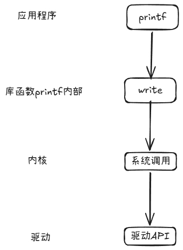
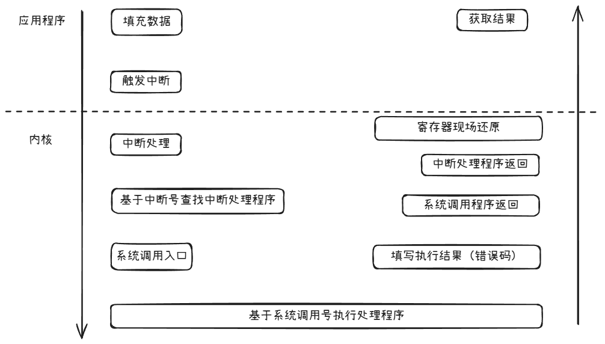

# 系统调用

本章的内容是与系统调用相关知识的学习总结，为下一步学习“系统中断”做一些铺垫。

## 为什么需要系统调用

首先需要了解一下为什么存在系统调用，应用程序为什么要使用系统调用。

根据之前程序装载章节学习的内容，我们知道程序都是运行在操作系统分配好的虚拟内存地址中。所以程序对变量的操作、函数的调用， 都是发生在这片虚拟内存地址中。

现在存在一个应用，他需要往屏幕上输出一些内容，这个应该怎么做呢？我们会想到使用printf函数可以实现。那么这里深究一下，为什么printf可以做到这一点呢？

对屏幕要显示的内容进行操作我们可以想象到需要的工作有：

1. 将数据传递到屏幕驱动程序指定的指定缓冲区

2. 调用对应的屏幕驱动程序提供的API告知数据已经写入缓冲区，可以显示了

printf函数要克服两个困难：

1. printf本身也是动态链接器在程序运行时将代码映射到程序的虚拟内存空间中的，因此本质上还是在虚拟内存空间中跑的代码，它怎么把数据写到自己不知道位置并且也不在程序虚拟内存空间里的内存地址呢？假如调用机器码mov，那mov的目标地址应该是什么呢？

2. printf函数在各式各样的设备上被程序调用，每个设备连接的屏幕各式各样，printf内部是怎么实现对每种屏幕都能顺利工作的呢？

这两座大山，一座是要脱离开程序的虚拟内存空间访问到另 一块区域的内存地址，一座是要能够兼容过去、现在、未来的各种屏幕驱动程序。

事实上，这两座大山printf函数靠自己本身一座都没有跨越。它能够实现的原因是因为站在了操作系统的肩膀上——让操作系统来帮忙执行这些逻辑。操作系统提供了系统调用这一机制，让需要的应用程序可以随时找他帮忙。这便是系统调用。

系统调用实际上是必须存在的，它是低权限的应用程序执行一些有权限要求的行为的**主要途径**——借助拥有高权限的操作系统来执行。那权限是什么，为什么要区分这些权限呢？这就引出了CPU的权限等级的概念，需要先介绍一下低权限（用户态）和高权限（内核态）。

### 用户态与内核态

首先，假设所有程序和操作系统一样有相同的权限是否可行呢？可以想象，光是程序可以自由访问任意内存就已经会造成灾难性的后果了，有心或者无意地修改其他程序的内存将可能导致其他程序运行出现异常，然后产生异常的行为，一系列的连锁反应最后就会导致整个系统崩溃。只让读取不让写入是否可以呢？也不行，这样程序的数据可能就有泄密的风险。

因此操作系统（软件）和CPU(硬件)共同配合实现了一个机制：以X86架构为例，CPU设定了四个特权级，称为环0（权限最高）、环1、环2、环3（权限最低），这个特权级指的是CPU当前所处的权限等级。CPU执行每条机器码时都会检查一下当前是否有权限执行这些指令（指令可能是修订一些特殊寄存器等特权指令），如果发现当前不具备权限则会触发硬件异常中断，让操作系统接管来处理，通常操作系统会向找个进程发送停止信号，停止这个应用程序的运行。

这个环0、环1之类的权限等级在CPU中是怎么样的存在呢？因为它只有4个权限等级，那么其实CPU能够找个地方拿出2个bit位，用00表示环0，01表示环1，10表示环2，11表示环3即可。在X86架构中就是使用代码寄存器（Code Segment Register，CS）的最低2位来保存，这两位被称为CPL（Current Privilege Level， 当前权限等级）。在其他架构的CPU中也是类似，只要用寄存器中的几个bit位即可区分当前的运行权限是什么。

所以上面所说的应用程序运行在用户态，就是指CPU运行应用程序的机器码时处在环3（两个bit都是1）的权限等级，而执行操作系统内核的机器码时就是运行在环0的权限等级（两个bit都是0），可以执行各种的特权指令。

当应用程序需要执行涉及特权指令的逻辑时，就可以通过系统调用的方式来让操作系统内核代为执行。所以我们可以合理的推测出来：当系统调用逻辑运行的时候，实际上是操作系统在执行指令，CPU是运行在内核态。

## 系统调用的好处

从上面的大段铺垫来看，我们其实可以明白为什么特地要提供系统调用的机制而不是让应用程序自由发挥，有两个比较明显的好处：安全与统一抽象。

### 保证系统安全与稳定

1. 只有内核有权限访问设备所有内存地址，防止了应用程序可以读写不属于它虚拟内存空间的内存地址。
2. 高权限的行为均由操作系统来执行，因此操作系统就可以对这些行为先做合法性检查然后才执行

### 提供统一抽象的接口

系统调用为应用程序隐藏了底层硬件的复杂性和差异性。无论使用哪种显卡、声卡或网卡，应用程序只需调用统一的 `write`、`ioctl`、`send`等系统调用接口就可以方便地实现读写的需求，由操作系统内核来负责将这些系统调用对应到各个硬件的驱动程序能理解的命令。应用程序在编码时基本可以不用关心运行时底层的硬件型号是啥，从而大大简化了代码编写，也提升了代码的可移植性。例如应用程序只需要调用printf函数就可以实现在大多数屏幕上打印出期望的内容。

## 系统调用的传统过程

那么好处说完了，坏处呢？坏处的话暂且不表，我们可以通过先介绍系统调用的过程来发现。

> 注：这里介绍的是传统做法，目前现代CPU与内核已经有更好的执行方式（见下文）

### 数据准备

系统调用本身就是一连串的函数调用，应用程序要做的就是准备好参数后调用系统调用接口，只是不一样的是应用程序这次是将参数全部放在栈内存中，然后将要调用的系统调用枚举值存在特定寄存器（%rax）中。（不同CPU架构存放系统调用号的寄存器不同），而前六个参数依次放在 `%rdi`, `%rsi`, `%rdx`, `%rcx`, `%r8`, `%r9`寄存器中，后续更多参数通过栈传递。（与上一章节介绍的函数传参方式相同）

### 触发软中断

接着应用程序会对触发一个值为128（0x80）的软中断（soft interrupt），关于中断的内容将在下一章节讲述。此处我们只要知道当设备出现中断时并且操作系统发现后，就需要放在手头的活先来处理这个中断的问题。**在处理中断时，CPU就会切换到上面说的内核态运行**。

操作系统在读取中断号时发现这是一个系统调用（0x80是系统调用的中断值），那么会启动对应的系统调用处理逻辑。

首先检查寄存器中的值得知应用程序需要执行的是哪个系统调用，然后从栈中读取对应参数，开始执行逻辑。

### 获取结果

系统调用例如写数据write()、读数据read()等都存在一个int类型的返回值。当执行成功时返回非负值（如读取的字节数，打开的文件描述符），失败时返回-1。

那由于系统调用之后存在一系列的复杂逻辑，那么应用程序看到-1怎么知道是哪出错了呢？是参数传的不对？操作系统异常？还是底层的硬件驱动异常？

这些出错的场景操作系统通过错误码（errno）进行返回。

有时候我们看代码会发现，这个errno哪来的？我的函数里也没有声明这个变量呀？

实际上这个errno来自于头文件<errno.h>中的定义，errno是一个线程独立的变量（即多个线程都同时在调用系统调用，也不会导致互相覆盖）

操作系统定义了一系列的错误返回值，当系统调用发生错误时，系统调用函数会在内核特定位置填写错误码。而write、read等库函数则将该错误码赋值到errno上。

可是应用程序拿着一个errno值，又怎么知道是什么意思呢？每天需要记得事情那么多，很难天天去记住每个系统调用返回值的意义。每次去翻看头文件也很麻烦。

因此操作系统也提供了一个方便的函数perror()，它可以自动读取当前线程的errno值并打印出错误码对应的解释字符串。例如errno返回4，通过perror()可以打印出字符串"Interrupted system call"。

## 系统调用的缺点

实际上系统调用的明显缺点就是性能问题，从上述过程可以看出，一次完整的系统调用伴随着多次状态切换和上下文保存/恢复，这带来了不可忽视的性能开销。

原因就是应用程序触发系统调用时，通过中断CPU需要从用户态切换到内核态，同时操作系统要停下手头的事情特别过来处理一下。

在系统调用返回时，CPU又需要从内核态切换到用户态。

在这个切来切去的过程中，不仅寄存器的清空、栈空间的切换（从应用程序的调用栈切换到操作系统的内核调用栈），还会导致CPU的缓存失效。

## 优化方案

由于系统调用性能问题的根本在于用户态和内核态之间的切换损耗，因此从各个环节入手的优化方案便被提出。

### 虚拟动态共享对象（VDSO）

Linux开始思考，一些应用程序可能只是仅仅想获取一下内核的一些信息，就需要大费周章的经历一系列流程，那内核可以把这些本身就是不会影响系统安全的数据直接提供到用户态不就可以提升性能了？

这就是虚拟动态共享对象（Virtual Dynamic Shared Object，VDSO）的设计初衷，——**优化某些频繁使用的系统调用，使其不需要陷入内核态**。

这种方案的实现方式是将内核中一些原本需要系统调用才能访问的代码段和数据段以动态库的方式映射到用户空间。在应用程序启动时，内核会**主动、强制将VDSO映射到进程的用户空间**。随后，动态链接器在加载过程中会识别并处理VDSO，将其提供的函数作为对应系统调用符号的优先解析目标，这样应用程序调用对应的系统调用函数时，实际上是访问自己虚拟空间，不再需要触发中断了流程。

应用程序常常需要获取当前的系统时间，或者获取进程、线程当前运行的CPU信息，这些高频执行的原本的系统调用被实现为VSDO后，大大提升了程序的运行效率。（`gettimeofday`与`getcpu`）

### 批处理

如果代码和数据相对安全，可以被作为虚拟动态对象提供。那么不太安全的情况呢？

例如对于读写操作(read、write)，这些对操作系统可能造成影响，但高频的读写又是很多应用程序不可避免的需要。

因此内核就提供了批量读写的接口（readv、writev），这些称为向量化读写。应用程序可以指定多个要写入的数据缓冲区，然后通过一次系统调用将这些数据全部写入，读取也是类似的道理，可以指定多个缓冲区用于存储读取的数据。

类似的思路，对于网络socket的报文处理来说，UDP数据报文原本使用recv、send来处理也可以使用更加高效的recvmsg和sendmsg，通过一次系统调用收发多个报文。

### 异步I/O队列

批处理是应用程序主动将多次需要系统调用整合后通过一次调用完成，从而减少系统调用次数。但程序还是需要在调用时进行等待，直到内核完成系统调用后才会返回。那么有没有异步的批处理方案呢？这个便是Linux内核提供的io_uring方法。

io_uring 提供了**异步I/O**接口。应用程序可以将多个I/O请求（SQE）提交到一个共享的提交队列（SQ），然后通过一次简单的系统调用（或甚至无需调用，通过内存屏障同步）通知内核。内核异步处理这些请求，完成后将结果放入完成队列（CQ）。应用程序可以通过API一次性获取所有结果。

由于通常数据的收发缓冲区都是应用程序准备好的，因此该机制也可以支持零拷贝（Zero Copy），直接将数据更新到缓冲区中，避免了“内核读取数据到内核缓冲区，然后又要从内核缓冲区拷贝到用户缓冲区”的动作——只有一次赋值，没有拷贝。

因此可以看到批处理是为了同步处理多次系统调用而提供的机制，io_uring就是为应用程序提供了异步处理多次系统调用的机制。

### 专用指令

由于人们早早发现了系统调用的性能问题，Linux内核也通过映射、批量化处理、异步的方式来优化整个系统调用行为。

因此在在硬件层面，现代的CPU架构设计时也专门为系统调用提供了更高效的指令，如x86中的`syscall`与`sysenter`两个指令：

- `syscall`：用于用户态应用程序请求内核服务

- `sysret`：用于内核态的系统调用函数返回到用户态

用这两个指令来替代原本的需要的中断流程，说到底系统调用使用中断来实现本身就是一个妥协方案，因为中断原本设计是服务于需要及时响应的硬件，例如网卡有数据可读触发一个中断，让CPU来将数据读取到指定缓冲区中， 或者可写触发中断，然后CPU将数据写到指定缓冲区等。结果现在软件层面也要使用，而且频率可能也很高，导致出现了众所周知的性能问题。

有了新指令，当应用程序需要系统调用时，按照约定按顺序将参数存放在寄存器中（存放的方式与上一章节的函数传参约定相同），然后执行`syscall`机器码。

`syscall`的行为如下：

1. CPU将syscall下面一条指令的地址（RIP）保存到 RCX寄存器中
2. 将当前的标志位寄存器RFLAGS的值保存到R11寄存器中
3. 修订CPL（代码寄存器的最低2位），将CPU设置到环0权限等级(进入内核态)
4. 从特定寄存器——IA32_LSTAR寄存器 (Long Syscall Target Address Register)中加载系统调用入口代码的地址到RIP寄存器并开始执行

这里的系统调用入口代码是一个总入口，内部还是要通过应用程序存在RAX寄存器中的系统调用号来最终决定要执行的代码段。

那么这种做法和传统的软中断有什么区别呢？似乎都是进入内核态然后查表执行系统调用？

差别就在于传统做法中在进入内核态前后的有一些步骤：

- 因为是触发中断，中断从用户态切换到内核态时，默认要保存现场，将例如用户态的栈指针（RSP）或其它通用寄存器压入内核栈。
- 操作系统需要先在中断处理程序中通过读取到的中断号查询到这是一个系统调用的软中断，然后跳转到系统调用入口代码地址开始执行。

专用指令则让硬件、操作系统都明确了这就是一次系统调用，使用约定好的方式来执行逻辑，不仅省下了对中断的处理，也使整体逻辑更加简单，因此性能自然比传统做法要提升不少。

---

以上便是系统调用的理论学习部分总结，关于系统调用的实践由于本章节内容已经够多了便放在另一篇文章中单独展示。

实践中将会通过查看编译的机器码、使用工具（strace、perf）来观察系统调用的运行情况。

