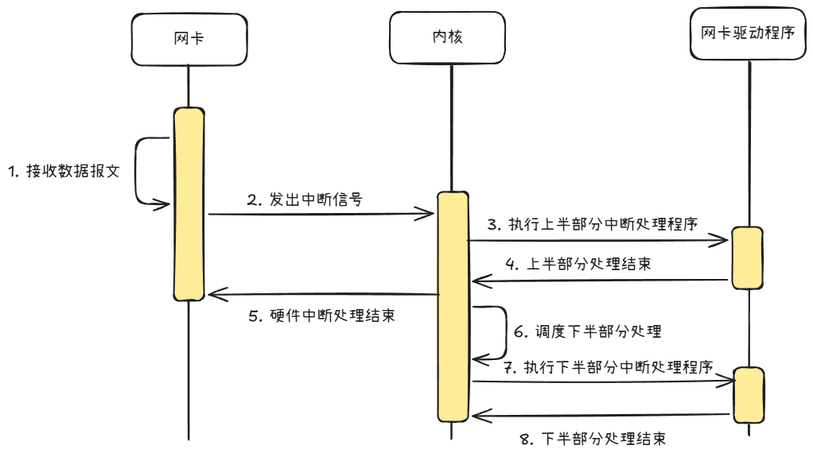
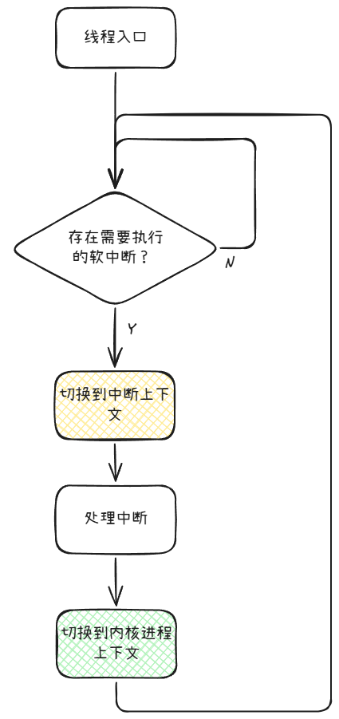
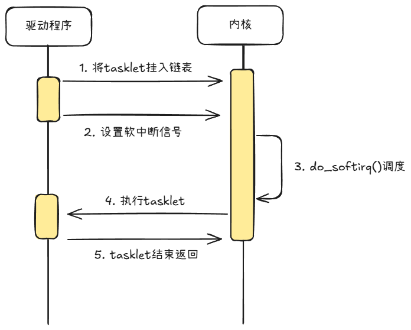

Header:

致力于通过费曼学习将个人学习到的知识用简单浅显的说法让所有人都能看得懂，难免会出现因为个人理解不正确而对他人产生误导的情况，提前感谢帮忙指正的大佬们~

前后相关文章可查看专栏[Linux程序原理学习](https://www.zhihu.com/column/c_2012836242115559468)

参考书籍：《Linux内核设计与实现》

参考Linux源码版本：6.19.8

# 系统中断

上一章节介绍系统调用时有提到，在系统调用的传统做法中触发了“软中断”，得以让代码执行在内核态执行高权限的逻辑。那软中断（soft interrupt）是本文系统中断的一种吗？那是不是还有对应的硬中断概念存在？这些问题都会在这一章节对系统中断（interrupt）的学习总结中谈到。

## 硬件处理

在谈中断的相关内容前，也需要用相应的背景知识来说明一下为什么需要中断机制。

中断的引入与硬件的处理是离不开关系的。

我们以上网必备的硬件——网卡为例：作为设备的一部分，网卡的工作就是收取数据包以及发送缓冲区内的数据包。以收数据包的场景为例，网卡会把自己收到的数据包存放在自己的存储缓冲区中，之后需要操作系统把这些数据包从缓冲区取走，这样网卡才可以腾出空间接收后续到来的数据包。如果操作系统迟迟没有处理，那么就会导致网卡缓冲区被占满，导致后续到来的数据包因为没有空间存放而只能丢掉。

那么作为操作系统，怎么知道网卡什么时候有数据包呢？如果时时刻刻盯着，在网卡没有要处理的数据包时又相当于白白浪费了本可以调度其他进程的资源。并且设备的硬件多种多样，声卡、键盘、鼠标，如果每个都要盯一遍看看是否有需要处理的数据，实在有些浪费性能。

那么换个思路，当硬件觉得自己有数据需要处理的时候通知操作系统是否可行呢？是可以的，因为这个就是设计中断机制的思路——为了处理硬件主动发出的信号。当硬件发出中断信号时，操作系统就会无条件停下手头的活（甚至可能是另一个硬件的信号中断处理）转而来处理当前的信号。由于这里本章节所指的操作系统实际上都说的是内核，所以下文都以内核来描述。

## 硬件中断信号处理

当内核收到硬件的中断信号后会怎么处理呢？

首先，内核需要知道这个中断信号是谁发送的，关于中断信号和硬件是怎么关联上的，这里的做法从硬件到软件做了几次演进：

- 对物理中断线做约定：约定了每个中断线对应的硬件是什么，例如IRQ0是系统定时器，IRQ1是键盘控制器等，硬件在插到设备后对应的中断号就是固定、已知的。

- BIOS启机分配时定义：BIOS在启动时会遍历所有硬件设备，并为有中断需求的设备分配一个IRQ号，然后将物理中断线编号与软件的IRQ号一起写入一张映射表中，这样便形成了关联。这种方案就变成了硬件对应的中断号可能每次启机期间是相同的，但是重启后可能被分配不同的IRQ号。此外，相比前一个方案，这里还可以为多个硬件设备分配相同的IRQ号，当中断信号触发时，由内核来轮询检查是哪个设备触发的信号然后调用对应处理程序。

- 用内存写入替代物理信号：硬件的驱动程序在初始化时，会向内核申请一个可用的中断号。内核会将这个中断号和目标CPU信息告知硬件。当硬件需要触发中断时，会根据这个信息向CPU指定的地址空间执行写入操作，这个地址空间内的数据会被视为触发中断。在这个设计下，一个硬件就可以拥有多个中断信号，还是以网卡举例，网卡就可以给自己申请一个收取数据报文的中断，一个发送数据报文的中断，从而提升效率。

不论是上述哪种方法，在硬件触发中断时会将对应的中断号存放到中断寄存器中，内核就可以从寄存器中读到中断号。然后拿着中断号在中断处理程序中查表，执行该中断号对应的所有处理函数。

为什么通过中断号就能找到对应的处理函数呢？自然是因为处理函数就是硬件自己根据中断号，使用内核提供的注册API注册到内核，例如`request_irq()`，下文会接着介绍到。

## 中断上下文

上一章节介绍系统调用时我们说到了用户态和内核态，从用户态切换到内核态时不仅仅是CPU权限等级的变化，还有各种寄存器的保存和栈的切换，权限等级不同、使用的栈不同，在专业术语中把这个称之为上下文（context），用户态和内核态就对应了两种上下文：

- 用户态：用户进程上下文

- 内核态：内核（进程）上下文

当内核在处理中断时，实际上是有别于这两种的上下文的新类型，称为“中断上下文”。

中断上下文和内核上下文类似，都是在内核的高权限状态下运行代码，但一个显著的特点是不能被调度，对执行的代码的要求是不应该阻塞。

由于中断处理程序是为了快速响应硬件的需求，因此内核设计者人为规定了中断处理程序在执行完前CPU不会被调度去干别的活，遵循的理念就是中断处理程序要越快越好，逻辑越轻越好。甚至Linux内核中设计了当一个硬件中断信号在处理时将关闭该CPU核的中断接收，这意味着没人会打扰当前的中断处理。

那既然在这个理念下，中断处理自然就不允许有例如休眠、等待I/O等糟糕行为——十分影响整个设备的执行效率。

可是绕不开的问题是：要完成响应确实有很多逻辑要做。为了解决这个问题，内核设计者将中断处理分成了上半部分（top half）和下半部分（bottom half）：

- 上半部分：讲究用快速、简单的逻辑来响应硬件

- 下半部分：用于执行后续耗时的逻辑

以网卡的收数据包中断信号为例，中断处理的上半部分就是将数据包从缓冲区存入内核缓冲区中，然后清空网卡缓冲区，执行流程耗时短。到了中断处理的下半部分才开始将内核缓冲区内的数据包分发给各个应用进程，执行流程耗时较长。



对于中断程序的编写者来说，推敲一个逻辑放在上半部分还是下半部分的标准例如：

- 对时间是否敏感（要求高实时性）

- 与硬件是否相关

- 不希望被打断

如果满足了上面一至多个条件，放在上半部分可能比较合适。

中断的上半部分与下半部分在内核中的实现方式也有不同

上半部分逻辑实打实运行在硬件中断上下文中，而下半部分可能因为实现方式的不同处在不同的上下文中，例如软中断上下文或内核（进程）上下文。

是的，中断上下文中亦有高低，硬件中断上下文代表了高优先级、不可被打断，而软件中断上下文是可以被其他硬件中断信号给打断抢占的。

内核提供了几个宏函数来让程序可知道自己运行在什么上下文中：

- `in_interrupt()`：判断是否处于中断上下文
  
  - 返回 true：代码运行在中断上下文。
  
  - 返回 false：代码运行在内核（进程）上下文。

- `in_irq()`：判断是否处于硬件中断上下文（上半部分）
  
  - 返回 true：代码正在执行硬件中断的上半部分。
  
  - 返回 false：代码不在硬件中断的上半部分。

- `in_softirq()`：判断是否处于软件中断上下文（下半部分）
  
  - 返回 true：代码运行在中断的下半部分。
  
  - 返回 false：在其他上下文中。

- `in_task()`：检查是否内核（进程）上下文中执行。
  
  - 返回 true：代码运行在内核（进程）上下文。   
  
  - 返回 false：代码运行在中断上下文中，可能是硬件中断也可能是软中断。

通过内核提供的API，程序就能知道自己运行在什么上下文内，推测自己是在上半部分还是下半部分，知道什么行为可以做什么行为不能做。

接下来介绍上半部分和下半部分的一些特点和对应的机制。

## 中断上半部分

由于上半部分是讲究极致效率的、和硬件直接打交道的部分，因此没有出现五花八门的实现方案，围绕的就是处理程序的注册和触发。

### 中断处理程序注册

硬件的驱动程序在完成初始化后，正是通过上文提到的`request_irq()`API向内核注册自己的中断处理程序，API在源码中的声明部分如下：

```c
/**
 * request_irq - Add a handler for an interrupt line
 * @irq:    The interrupt line to allocate
 * @handler:    Function to be called when the IRQ occurs.
 *        Primary handler for threaded interrupts
 *        If NULL, the default primary handler is installed
 * @flags:    Handling flags
 * @name:    Name of the device generating this interrupt
 * @dev:    A cookie passed to the handler function
 *
 * This call allocates an interrupt and establishes a handler; see
 * the documentation for request_threaded_irq() for details.
 */
static inline int __must_check
request_irq(unsigned int irq, irq_handler_t handler, unsigned long flags,
        const char *name, void *dev);
```

可以看到注册需要提供的参数为：

- irq：一个中断提供无符号整型的中断号

- handler：一个函数指针

- flags：注册标志位

- name：这个处理程序的名称标识

- dev：处理程序私有的一个指针，可以在处理程序中访问

为什么注册接口的开头注释是说将一个处理程序注册到“中断线”上，而不是说设置中断号对应的处理程序呢？因为没人说过中断信号不能对应多个中断处理程序呀，中断信号在“一定条件下”可以被挂载在中断线上的多个中断程序共享处理。

### 共享处理

内核支持让多个中断处理程序注册同一个中断信号，前提是它们均同意共享。

在调用注册函数时，注册者可以在flags中传入`IRQF_SHARED`标志，代表同意中断共享。当中断信号来临时，中断线上所有的中断处理程序会被依次调用，全部处理完成后才算是完成了本次中断信号的处理。

那假如在一群同意中断共享的程序中，有一个不同意共享的呢？这个事情其实不会发生在中断处理时，因为内核则秉承着要么全部要么没有的理念：

1. 如果中断线的第一个注册者传入了`IRQF_SHARED`，内核会将标记这个中断号的属性为“共享”，后续没有带上`IRQF_SHARED`（不同意共享）的函数将注册失败，返回-EBUSY。

2. 如果中断线的第一个注册者没有传入`IRQF_SHARED`，内核会标记这个中断号的属性为“独占”，后续不管是不同意还是同意的，都会注册失败，返回-EBUSY 或 -EINVAL。

### 临界资源问题

在编写中断处理程序时非常重要的一点就是要保护好自己正在访问的变量（临界资源）不被其他核运行的相同程序修订。

之所以会出现其他核也在运行相同的程序，是因为现在基本都是多CPU核的设备，上面也说了虽然内核会关闭本CPU核的中断接收（术语是“关闭本地中断”），但是别的CPU核还是开着的呀，还是可以正常捕获中断信号，因此如果一核正在处理，硬件第二次发出信号还会被别的CPU核捕获，就会导致多个CPU核同时在运行同一段代码。此时如果存在一个例如网卡收包个数统计的全局变量，就有可能会因为多核同时写而导致结果不对的情况。

通常的解决方案可能访问变量前先加个锁，但是使用每核变量或原子变量来解决也未尝不可。

## 中断下半部分

中断的下半部分在Linux演进过程中，也迭代出了很多中断后续流程的处理方案。本章节会介绍在书中学习到的三种：

- 软中断（softirq）

- 小片任务（tasklet）

- 工作队列（workqueue）

既然是能在内核不断优化的情况下保留下来的方案（小片任务也马上就要废弃了），必然都有其可取之处。

事实上，这三种方案提供了各自的使用场景，假如是中断程序的编码者，可以通过几个问题的是和否来初步确定自己要采用的方案：

1. 是否要使用内核预定义枚举值？使用软中断。

2. 处理频率要求极高并且同类任务可以并行？使用软中断。

3. 希望同类任务不要并行？使用小片任务。

4. 程序内部需要睡眠等待或非常耗时？使用工作队列。

通过以上的是和否问答选择，实际上已经可以看出每个方案的优缺点了，接下来将具体介绍。

### 软中断（softirq）

上文也已经提到了软中断这一概念，softirq顾名思义是软件层面的中断。内核中定义的软中断类型如下：

```c
/* PLEASE, avoid to allocate new softirqs, if you need not _really_ high
   frequency threaded job scheduling. For almost all the purposes
   tasklets are more than enough. F.e. all serial device BHs et
   al. should be converted to tasklets, not to softirqs.
 */

enum
{
    HI_SOFTIRQ=0,
    TIMER_SOFTIRQ,
    NET_TX_SOFTIRQ,
    NET_RX_SOFTIRQ,
    BLOCK_SOFTIRQ,
    IRQ_POLL_SOFTIRQ,
    TASKLET_SOFTIRQ,
    SCHED_SOFTIRQ,
    HRTIMER_SOFTIRQ,
    RCU_SOFTIRQ,    /* Preferable RCU should always be the last softirq */

    NR_SOFTIRQS
};
```

虽然看的出来内核设计者强烈推荐程序编写者使用tasklet来替代增加新的软中断，但这并不影响我们学习软中断的原理，因为tasklet的实现基础也是软中断。

#### 注册

软中断的信号和处理函数是一对一的关系，因此如果真的需要新增自己的软中断，就需要在内核编译时新增枚举值，然后在硬件初始化时调用API将处理函数设置到该信号中。

```c
void open_softirq(int nr, void (*action)(void))
{
    softirq_vec[nr].action = action;
}
```

#### 触发

当硬件中断信号结束上半部分的处理前，下半部分想使用软中断的程序会将对应的软中断设置为激活状态。

内核会使用函数`do_softirq()`来检查当前有哪些软中断需要处理，当发现一个软中断信号处于激活时就会立即执行它的action函数，执行完毕后才接着检查下一个软中断信号，这个函数通常在几个处理点会被调用：

- 硬件中断结束返回后

- 内核设置的每核线程`ksoftirqd`

- 有些程序会显式调用该函数

#### 取舍

为什么内核会专门设置`ksoftirqd`线程来执行软中断呢？按道理硬件中断后直接执行下半部分的逻辑应该就行了？这里源于一个基于全局的取舍问题——中断程序占用CPU执行得很开心，但其他普通进程怎么办？

由于不论是硬件中断上下文还是软件中断上下文，都是不可打断、不可调度的，还是以网卡来举例：如果网络此时流量很大，CPU刚处理完网卡触发的接收数据报文中断，把数据放到缓冲区执行后续的软中断，然后此时硬件中断又把CPU叫来干活，相当于CPU长时间都在处理网卡的中断程序，没有办法顾及到其他程序。其他程序就会迟迟等不到CPU的调度执行。

考虑到这种高频中断调用导致普通进程可能饿死的情况，当内核发现软中断已经执行很多次、耗时较久的情况下，就会在当前CPU核拉起一个最低优先级的内核线程ksoftirqd/n，这个线程将参与调度，使得一些高优先级的进程可以被运行。线程名后面有个"/n"的意思是第几个CPU核的线程，例如0核拉起的线程名就是ksoftirqd/0，1核拉起的是ksoftirqd/1。

在Linux设备上查看线程，基本都能看到这几个线程：

```shell
[root@iZ2zeamih4tp4e8ya0gnukZ ~]# ps -aux | grep ksoftirqd
root          11  0.0  0.0      0     0 ?        S    Mar16   0:02 [ksoftirqd/0]
root          17  0.0  0.0      0     0 ?        S    Mar16   0:03 [ksoftirqd/1]
```

值得注意的是，ksoftirqd是一个运行内核进程上下文的、可以被调度的线程，但它执行软中断逻辑前会切换到软中断上下文，确保不会被调度和打断，然后执行完毕后再切换回内核进程上下文参与调度等待下一次执行。



总的来说，这个线程是对应“既不能不管软中断的处理，又不能忽略用户进程调度”的折中做法。

### 小片任务（tasklet）

tasklet虽然不是软中断，但它基于软中断机制来实现的——`HI_SOFTIRQ`与`TASKLET_SOFTIRQ`两个软中断信号设置的action就是tasklet的入口。当这两个软中断被激活时，意味着tasklet将被执行。当前大部分驱动程序都是用tasklet来实现中断的下半部分逻辑。

`HI_SOFTIRQ`不带有任何打招呼的意思，而是High的缩写，意味高优先级的tasklet任务队列。而`TASKLET_SOFTIRQ`指的就是普通的tasklet任务队列。（之所以是高优先级，是因为`HI_SOFTIRQ`的位于枚举的第一个，那么`do_softirq()`时总是最先处理到）

稍微从代码里看一下tasklet的结构：

```c
/* Tasklets --- multithreaded analogue of BHs.

   This API is deprecated. Please consider using threaded IRQs instead:
   https://lore.kernel.org/lkml/20200716081538.2sivhkj4hcyrusem@linutronix.de

   Main feature differing them of generic softirqs: tasklet
   is running only on one CPU simultaneously.

   Main feature differing them of BHs: different tasklets
   may be run simultaneously on different CPUs.

   Properties:
   * If tasklet_schedule() is called, then tasklet is guaranteed
     to be executed on some cpu at least once after this.
   * If the tasklet is already scheduled, but its execution is still not
     started, it will be executed only once.
   * If this tasklet is already running on another CPU (or schedule is called
     from tasklet itself), it is rescheduled for later.
   * Tasklet is strictly serialized wrt itself, but not
     wrt another tasklets. If client needs some intertask synchronization,
     he makes it with spinlocks.
 */

struct tasklet_struct
{
    struct tasklet_struct *next;
    unsigned long state;
    atomic_t count;
    bool use_callback;
    union {
        void (*func)(unsigned long data);
        void (*callback)(struct tasklet_struct *t);
    };
    unsigned long data;
};
```

从上面的注释可以得到的信息是**tasklet也要被废弃了**。但我们也还需要学习它，理解它会被废弃的原因。

tasklet的结构体可以看出是一个链表结构，通过next指向下一个结构体。

当CPU核的软中断信号被激活处理时，核上的tasklet链表就会被遍历处理。所以可以看出tasklet依旧是串行执行，但比起softirq要在内核中增加枚举值来说方便了不少。



上面的选择问题中我们已经知道相比软中断，tasklet的一个特点就是：**同类任务不会并行**。之所以能做到就是靠`state`和`count`两个变量。

`state`的取值在最新源码中只有`TASKLET_STATE_SCHED`和`TASKLET_STATE_RUN`（原书上说是0、`TASKLET_STATE_SCHED`与`TASKLET_STATE_RUN`）。当程序调用接口准备把自己的tasklet启动执行时，内核会检查`state`的取值，如果是`TASKLET_STATE_RUN`说明这个任务已经在别的核上处理了，就不再重复挂到自己的链表上。

假如仅仅只有这一个机制，熟悉多核竞争的同学就会发现，如果两个核都刚好判断`state`状态是`TASKLET_STATE_SCHED`，那岂不是还是会变成挂在了多个核上？

是的，仅仅有这一个机制不够，还需要`count`配合。在定义中我们可以看到count是原子变量类型，当CPU处理时发现count为0时说明还没人执行它，那么就会将count加一然后执行，此时CPU会将`state`的值设置为TASKLET_STATE_RUN。即使恰好其他核也把这个任务挂到链表上，当它发现count不为0时，便知道其他核已经开始执行这个任务了，便跳过不再执行。

所以`state`只是第一道筛选门槛，真正保证同一个tasklet同一时间只会有一个核运行的原因是`count`这个原子变量。

#### 回看废弃的原因

tasklet最后走向废弃的原因，很大原因是因为那个年代的优点逐渐跟不上现在这个处理性能爆表的时代了：

1. 串行执行，且处于中断上下文不能被打断

2. 同一时间同一个任务只能有一个核运行，无法利用多核CPU的并行能力

所以在上面的注释中内核设计者也建议使用线程化中断（threaded IRQ）来替代原本的tasklet。

### 工作队列（workqueue）

实际上，工作队列并不是特地为了中断准备的，实际上如果有需要，可以把任何异步任务使用API`schedule_work`丢到工作队列里。

**这个正是Linux的设计格言的应征：“提供机制而不是策略。”**

不是为了中断下半部分的执行而设计的工作队列，而是工作队列符合了一些程序的下半部分处理逻辑的执行需求。

工作队列相比软中断和小片任务的最大区别是它运行在内核进程上下文而不是中断上下文中。因此一些耗时很长的操作就可以放心执行，不会影响设备的整体运行性能。

```c
/**
 * schedule_work - put work task in global workqueue
 * @work: job to be done
 *
 * Returns %false if @work was already on the kernel-global workqueue and
 * %true otherwise.
 *
 * This puts a job in the kernel-global workqueue if it was not already
 * queued and leaves it in the same position on the kernel-global
 * workqueue otherwise.
 *
 * Shares the same memory-ordering properties of queue_work(), cf. the
 * DocBook header of queue_work().
 */
static inline bool schedule_work(struct work_struct *work)
{
    return queue_work(system_percpu_wq, work);
}
```

内核在初始化之后，会在每个CPU核上启动一个worker线程，线程将定期轮询并执行自己的队列里的任务。同样，现在找台Linux设备可能就可以看到这些线程：

```shell
[root@iZ2zeamih4tp4e8ya0gnukZ ~]# ps aux |grep worker
root           6  0.0  0.0      0     0 ?        I<   Mar16   0:00 [kworker/0:0H-events_highpri]
root          19  0.0  0.0      0     0 ?        I<   Mar16   0:00 [kworker/1:0H-kblockd]
root          89  0.0  0.0      0     0 ?        I<   Mar16   0:01 [kworker/0:1H-events_highpri]
root         129  0.0  0.0      0     0 ?        I<   Mar16   0:01 [kworker/1:1H-events_highpri]
root         155  0.0  0.0      0     0 ?        I<   Mar16   0:00 [kworker/u5:0]
root       70460  0.0  0.0      0     0 ?        I    16:09   0:00 [kworker/u4:1-events_unbound]
root       71253  0.0  0.0      0     0 ?        I    16:47   0:00 [kworker/u4:0-events_unbound]
root       72048  0.0  0.0      0     0 ?        I    17:30   0:00 [kworker/1:1-cgroup_destroy]
root       72487  0.0  0.0      0     0 ?        I    17:50   0:00 [kworker/0:0-cgroup_pidlist_destroy]
root       72684  0.0  0.0      0     0 ?        I    18:00   0:00 [kworker/0:1-cgroup_destroy]
root       72685  0.0  0.0      0     0 ?        I    18:00   0:00 [kworker/1:0-cgroup_pidlist_destroy]
root       72885  0.0  0.0      0     0 ?        I    18:10   0:00 [kworker/u4:2-events_unbound]
root       72888  0.0  0.0      0     0 ?        I    18:10   0:00 [kworker/0:2-mm_percpu_wq]
root       72890  0.0  0.0      0     0 ?        I    18:10   0:00 [kworker/1:2-events]
root       73158  0.0  0.0      0     0 ?        I    18:13   0:00 [kworker/0:3-events]
```

线程的命名格式为：`kworker/<CPU>:<ID><flags>-<name>`

- CPU：绑定的 CPU 编号（如果是`u`代表unbind，意为未绑定到具体 CPU核）。

- ID：线程序列号。

- flags：标识符（如 `H`表示高优先级）。

- name：关联的工作队列名称。 

内核提供了一套接口，允许创建程序（这里指所有的内核程序，而不是驱动程序）的队列与线程，这里就不再赘述。

### 线程化中断（threaded IRQ）

从上文得知，tasklet即将要被废弃啦，内核设计者让大家考虑一下可不可以用threaded IRQ来实现。

其实线程化中断的特点非常顾名思义，也没有什么特别要说明的。实际上就是用一个内核线程（thread）来执行下半部分的逻辑。与工作队列的特性基本一致，只是从创建硬件自己的任务并推入工作队列变成了硬件驱动程序可以注册和创建自己的线程。

由于是一个线程，因此特点就有：

1. 运行在内核（进程）上下文中，可以阻塞也可以休眠。

2. 参与内核的调度，如果希望更快被执行到，可以设置线程的优先级。

这样做之后相比不可以被调度打断的方案来说，大大提升了系统整体的资源利用率。

程序可以通过`request_threaded_irq()`方法向内核注册硬件中断对应的下半部分要执行的处理函数。当程序的上半部分执行完成后，就从原来的激活软中断信号、添加tasklet、添加工作队列等做法变成了唤醒一个线程。

程序的编写者就按照普通的线程编程方法来实现即可，不要再基于调用位置区分考虑是否可以阻塞休眠，是否要考虑多核竞争等。

## 总结

> 每次写完最后一节时都感觉结尾怪怪的，和讲到一半停了一样没有那种收的感觉，因此计划后续都会补一个总结部分。

首先回答一下开头的问题，上一章节系统调用产生的中断是本文提到的软中断（softirq）吗？不是，系统调用时提到的中断实际上是通过执行CPU支持的机器码`int`，在没有硬件中断信号的情况下，让CPU陷入内核态从而执行后续流程。因此和Linux内核设计的软中断机制没有什么关系。

从学习了Linux内核上半部分与下半部分的中断处理，从设计的角度可以感受到一些设计理念：

1. 就事论事，将复杂问题按时间维度、按流程进行划分——将中断的处理划分为了上半部分和下半部分，针对性考虑
1. 用机制代替策略，提供机制让业务思考使用，而不是为业务设计方案，这一点我觉得**是对所有平台框架开发很重要的一个基本信念**
