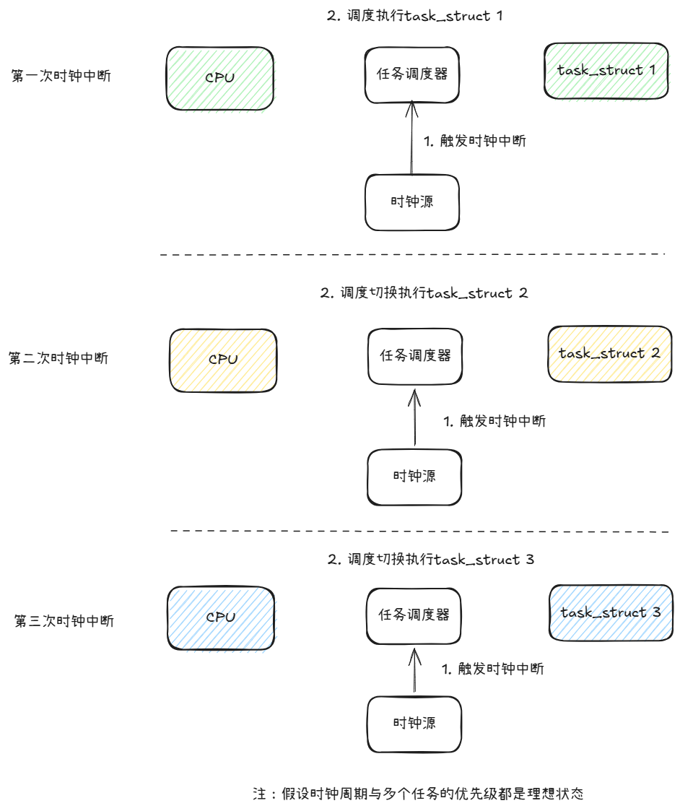
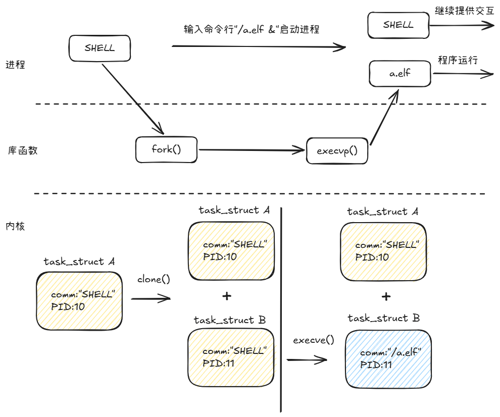
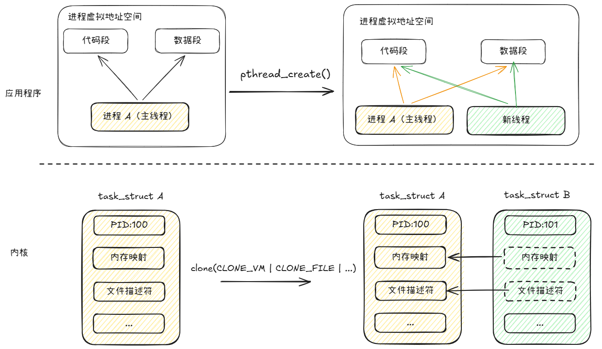

随着系统调用和系统中断的知识点学习总结，现在整个Linux程序原理的知识点是时候正式深入到Linux内核部分了！——真实原因是本章节的内容想来想去也没法绕开内核的相关实现原理，否则会导致叙事结构非常跳脱、不够完整。

（有很多知识点本人都认为需要以单篇深入的方式来描述，所以在总结性文章里只能先带过。最终目标是将各个知识点串联在一起。）

本篇文章的叙事思路如下：

> 反思文章结构后的另一个改进，让大家能get到我写文章的时候的一个叙事思路

1. 先简要介绍一下内核调度的基本单位——任务（task）
2. 进而揭露进程创建的部分背后逻辑
3. 说明进程的关键特点与线程的关键特点
5. 串联一下系统调用与系统中断的知识点

## 内核中的任务调度

“设备上可以同时运行一至多个应用程序”——这个似乎是常识，那为什么可以呢？是因为多个CPU核的原因吗？似乎不全是，因为单CPU核的设备似乎也可以做到“同时”运行多个程序？

事实上，单CPU核的设备从事实层面上是无法同时运行多个程序的，只是因为程序间切换执行的间隔太短了所以看起来像是同时运行一般。

由于CPU只懂得不断的取得指令然后运行，没有人让它停下来那就只会在一个程序里不断执行直到程序结束，甚至程序结束后如果没有人告诉它接着做什么，那它只会啥也不干。因此内核需要负责指导CPU现在应该做什么，当内核觉得一个程序运行时间已经足够后，会修改CPU的寄存器信息，让它指向其他不同的程序从而让CPU转而执行其他程序。

如果我们将CPU当做执行指令干活的人，那么内核做的事情就是**为CPU实现调度任务，这正是内核的核心工作之一**。

如果内核需要实现让CPU在各个任务之间切换的功能，那肯定就需要知道：

- 当前设备上都有哪些任务正在运行或需要运行？
- 每个任务运行了多久？
- 现在要切换执行的任务之前运行时寄存器的值是多少?

以上的种种描述“任务”运行的信息都被保存在一个个`struct task_struct`结构体中，这个结构里记录的字段内容包括但不限于：

- 任务现在的状态——state
- 任务的优先级——prio与static_prio
- 任务的内存使用情况——mm（memory map）
- 任务的栈信息——stack

由于任务调度是内核的一个重中之重的功能，因此内核用了多样的数据结构来更高效地执行不同的逻辑：

- 通过双向链表来遍历所有的任务
- 用红黑树来查找即将执行的任务

内核尝试执行任务调度的频率和硬件时钟源有关，时钟源会周期性的产生中断信号，触发内核执行时钟中断回调，在回调中内核主要做了两个事情：

1. 更新系统时间
2. 使用调度器尝试调度任务

关于这一块的知识后面将单开章节描述，不过通过上面的介绍我们目前要理解：不论是进程（process）还是线程（thread），实际在内核中都是以任务（task）的形式存在，只是在内存、文件等运行资源的配置上有不同。我们将在这个视角下回看平常所说的进程和线程。

## 进程

在《03-装载》中详细介绍了程序加载的整体流程，只是一直没有点破内核在其中扮演的角色，在这一章我们就做一下知识点的串联。

### 程序加载

经由上文的介绍我们知道了内核只认任务，因此毫无疑问我们平常在用户态执行的应用程序在内核中都是以任务的形态存在，内核通过任务间的调度运行让我们在单CPU核的设备上也产生了多个应用程序同时运行的错觉。

想要创建一个进程意味着首先需要让内核帮忙创建一个任务，那么内核怎么知道要帮程序创建呢？用户态想让内核帮忙做事，更别提是操作内核的数据这种需要高权限的工作——当然是通过系统调用。

在系统调用章节中曾经介绍过，对应用程序来说使用库函数来执行一些逻辑，而库函数基本是对系统调用的封装。在创建进程方面，应用程序可以使用例如fork()函数与以exec为前缀的一系列库函数（如execv、execvp等,下文就以exec类函数来描述）：

- fork: 创建一个与父进程完全相同的进程，对应的系统调用为clone
- exec类: 用指定的应用程序替换当前的进程，对应的系统调用是execve。

在得知`struct task_struct`结构体存在的情况下，其实可以大概猜测到这两个系统调用在Linux内核中的行为了：

- clone相当于拷贝了一个与原任务除了进程ID不同外，其他完全相同的新任务
- execve相当于将原本的任务内容除了进程ID这些通用内容保留外，其他都覆盖成了新程序的内容

在《03-装载》章节中我们重点描述了加载器（Loader）在程序加载过程中所做的工作，例如读取程序表头、内存分配、符号表重定位等，实际上**加载器指的正是系统调用execve**。（又是一个知识点的伟大会师）

平时我们通过SHELL执行命令行来启动一个应用程序，对应的正是SHELL进程对自身进行了一次fork()，复制出来的子进程通过execve的方式被内核替换为了目标应用程序，然后从程序的入口函数开始执行新程序。

### 第一个进程

既然我们平常执行的应用程序进程都是通过SHELL命令的方式创建的，那SHELL又是怎么被创建的呢？如果有人创建了SHELL,那么是谁创建了它自己？此时先有鸡还是先有蛋的问题对应的就是“设备上第一个进程是怎么来的”？

若了解Linux内核的初始化流程那问题的答案其实不难想——内核在初始化完毕后创建了第一个进程。

当设备上电后，经由BIOS的引导，内核完成了初始化后会将自己名为`kernel_init`线程，通过execve的方式替换为PID号为1的`init`进程，关于它的具体内容以后单开篇章详细描述，用户态的一切初始化都是由该进程来完成，包括提供可以供用户交互的SHELL。

### 进程的特点

内核设计者如此大费周章地设计了用户态和内核态，低权限和高权限，提供了系统调用的方法等等，为的都是保障系统的安全稳定。

在之前的章节中我们已经知道了虚拟地址（virtual memory address, VMA）的概念，不论是进程的代码段、数据段、链接的动态库还是读写的I/O文件，这些通通都需要通过内核将实际的物理地址、磁盘区块转换为虚拟地址映射到程序自己的虚拟内存空间中，程序既不能访问他人的虚拟内存空间，也不能访问自己虚拟内存空间之外的地址，只能在内核分配好的空间内使用栈内存和堆内存来执行自己的逻辑，必要时通过系统调用来执行一些高权限的动作。

内核通过这种方式实现了进程之间的资源隔离。

## 线程

介绍了进程的相关知识后，线程的相关知识也就水到渠成。

要创建一个线程同样是使用库函数pthread_create()，这个函数最终也会调用到系统调用clone()在内核创建一个新任务。

为什么进程和线程都是用clone()呢？这正是对应了进程和线程对内核来说都是task的概念。clone()可以通过传递不同的标志位(flags)控制新创建的task资源是怎么安排的：

- 对fork的进程，内核需要重新映射一块内存用于加载目标程序截然不同的数据与代码，需要清除原本任务结构体的信息，例如文件描述符、映射的内存块等等。
- 对于clone的线程，由于线程通常会共享原本进程的内存地址，可以访问已经被打开的文件等等，因此调用clone()时会传递一些标志位（flags）告知哪些可原本任务结构的相关信息可以完全使用，例如：
  - CLONE_VM：创建的task共享原本task的虚拟内存空间
  - CLONE_FILE：创建的task共享原本task的文件描述符

由于线程创建时很多资源是可以直接复用，不必像创建进程那样推倒重来，所以以前常听说创建线程比创建进程速度更快，代价更小。

这里也可以合理的通过类比法明白：**主进程本身也是一个线程**，因为它们本质都是内核中的任务。

线程与线程之间共享资源，虽然调度时还是需要做上下文的切换，但因为是同一个程序，所以CPU缓存的命中率较高，总体表现也好进程间的切换。但是由于本身多进程和多线程就是程序设计方案上考虑有不同，所以本文也只是单从创建与上下文切换的代价维度做对比，实际生产环境肯定不是直接这么对比的。

但也正是由于线程之间共享了大部分资源，因此一个线程的异常（例如除零异常/访问非法地址异常）将被内核视作整个程序异常。这也是为什么程序异常后coredump都是对应程序，而不是对应单个线程。

进程与线程似乎都是用户态的概念，那在内核里执行内核逻辑、访问的是物理地址而不是虚拟地址的那些任务叫什么呢？常见的称呼是“内核线程（kthread）”。

## 串联系统调用

既然应用程序是运行在用户态，通过系统调用让内核帮忙执行相关高权限操作，那此时跑代码的是内核的某个线程吗？

并不是内核线程，执行系统调用代码的还是应用程序自己。

在`struct task_struct`结构中，内核为每个任务都定义了一个小小的内核栈。因此当应用程序切换到内核态后，就可以使用自己的内核态调用栈运行系统调用处理程序。

## 串联系统中断

为什么之前说系统中断的上半部分是无法调度、不允许阻塞的呢？

根本原因是系统中断处理程序本质上只是内核初始化后提前放在特定地址上的一段代码，当被硬件信号激活后CPU就会去执行这段代码。

内核从来都没有为这段代码创建过任务，因此**系统中断执行本身既不是进程也不是线程**，正因如此，所以内核没有办法对它做调度——因为切出去后面就没法切回来了，休眠也是同理。

## 总结

1. Linux 内核通过 `struct task_struct`结构来描述设备上运行的任务内容以及使用的资源情况，用户态的进程和线程只是任务不同资源配置的表现。

2. 系统调用虽然说是从用户态陷入内核态，但执行对应内核态高权限任务的还是应用程序自己。
3. 系统中断（上半部分的硬中断）没有对应的任务结构，这是他无法调度，不允许阻塞的根本原因。

