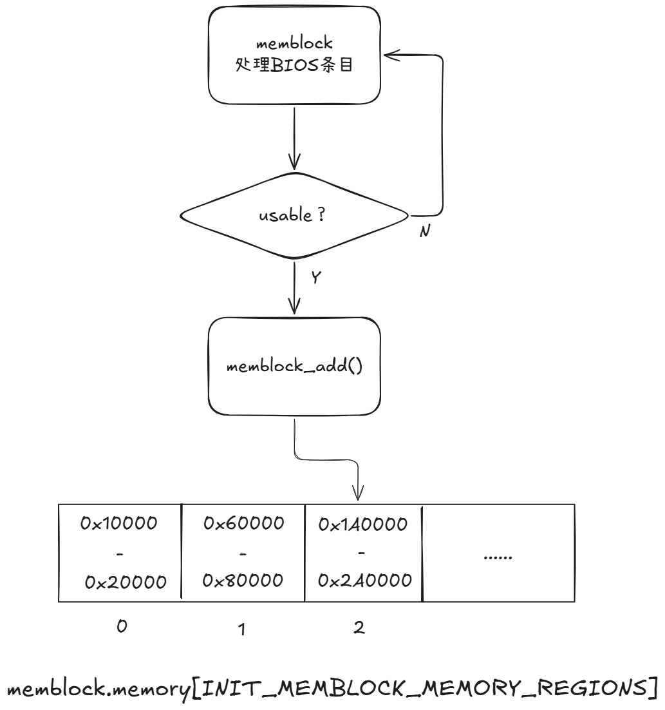
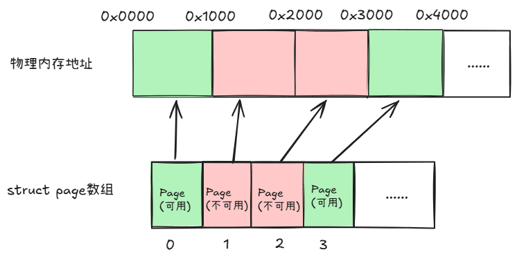
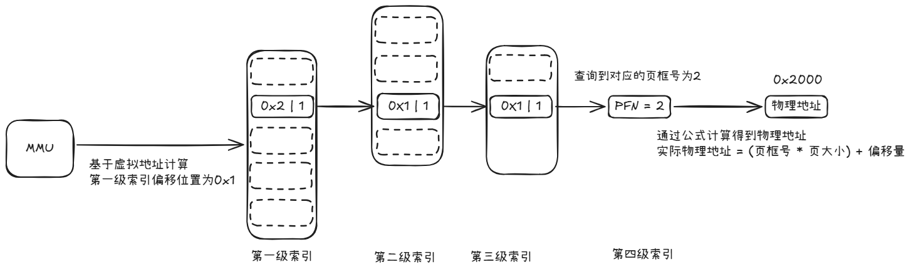
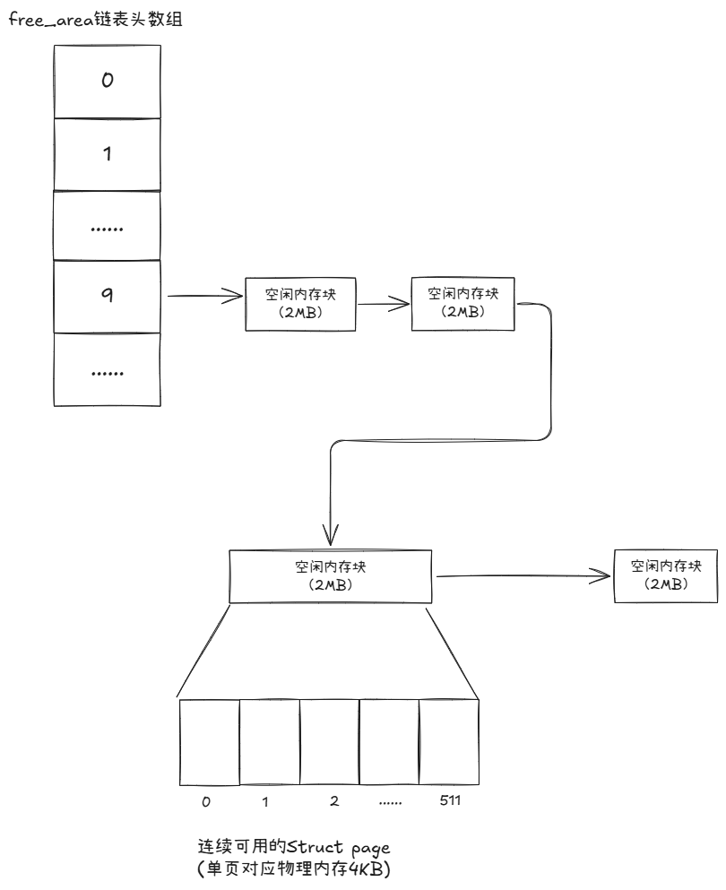
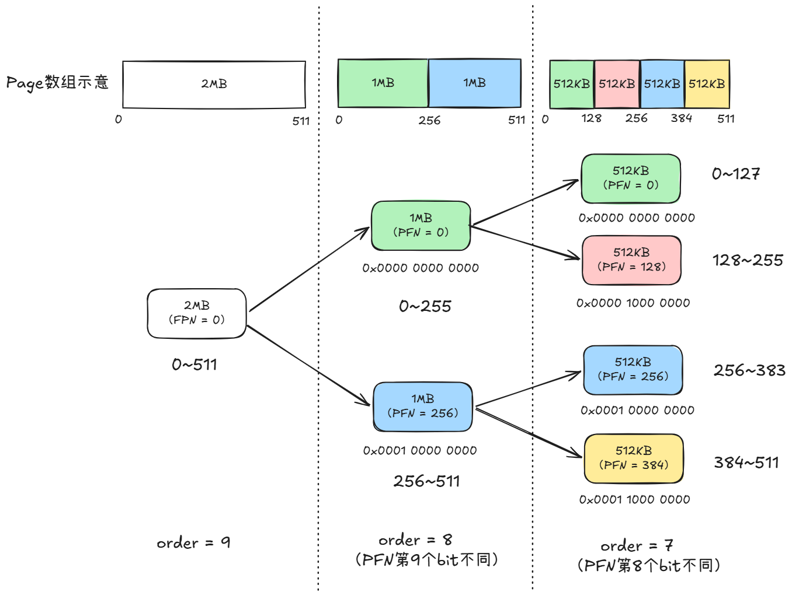

# 物理内存管理（上）

上一章节08中介绍了虚拟内存机制存在的意义，以及内核是怎么组织、管理虚拟内存的：程序使用虚拟内存地址时由CPU中的硬件MMU进行虚拟地址到物理地址的转换，如果物理地址查找失败则触发缺页异常，由内核进行实际物理页的分配。

这一章节是聚焦于内核对实际物理内存的角度，继续完善我们的知识面

写文的时候发现想写的内容太多了，光一二级标题都起了一堆，所以我把09分为了上、下两章，这样知识点之间的逻辑更清晰一些。

本篇（上）主要围绕内存管理相关：

1. 物理内存是怎么被内核感知的
2. 管理物理内存对应的核心数据结构
3. 内核中主要的内存管理机制，memblock分配器以及伙伴系统（Buddy System）

## 物理内存的管理

Linux内核中实际上存在多种内存管理机制（分配器），它们分别在内核的不同生命周期工作：

- memblock分配器：在内核初始化时执行简单的内存管理
- 伙伴系统（Buddy System）：在内核完成初始化后，接管memblock分配器的工作，执行更为复杂、精密的内存管理

为什么不直接上功能更强大的伙伴系统一步到位，还需要先用memblock分配器呢？

原因是因为伙伴系统没办法做到“自举”——伙伴系统需要对应的数据结构来管理物理内存，但这些数据结构本身存储在物理内存中。因此伙伴系统没有办法在不知道物理内存信息的情况下，用物理内存来存储物理内存的信息，落入了“先有鸡还是先有蛋”的矛盾中。

为了替伙伴系统铺平道路，因此内核会先使用简单的memblock分配器来完成物理内存信息的收集与初步管理。

### memblock分配器

memblock实际上是一个全局静态结构体的类型名称，memblock的所有逻辑都只使用这些静态数组来存储，这也是为什么它不需要知道物理内存的信息也可以运行。为了更加直观的认识到它只是一个结构体，因此贴上内核中的结构体定义代码：

```c
/**
 * struct memblock_region - represents a memory region
 * @base: base address of the region
 * @size: size of the region
 * @flags: memory region attributes
 * @nid: NUMA node id
 */
struct memblock_region {
	phys_addr_t base;
	phys_addr_t size;
	enum memblock_flags flags;
#ifdef CONFIG_NUMA
	int nid;
#endif
};

/**
 * struct memblock_type - collection of memory regions of certain type
 * @cnt: number of regions
 * @max: size of the allocated array
 * @total_size: size of all regions
 * @regions: array of regions
 * @name: the memory type symbolic name
 */
struct memblock_type {
	unsigned long cnt;
	unsigned long max;
	phys_addr_t total_size;
	struct memblock_region *regions;
	char *name;
};

/**
 * struct memblock - memblock allocator metadata
 * @bottom_up: is bottom up direction?
 * @current_limit: physical address of the current allocation limit
 * @memory: usable memory regions
 * @reserved: reserved memory regions
 */
struct memblock {
	bool bottom_up;  /* is bottom up direction? */
	phys_addr_t current_limit;
	struct memblock_type memory;
	struct memblock_type reserved;
};

```

如果认真扫一遍结构体定义会发现：`struct memblock_type`里的`struct memblock_region *regions`不还是一个指针吗？这个地址看起来不像是预分配的呀？

实际上这个指针在结构体初始化时会指向`.c`文件里创建的静态数组：

```
static struct memblock_region memblock_memory_init_regions[INIT_MEMBLOCK_MEMORY_REGIONS] __initdata_memblock;
static struct memblock_region memblock_reserved_init_regions[INIT_MEMBLOCK_RESERVED_REGIONS] __initdata_memblock;

......

struct memblock memblock __initdata_memblock = {
    .memory.regions     = memblock_memory_init_regions,
    .memory.max         = INIT_MEMBLOCK_MEMORY_REGIONS,
    .memory.name        = "memory",
    .reserved.regions   = memblock_reserved_init_regions,
    .reserved.max       = INIT_MEMBLOCK_RESERVED_REGIONS,
    .reserved.name      = "reserved",
    ...
};
```

这些静态数组在定义时利用了`__initdata_memblock`宏修饰，这个宏用于告知编译器，将这些变量放置在程序的 `.init.data` 段中。如果不做声明，编译器和链接器基本就会放在.data段或者.bss段。

之所以要特意修饰，让编译器将变量存放在`.init.data`段的原因是memblock深藏功与名到极致：当memblock分配器的工作结束后，`.init.data`段中的变量（如这两个数组）所使用的内存也会被内核作为空闲内存回收，用在以后的内存分配中。

总之我们明白了在内核镜像被引导、加载到物理内存运行后，memblock就已经拥有了实打实的内存空间，开始利用这些空间获取设备的物理内存信息。

#### memblock获取物理内存信息

这里介绍的是还比较传统的、基于BIOS的E820信号来获取物理内存的流程（使用UEFI启动的系统可以用`GetMemoryMap()`服务来获取数据），整个流程实际上非常的好理解：

1. 触发中断：内核会触发一个中断号为15的软件中断，并且将寄存器的值设置为0xE820
2. 获取数据：CPU收到该中断后会触发BIOS开始逐条返回内存信息，内核的处理函数捕获这些内存信息
3. 条目处理：每条内存信息包含内存的类型、起始地址以及长度等。处理函数将这些数据过滤、合并后，整理出能够使用的物理内存分布并保存在内核表中

在获取数据的过程中，函数会过滤所有非“usable”类型的内存信息——BIOS会返回所有的内存信息，其中也包括被各种理由占用而不允许使用的部分。

函数会将所有“usable”类型的内存进行去重、合并，然后逐条调用 `memblock_add()`，把每段可用内存写入结构体的`memory` 数组中。



基于源码来看，数组大小`INIT_MEMBLOCK_MEMORY_REGIONS`的值是128，那万一可用内存就是非常多、非常零散，条目超过了128呢？

当可用条目超过128条时，由于已经知道有这么多usable的物理内存空间了，内核就会扩容原本的数组，将后续信息存储到扩容的地址中。

#### 内核预留内存

通过上述说得简单的机制，memblock结构体的`memory`数组中已经填充了多条代表可用物理内存范围的数据。

此时，内核会在这些内存中留一部分给自己——在`reserved`数组中添加一条描述范围的条目，代表这部分被内核预留，后续不会分配给其他业务。

之所以要预留内存，存在很多用途：

- 内核镜像本身占用的内存：由于BIOS返回的是所有可用内存，也包括了内核代码加载的这部分内存，因此内核自然不能把这块内存分配出去
- `struct page` 数组存放的内存：为伙伴系统铺路的核心数据
- 进程的页表层级结构存放的内存：用于硬件MMU把虚拟地址翻译为物理地址时使用
- ......

这也是为什么在系统启动后，通过 `cat /proc/meminfo`看到的 `MemTotal`会小于物理内存总容量的原因之一。

#### 物理内存管理结构创建

将内存分为“未来可以分配”和“绝对不允许分配”两类后，memblock已经帮伙伴系统铺平了道路，接下来就准备开始交接给伙伴系统了。

为什么伙伴系统没办法一开始就使用呢？因为伙伴系统需要使用数据结构来精细管理物理内存，这些数据结构是没办法像memblock这样直接以静态数组来搞定的。memblock会先帮伙伴系统创建这些数据结构——一个由连续的`struct page`结构体构成的数组。

`struct page`结构体是伙伴系统对物理内存管理的核心结构，一个`struct page`描述的正是之前章节我们谈到的“页框（Page Frame）”（物理页）。

`struct page`描述的是设备所有物理内存的信息，不只是可用的内存。对于上面提到被描述在memblock的`reserved`数组中的内存段，memblock会给结构体中打上`PG_reserved`标记，告诉伙伴系统这些对应的内存是不可以分配出去的。

假设内核约定的一个物理页大小为4KB，对于一个4GB的系统来说，会创建4GB/4KB个`struct page`结构来完整描述所有物理内存，即1048576（1M）个结构体。因此这个结构体的大小决定了占用内存的大小，从源码可以发现结构体内部处处是union，目的也是为了能省则省（源码太长就不放了）。

由于`struct page`结构是以连续数组存放在内存中，与实际的每个4KB物理内存一一对应，那么这意味着数组下标0表示了物理地址0x0000到0x1000，数组下标1代表了物理地址0x1000到0x2000。用数组下标可以计算出物理内存的地址，用物理内存地址也可以计算出数组下标。



这个数组下标也被称为页框号（Page Frame Number, PFN）——正是硬件MMU翻译物理地址机制中每个页表项里存储的内容，MMU在拿到页框号后，就可以基于上面所说过的逻辑，通过页框号、每个物理页的大小、访问数据在虚拟地址对应的偏移量，直接计算出访问数据在物理地址的位置，即

实际物理地址 = (页框号 * 页大小) + 偏移量

MMU就可以计算出实际数据的物理地址后告知CPU进行读写，至此整个MMU翻译物理地址机制的运作原理就算是闭环了。



### 伙伴系统

> 注：下文如无特殊说明，所有bit位置是从0开始，即第一个bit是bit0

#### memblock交接

当一切准备就绪后，memblock分配器就启动了与伙伴系统的交接工作。说是交接，实际上是在做memblock分配器销毁。

两个关键的函数，一个是`memblock_free_all()`，一个是`memblock_discard()`。本节会简要描述整个流程。

在`memblock_free_all()`中，内核会遍历memblock的`memory`数组中的每一项，并检查在`reserved`数组中有没有被标记为不可分配。如果检查可以被分配，则找到它对应的 `struct page`结构体，然后执行以下操作：

1. 将结构体的flags标记设置为`PG_buddy`（归属伙伴系统）

2. 把 page->private赋值为`order`，然后将这个page挂到伙伴系统的`free_area[order]`上

order本身是一个正整数，代表了2的幂：例如order = 0，表示2 ^ 0 = 1，order = 1，表示2 ^ 1 = 2。

在交接时，order的取值实际上是一个宏常量`pageblock_order`（通常为 9，即 2MB），为什么不是直接取order=0（4KB）呢？内核综合考虑了性能与灵活——伙伴系统一个很重要的特点就是：可以根据业务需求，将一大块内存拆分成小内存分配出去，也可以把一堆空闲小内存整合为一块空闲大内存。交接时取 2MB 作为初始值，后续伙伴系统按需自行拆分。

当第一个`struct page`被赋值了order时，这个`struct page`就成了一块连续内存的代表。例如page->private被赋值为了9，那么这个`struct page`就用于表示4KB * 2 ^ 9（2MB）大小的连续内存。而这2MB除了第一个更新了order外，后续其他`struct page`就可以暂时不用赋值这个order，即信息存放在头页中。

此时，这个2MB的头页就会被挂入到`free_area`的对应链表上，代表2MB的维度中存在这么一块空闲可分配内存。



当所有memory中的内存都被挂到伙伴系统的`free_area`上时，伙伴系统便拥有了分配空闲物理内存的能力。

接下来就是执行`memblock_discard()`，这个函数的功能是回收memblock动态申请的内存，如果曾经扩容过`memory`或`reserved`数组，由于这俩数组已经没有用了，所以这一块内存是需要回收的。

存放在`.init.data`段中的两个静态数组，并不是在discard函数中回收，而是在内核的init阶段结束时，由内核统一回收。

#### 内存管理

前面做了这么多努力，为的就是用上内存管理强力的伙伴系统。

那么它强力在哪里呢？内存管理模块的目标就是当外部需要申请内存时，给出最合适的内存（按 2 的次幂向上取整），又快又好。

伙伴系统会查找并分配符合需求的内存，并且尽量避免产生过多内存碎片。

通过上一小节的示意图我们也可以知道，伙伴系统的核心结构`free_area`上，按2的次幂（order值）分类了大小不一的内存块，例如：

- order 0: 4KB

- order 1: 8KB

- order 2: 16KB

- ...

因此伙伴系统提供服务的场景如下：

- 当业务申请8KB的内存时，伙伴系统就从free_area[1]上摘下一块给业务。

- 当业务申请32KB的内存时，伙伴系统就从free_area[3]上摘下一块给业务。

- 当业务申请36KB的内存时，由于需要返回连续的内存，而order 3只能支持32KB，因此伙伴系统就会从free_area[4]上摘下一块64KB的交给业务。

**拆分大内存**

按上文我们了解到的，实际上memblock交接时，所有内存都是挂在特定order上的，其他链表此时都是空链表，那此时怎么给业务分配内存呢？

此时伙伴系统会对更大的内存块做对半拆分（因为所有内存块都是2的次幂大小）来满足业务需求。



**整合小内存**

假如按照上面一直拆拆拆，那么当业务需要一块大内存时，很有可能对应链表上就拿不出来了。

因此伙伴系统也不是一味的只会拆，也会做内存块重新整合的工作。

当一块内存块被业务归还时，伙伴系统会对内存（内存碎片）做整合，将相邻的小内存块重新合并成大内存块。

伙伴系统会算出这个内存块的伙伴内存块的PFN，然后通过PFN找到对应的`struct page`。如果 `PG_buddy` 置位且 order 相同则合并。然后继续对合并的内存块再次查找上一级（order + 1）的伙伴内存块，然后继续合并，直到对应的伙伴不空闲或者order  = MAX_ORDER位置。

这里一定要强调的是：小内存块的合并一定**要求两个小内存块互为Buddy才可以——这两个内存块是同一个更大内存块拆分出来的。**

相信这也是为啥这个内存管理机制被称为伙伴系统（Buddy System）的原因，一块内存块总能找到和自己相邻的好伙伴（Buddy）。

计算内存块对应的Buddy的PFN的公式为：

Buddy的PFN = 当前内存块的PFN ^ (1 << order)

例如：内存块的PFN号是0，`private`=8，那么这个内存块对应的buddy的PFN = 0 ^ (1 << 8) = 256，即数组下标256的page就是当前内存块的Buddy。

为什么用异或就可以计算出对应Buddy的PFN呢？根据上面拆分的示意图其实能够理解——由于两个内存块都是从1个大内存块分裂而来，那么他们之间的地址只第order + 1位的bit不同（order = 0则是bit1不同），一个是0，一个是1，因此可以通过异或来计算。

**内存规整（compaction ）**

伙伴系统释放时的合并只能处理"相邻的空闲块"。

如果内存块被拆的稀碎，又是一块空闲一块繁忙无法合并，此时这些碎片正是我们所知的内存碎片。

当外部业务需要大块连续内存，但此时因为内存碎片过多，将Buddy合并后也凑不出来时，内核将会触发内存规整操作：

- 扫描物理内存页，找到可以搬迁的 MOVABLE 类型页
- 将这些页的内容复制到其他空闲位置，更新页表指向新地址
- 原位置归还 buddy → 触发释放时合并 → 相邻空闲块连成大片

可以看出上述机制都是被动式触发，内核实际上没有什么定时器定期做回收之类的逻辑，不在这边整什么GC算法之类的。

这个流程听起来很简单，但是有很多小点需要记录一下：

- 什么是MOVEABLE类型页？

​	顾名思义是可以移动的类型页，例如被页表引用的物理页，应用程序实际上并不关心数据的物理地址位置，只要修订一下页表项中记录的PFN号即可。这种就是MOVEABLE，而UNMOVABLE则是类似内核代码，它的物理地址被其他代码以硬编码的方式引用（不是PFN号的间接引用）。

- 页表项里存放的是PFN，将物理内存的内容移动，是否会造成程序访问异常呢？

​	内核在搬迁物理页时，会将所有引用该物理页的页表项的存在位（Present）置为0，当MMU查找发现后就会触发缺页异常，从而陷入内核态执行缺页异常的处理。而这恰恰是内核希望看到的！内核正在搬迁这一页物理页，并且程序陷入了内核态，此时内核就可以让应用程序等待搬迁结束，当页表项填入新的PFN后再返回程序继续执行。

- 数据迁移会使用其他空闲页，是否会导致产生更多的内存碎片？

​	不会，迁移扫描器（源）从低地址向高扫，空闲扫描器（目的）从高地址向低扫。搬走的页去了高地址，释放出来的空间在低地址——两者不交叉。所以搬迁实际上是将零散内存统统往高地址搬迁，从而让低地址变为连续空闲的地址。

由于很明显的是优秀的机制不可能轻描淡写就讲明白，本节只能做原理上的简单介绍，后续另开新章来做它的分析实践。

**内存回收（reclaim）**

内存规整被触发的原因是内存碎片太多，没有可以用的大块连续内存，并不一定代表空闲内存不足。

内存回收机制。回收机制顾名思义是批量找到一些内存页，将其重新归为空闲内存。

当空闲内存剩余量低于内核设定的水位线，此时内核的回收机制就会触发。

内核会开始持续扫描物理内存页（直到剩余量恢复到水位线以上），基于物理页最近是否被访问来决定是否回收。

那么这里就有一个问题：物理页只要没有被外部业务归还，不就意味着需要使用吗？为什么最近没访问就可以回收？

外部业务虽然没有归还这块内存，但并不意味着外部业务此时此刻正在使用这块内存，如果现在没用到，那内核先把这块数据先搬到硬盘上保存，然后把这块内存腾出来当做空闲内存分配给之后有需要的人岂不美哉。这个操作对应的正是匿名页的swap操作。

如果后续原本的外部业务又需要重新访问这块内存，则会触发缺页异常，内核又会从硬盘找到这块swap出去的内存，重新找一块空闲的物理页再给他刷进去。

匿名页这个名词也是本系列第一次提到，涉及到了物理页可以基于数据来源的不同从而分为文件页与匿名页，这些知识点将会在物理内存管理（下）中继续接着完善，本章节就点到为止了。

## 总结

本章节主要介绍了两个机制的基本原理，以及它们之间的交接过程。原以为这一块的内容想必是十分深奥复杂的，但是实际带着问题去咨询AI以及阅读书籍查证后，发现学起来也是十分朴实。但切实看到内核设计者一个又一个的小巧思后，本人目前对不可阻挡的AI编程浪潮持有的观点是：虽然手工编程已然被打为“古法编程”，但AI提供、编写的方案属实是大开大合——在资源吃紧、追求效率的场景下还是需要人工的精雕细琢。因此为AI提供更加精巧的方案设计是程序员下一阶段发光发亮的点，未来需要的不是编程的美妙手法，而是编程的艺术灵魂。


