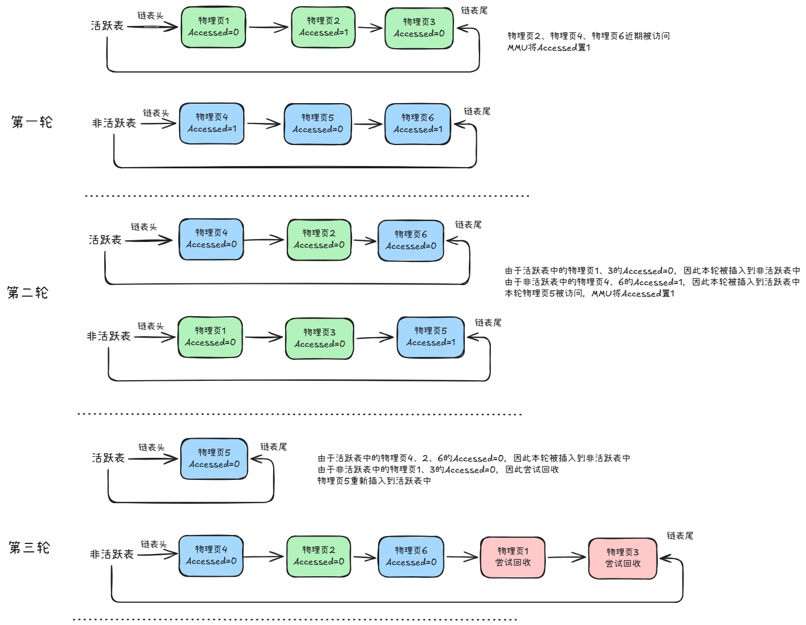
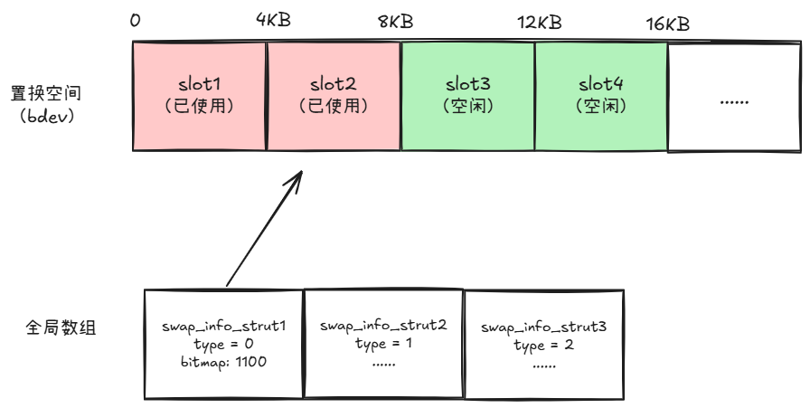
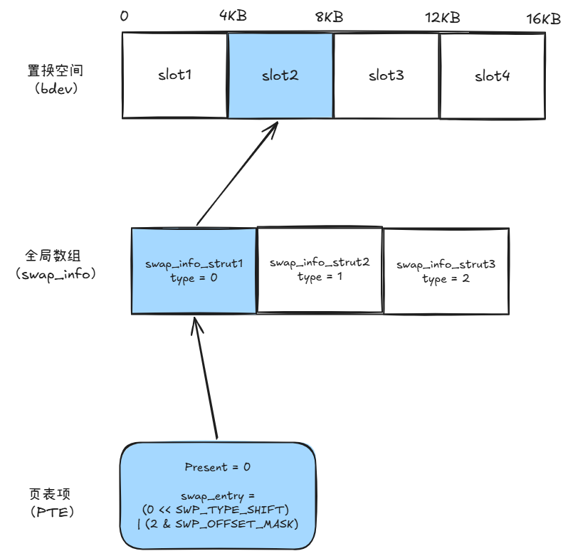

# 物理内存管理（中）

前言：本来以为可以用一章搞定剩下的内容，发现想写的东西还是太多了，还得单开一章节写相对独立的其余内容。

上一章节我们开始聊内核管理物理内存的机制，一个是初期的memblock分配器，一个是后续的Buddy System（伙伴系统）。明白了内核能够正确管理物理内存，实际离不开与物理内存区间一一对应的`struct page`结构体的字段赋值更新、挂链摘链。

章节末尾部分还提到内核在空闲内存不足（触发水位线）时，会启动内存回收机制，会逐一尝试回收当前“不热”的物理页。

而回收的方式基于物理页存储的数据来源不同而有区别，这一章节就基于这一点作为线索展开讨论：

1. 内核是如何判断内存是否可以回收的？
1. 什么是匿名页什么是文件页？
1. Page Cache是什么？Swap Cache又是什么?

## 内存回收

在上一章节最后有提到内存回收（reclaim）机制——在空闲内存不足（触发水位线）时，内核会**唤醒**名为kswapd的内核线程尝试对内存进行回收。

之所以强调唤醒一词，是因为kswapd内核线程对应的`struct task`一直存在，只是在水位线高（内存充足）时它会将自己挂起（处于不做调度的状态）。在内存低于水线后，伙伴系统在分配内存时才会尝试唤醒kswapd让它开始回收内存从而增加空闲内存大小。

整个回收机制由几个重要要素组成：

- 基于LRU规则的、维护物理页的链表：内核将分配给应用程序（内核自己用的不在其中，例如slab分配器、内核栈等）的物理页结构（`struct page`）都串联在了基于"最近最少使用"（Least Recently Used, LRU）规则维护的链表上，区分为活跃（active）与非活跃（inactive）两级链表，随着现代操作系统对内存管理精细度的上升，现在也已经发展为多级链表（MLRU）了，不过不论区分了多少个链表，总之遵循的是从活跃到非活跃的热度渐变关系。
- 基于硬件的访问标志更新：之所以内核能够知道一张物理页最近是否被访问，实际上使用了页表项（PTE）中的一位标志位（Accessed）。当MMU对虚拟地址完成转换，成功找到对应的表项后，就会将这个表项对应的Accessed位置为1，当kswapd线程在遍历检查时，可以根据`struct page`结构体的特定字段找到对应的PTE表项，从而基于标志位区分这块内存最近是否被访问过。kswapd检查标志位的方式是原子操作`test-and-clear`，即检查是否符合期望值并清零。
- 后台线程：kswapd内核线程会检查物理页是否最近被访问过，如果被访问过则不做处理，如果没被访问过，则回收这页内存，对应了“时间局部性”原理——最近被访问到的内存很可能后续被再次访问。

LRU链表、硬件置位、异步线程共同完成了物理页从创建到非活跃回收，我们按最简单的两级链表来描述这个流程：

1. 插入活跃表链表头：物理页被缺页中断实际申请初始化完毕后，会被添加到LRU活跃表的链表头
2. 程序通过虚拟内存地址访问该物理页，MMU查找到PTE表项后顺便将Accessed位置为1
3. 被唤醒的kswapd线程扫描LRU链表：
   1. 扫描活跃表：kswapd内核线程遍历活跃表（active）中的表项，检查对应的PTE表项Accessed位是否为1并清零
      1. 如果是1，则将其从链表尾摘下然后插入到链表头中
      2. 如果是0，则将该表项从活跃表中摘下，插入到非活跃表的表头
   2. 扫描非活跃表：kswapd内核线程遍历非活跃表（inactive）中的表项，检查对应的PTE表项Accessed位是否为1并清零
      1. 如果是1，则从非活跃表中摘下，插入到活跃表的表头
      2. 如果是0，那就说明可以尝试回收（非活跃是回收的前提条件之一，还需要走入正式回收检查流程）这页物理内存了！

这里需要补充说明一下kswapd内核线程的行为：

- 遍历活跃表和非活跃表的时候，是从链表尾部开始遍历——越在尾部说明越可能是不活跃的
- 每次是按有限数量遍历，而非完整遍历所有物理页——全部遍历的性能损耗太大了

这两点都是基于设计原理的小巧思：因为一张不活跃的物理页只会被不断推向所在链表的尾部，因此只关注末尾最有可能不活跃的一部分物理页是投入产出比最高的。

示意流程如下图所示：



放在现代的多级链表（MLRU）的情况下来看，物理页也只是基于Accessed位在这些链表之间加入剔除、沉沉浮浮，机制设计是相同的。

继续补充一点，虽然内核自己使用的物理页不参与上述的流程，但是内核在唤醒kswapd线程时，也会触发一个`shrinker`回收事件，内核模块可以通过注册事件回调触发回收自己空闲内存（例如文件系统回收inode结构体，在下一章节介绍slab分配器时会接上这个事件）。

寻找可回收的物理页的流程理解了，那对物理页的回收流程呢？为了讲明白回收流程，这里先要引入物理页类型这个重要概念（不然要讲不下去了）。

众所周知，内存里存的是数据，对于内核来说，数据的值是什么不重要，但是**数据是什么很重要**，因此物理页围绕数据是什么被区分为了匿名页（Anonymous Page）与文件页（File Page）。 一张物理页将基于各种判断条件被归类为匿名页或文件页。

从缺页中断的分配处理到内存回收，处处都存在着对匿名页和文件页的区别对待，可以分成几个部分来分析：

- 装载内容不同
- 回收处理不同
- 分配流程不同

## 物理页装载内容

抛开特殊场景后，正常来说：匿名页和文件页是用于形容一张物理页对应物理内存当前存储的数据来源是什么。

- 匿名页：指的是设备上的应用程序在运行过程中动态使用的物理内存，通常的来源例如程序的堆栈

- 文件页：顾名思义，物理内存当前存储的内容来自例如硬盘等持久化设备上的文件数据（或者说存在备用数据），通常的来源例如读写文件

再次call一下程序链接、装载章节学到的知识：

1. 程序头中会描述程序的各个段的属性（只读、可读写），以及在二进制中的起始和结束位置。
2. 段与段之间基本遵循按页对齐
3. 内核在加载时会根据程序头中的描述，将这些二进制数据分别读取不同的物理页中

那么知道了上面匿名页与文件页的本质后，我们就能够推断：一个二进制程序被加载到内存中运行时，装载不同段的物理页会分别对应匿名页与文件页。

例如：

- 程序的代码段（.text）——文件页
- 程序的常量（.rodata）——文件页
- 程序初始化的全局变量（.data）——通常是文件页，但是在写时拷贝下也可能是匿名页，将在下文展开描述
- 程序未初始化全局变量（.bss）——匿名页，因为.bss只是描述要预留多大的内存用于分配变量，并没有数据来源于文件

而程序在运行中的一些会使用新内存的行为，我们也可以通过上面的判别标准得知使用的是哪种物理页：

- 栈生长——匿名页
- 堆内存申请（例如malloc）——匿名页
- 读取文件（例如read）——文件页

linux中可以通过`cat /proc/<pid>/maps`查看程序的VMA（虚拟内存区域）映射关系：

```
root@Ruijie:~# cat /proc/3180/maps
00400000-00500000 r-xp 00000000 07:00 4978                               /usr/bin/a.elf
0050f000-00510000 r--p 000ff000 07:00 4978                               /usr/bin/a.elf
00510000-0051e000 rw-p 00100000 07:00 4978                               /usr/bin/a.elf
0051e000-00537000 rw-p 00000000 00:00 0
ffff8a2f8000-ffff8a2f9000 ---p 00000000 00:00 0
ffff8a2f9000-ffff8aaf9000 rw-p 00000000 00:00 0
......
ffff96577000-ffff96583000 rw-p 00000000 00:00 0
ffff96583000-ffff96584000 r--p 00000000 00:00 0                          [vvar]
ffff96584000-ffff96585000 r-xp 00000000 00:00 0                          [vdso]
ffff96585000-ffff96586000 r--p 0001c000 07:00 5517                       /usr/lib/ld-2.27.so
ffff96586000-ffff96588000 rw-p 0001d000 07:00 5517                       /usr/lib/ld-2.27.so
ffffc4819000-ffffc483a000 rw-p 00000000 00:00 0                          [stack]

```

从命令中可以很容易的get到：如果最后一列有文件路径，那么就是文件页。更准确的可以通过设备号和inode来看（匿名页设备号为00:00, inode为0）。

一个初步的判别方法是：这个物理页中的数据在持久化设备上存不存在原始备份，如果存在则是文件页，否则是匿名页。

接下来讲讲特例——存储程序的全局变量的物理页是文件页还是匿名页呢？实际上都有可能，要依据具体场合来看。

在介绍应用程序装载章节以及进程线程的章节时，我们都提到过写时拷贝（Copy On Write, COW）机制。

在进程加载时，虽然程序头上标注了全局变量（例如.data段）的权限是可读写，但内核往往会先分配一页只读权限的物理页。

当程序真正修订全局变量时，对只读页面做写入操作会触发缺页异常，此时内核会根据该只读页的引用（ref计数）情况做出不同的操作：

- ref计数大于1，说明这页只读物理页被多个进程使用，则会为写入进程重新分配一张可读写的物理页（写副本），此时执行写操作的进程对应的PTE表项会指向新分配的写副本，并且这个写副本物理页类型是匿名页。
- ref计数等于1，说明这页只读物理页只被当前进程使用，则直接将物理页权限提升为可读写，此时这页物理页仍是文件页。

如果不管是匿名页还是文件页都不影响应用程序的读写的话，那为何还要区分这个呢？

的确无论是匿名页还是文件页都不影响应用程序的读写，但是自然了要回收这页物理页时的行为。因此我们赶紧接着回到内存回收部分，来来谈一下两者的处理有何不同。

## 物理页回收流程

这里插入两个非常好懂但很重要的概念：

**脏页**

在PTE表项中存在一个Dirty标志位，代表这张物理页是否被修改过。

如果Dirty=1，则我们称这张物理页是脏页。

如果Dirty=0，则我们称这张物理页是干净页。

**MAP_PRIVATE/MAP_SHARED**

在介绍虚拟内存的章节中，我们讲过应用程序的每一块虚拟地址空间都是由一块VMA对应进行描述。

在描述中，VMA也会描述这块地址是私有还是可共享的，体现为：

- MAP_PRIVATE：这块地址中的数据是进程私有

- MAP_SHARED：这块地址中的数据是多进程可共享的

有了上述概念后，内存回收的方式就可以描述为下面几种：

- 干净的文件页：直接丢弃内存数据并回收
- MAP_SHARED的脏文件页：将内存数据写回到源文件中（Writeback），写入完毕后回收

- 针对匿名页与MAP_PRIVATE的脏文件页：将内存数据保存到硬盘上（Swap），保存完毕后回收

**直接回收**

字面意思，上文我们有说到，物理页是文件页说明数据来源于实际存储在硬盘等持久化设备上的文件内容，那么如果没有被修订，说明内存的内容和源文件一模一样，后续如果又要的话直接再从源文件取就行了，当前可以无忧地直接回收。

因此未被修改过的文件页也是最容易、最快回收的一种内存类型。

**WriteBack机制**

一张MAP_SHARED标记的脏文件页意味着内存中的数据和源文件不一致，如果此时直接丢弃回收，那就会导致这部分的修订丢失。那么自然能想到，内核的做法就是先把修订内容写回源文件中，将“脏页变干净”后再回收这张文件页。

这一流程就被称为Writeback(写回)：

1. kswapd内核线程发现要回收的文件页是脏的，因此将文件页标记为PG_writeback状态，接着提交一个I/O请求后直接继续对链表中其他物理页做检查，不再关注这一页文件页
3. I/O请求被内核I/O模块接收，开始将请求的内容写入硬盘
4. I/O请求完成后，内核将触发kswapd内核线程注册的回调函数，回调函数会将文件页的PG_writeback状态清除，并且将Dirty标记也清除，此时文件页成为了干净的文件页——内存数据与源文件完全相同。
5. 在下次kswapd内核线程的遍历操作中，这张干净的文件页就可以被直接丢弃回收。

可以看出，Writeback机制本身不回收内存，它只是完成将脏页转换为干净页的逻辑。

注1：kswapd内核线程也并不是遇到一张脏文件页就会触发一次I/O（如果这样就变成中断的灾难了），而是累计一定数量后提交一次I/O批量写入请求。但是提交后并不一定会被立即执行，因为I/O模块的性能优化设计可能会对一定时间内、一定量的I/O请求做合并、排序（因为存在磁盘寻道开销）后再进行写入，后续的章节也会介绍这部分的内容。

注2：Writeback听起来似乎是和Flush机制相同，都是将内存中的脏文件页内容写回源文件，然后将脏文件页变为干净的文件页，但Flush是应用程序使用`sync()`、`fsync()`等函数主动触发的操作，并且是同步等待执行完毕，与内存水位等无关。而Writeback则是异步执行、由内存回收触发的逻辑。

**Swap机制与Swap Cache**

Swap（置换）机制是针对匿名页与MAP_PRIVATE的脏文件页的数据处理方式，一句话说明白就是将内存里的数据先保存到硬盘等指定区域存储，等后续需要的时候再加载回内存。

先不谈匿名页，为什么MAP_PRIVATE标记的脏文件页本质上也是文件页，为什么不是基于上述的Writeback机制写回源文件而是要走置换呢？

原因是我们上文提到的MAP_PRIVATE的含义——代表这个数据是进程独有的，不会共享给其他进程。想象一下，假如真的把脏数据写回到源文件中，岂不是后续其他进程就能读取到了吗？从这个角度就能理解MAP_PRIVATE的文件页中的数据只能先找个地方存起来，等需要的时候再加载回来。

物理页的swap流程如下：

1. 在置换的目标区域中找到一块可用于存储数据的空闲区域
2. 更新物理页对应的PTE表项，将原本指向物理页的内容替换为指向置换区域的内容，且将Present（存在）标志位清0
3. 将物理页数据写入空闲区域，写入完毕后会触发对应的回调函数
4. 当进程再次访问这块内存时，MMU发现表项的Present位为0，则会触发缺页异常
5. 缺页异常处理时，发现PTE表项虽然Present位是0但内容非0，则明白了这是一张被置换的物理页，此时会分配一张新的物理页并且根据表项中的内容找到对应的置换区域，将置换出去的内容重新装载到新物理页中。
6. 新物理页装载完毕后，该PTE表项的内容被更改为新物理页的PFN号，并且Present位被设置为1

这段流程看起来还挺简单，但是由此能够牵扯出许多的知识点，此处我们通过问题引出几个重要内容：

- 内核是怎么维护可用于置换的区域信息的？
- 被置换后，PTE表项中记录了什么内容可以让内核认得是内存是被置换的？
- 回收是基于物理页进行回收的，但是之前学过一页物理页可能被多个进程映射，每个进程对应的虚拟内存地址不一样意味着PTE表项也不一样，回收时是怎么修订到每个PTE的？
- 将内存数据写入磁盘是异步的，且耗时又不短，万一写的过程中内存又被访问怎么办？

**针对问题一：swap_info_struct管理置换空间**

从一个很朴实的角度思考，物理页的数据要被置换到硬盘中保存，那物理页的一页内存大小如果是4KB，那就需要4KB的硬盘空间。

如果要维护可用于置换的硬盘空间，似乎与以前memblock的操作类似，将可用空间按4KB分割一下，然后用数据结构保存一下就可以管理了？

对的对的，这个就是内核维护的`struct swap_info_struct `数据结构的做法。

内核有一个swap_info_struct构成的数组`swap_info[MAX_SWAPFILES]`，说明内核可以支持同时存在多个不同的置换区间。

这里简单放一下这个数据结构定义：

```
struct swap_info_struct {
    unsigned int type;           // 本 swap 区的编号
    struct block_device *bdev;   // 所在块设备
    struct file *swap_file;      // swapfile 对应的 file 结构
    unsigned char *swap_map;     // 每个 slot 的引用计数位图
    struct swap_cluster_info *cluster_info;  // 每个 cluster 的状态
    unsigned long max;           // 总 slot 数
    unsigned int pages;          // 已用页面数
    unsigned int inuse_pages;    // 实际在用页面数
    ...
};
```

`struct swap_info_struct`直接对应了一块可以用于置换内存的区域，区域内部按指定大小进行分割，并且以slot作为偏移量的统计。

例如slot = 0,代表这片区域offset = 0的位置，而slot = 1代表offset = page_size * slot的位置



**针对问题二：swp_entry_t告知置换位置**

`struct swap_info_struct`通过维护位图`swap_map`来分辨slot是否可以使用。

当内存需要置换时，就看看位图哪位bit是0——代表对应的slot是空闲的，然后将`swap_info_struct.type`与slot计算出的offset构成一个`swp_entry_t`结构返回。

```
typedef struct {
    unsigned long val;
} swp_entry_t;

swp_entry_t = (type << SWP_TYPE_SHIFT) | (offset & SWP_OFFSET_MASK)
```

而内核收到这个结构后就将PTE表项中原本记录PFN号的内容替换为`swp_entry_t`(实际也就是一个unsigned long)。

后续缺页异常发现`present`位值是0，但内容不又不为0，就将内容按`swp_entry_t`来解析，反向计算出对应的swap_info_struct是全局数组中的哪个，与原本的数据在整片空间对应的偏移量offset是多少，将数据重新读入新物理页。



**针对问题三：反向映射**

个人的心得是：内核设计中一切查找、反查都离不开指针指来指去，要不就是偏移量移来移去。

在进程触发缺页异常后，内核才实际分配物理页。在分配时，内核可以通过进程访问的虚拟地址拿到虚拟地址所落在的VMA结构体。

内核基于VMA描述的类型（匿名页或文件页）将VMA挂到了物理页（struct page）字段上的不同地方。

如果是匿名页，则`struct page`的mapping字段可以遍历到所有对应的VMA结构。

如果是文件页，则`struct page`的mapping字段会最终指向文件i_node结构（说最终是因为实际上先到address space结构，然后到i_node），而文件i_node上又会记录所有引用该文件的VMA结构。

已知，每个物理页都是一页一页分配的，那么物理页的偏移量和虚拟地址的偏移量是可以对应上的。

根据物理页映射内容的偏移量计算出每个VMA对应的不同虚拟地址，就可以找到进程对应的PTE了。

**针对问题四：swap cache保证安全**

因为置换的时候是先把物理页对应的PTE置为`swp_entry_t`后，再开始正式写硬盘。

那么如果硬盘数据还在写，缺页异常直接根据`swp_entry_t`的值去读取硬盘，则读取到的数据不是空的就是少的。

因此内核在这一过程中加入了swap cache的机制。

swap cache与要被置换的物理页是一一对应的关系，事实上swap cache是复用了page cache机制的一部分流程结构（下文会介绍）。这一流程中主要有两把锁需要介绍：

- xa_lock：全局锁，用于保护管理swap cache的数据结构，保护cache节点的增删改查

- folio_lock：swap cache每个cache节点内部的锁，用于保护物理页的原子性

物理页整体置换流程如下：

1. 内核找到空闲的slot后，获取xa_lock，创建物理页对应的swap cache并插入数据结构，然后释放xa_lock。
2. 把得到的`swp_entry_t`写入所有物理页对应的PTE。
3. 内核尝试获取folio_lock并设置cache的PG_writeback标志位，代表这个物理页要开始置换了，然后释放folio_lock，提交物理页的写入请求。
4. 此时进程通过缺页异常进行访问时，通过表项得知了这是置换页，不会直接去读取对应slot，而是先查找swap cache。
5. 如果swap cache存在，则需要区分PG_writeback标志位是否存在（是否正在写入）：

- 如果存在，则进程会将自己加入到物理页的等待队列（`wait_queue_head_t`）中等待写完。写硬盘结束的回调函数（`folio_end_writeback()`）会清空PG_writeback标志位，并且唤醒所有等待队列中的任务。此时进程就会执行映射操作。

- 如果不存在，则进程直接执行映射操作。

- 进程重新映射后，物理页的引用数不再是0。后续kswapd内核线程发现引用数不为0，放弃回收这张物理页。对于不能直接映射而要等到写入结束的原因在于如果写入没执行完时，进程做了修订，那么写入硬盘的数据就乱套了。

6. 如果swap cache不存在：

- 那说明物理页已经被彻底回收了，只能去硬盘里重新拉取了，于是进程创建一个swap cache并在xa_lock锁的保护下插入到数据结构中。

- 要拿xa_lock锁的原因也是防止两个进程同时通过缺页异常同时发现swap cache不存在，导致创建两张物理页读取两次硬盘的情况。

- 插入swap cache后，进程会尝试获取folio_lock，然后启动硬盘读取，如果尝试（try_lock）失败拿不到锁的进程则会加入等待队列，在 I/O 完成、锁释放后被唤醒，然后直接映射。

这里补充几个点：

- 可以看到匿名页的cache设置的标志位名为PG_writeback，与文件页的回写机制名称一样啊？实际上就是因为机制的复用。
- 如果物理页后续又因为不活跃被置换回硬盘呢？如果这页物理页一直没有Dirty标志，则说明硬盘里之前slot的内容也是完全一样的，这次就可以不用写入硬盘了，直接走回收。
- kswapd内核线程并不是提交I/O请求后等着这些匿名页置换完毕，而是将这些页加入到链表中，在后续下一轮调度时再进行检查和回收。

以上便是物理页的各种回收方式，在介绍swap机制时我们谈到了一个新名词Page cache，这个实际上与文件页的分配有关。

因此接下来本章节的最后一部分，我们就要讲讲物理页的分配流程中匿名页和文件页有哪些不同。

## 物理页分配

经过之前的学习，我们都理解了物理页的分配全靠缺页异常。

关于如何拿到一张空闲物理页，这里就不再赘述了，在上章节中的伙伴系统已经讲解过了。本节主要围绕匿名页与文件页的相关知识点介绍。

应用程序缺的可能是堆栈内存空间——匿名页，也可能是文件的内容——文件页。两类都是能复用就复用，找不到就分配的逻辑。

大部分情况下其实都是文件页才能在多进程之间复用，例如同一个程序的多个进程就能复用.text等部分，但进程的堆栈是自己的，除了父子进程可以短暂共用外，其余进程很难共享，因此匿名页的复用比较少。

**Page Cache**

文件页能够复用，依赖的就是Page cache机制。Page cache机制维护了源文件与物理页的关系，也支撑了writeback机制的执行。（所以复用了Page cache机制的swap cache才会出现`PG_writeback`标志位与`folio_end_writeback`等包含writeback字眼的符号名）

当进程读取文件内容触发缺页异常时会：

1. 检查page cache中是否存在对应的文件内容的cache节点
2. 如果存在则直接映射该文件页
3. 如果不存在则创建cache节点，并且获取xa_lock锁后插入到数据结构中
4. 设置cache节点中的标志位`PG_locked`，接着启动一个I/O读取请求，请求读取文件对应内容到物理页中，并且将自己加入到这页物理页的`wait_queue_head_t`中等待
5. I/O结束的回调函数会清空`PG_locked`标志位，并且唤醒所有等待的进程。进程将这张物理页映射到自己的PTE表项中

此时，如果其他进程同样需要访问这块内容，并且发现`PG_locked`标志位为1（已经在执行读取操作了），则将自己加入到等待队列中即可。

上述逻辑实际上和前面提到的swap cache流程大致相同，毕竟这个才是“正规用法”。

page cache与上面提到的swap cache的目的相同，都是为了防止每个进程都在缺页中断中发起了对相同内容的多次I/O请求，提升了综合性能。

# 总结

本章节承接上一章节的struct page结构体初始化、伙伴系统分配物理页之后的内容，描述了伙伴系统中管理的物理页作为匿名页与文件页在数据内容、内存回收、缺页异常分配过程中的各种区别与对应的配套机制。

而在物理内存管理（下）——应该真的是物理内存管理的最后一篇，会讨论关于内存管理的其他部分：

- slab分配器——内核模块怎么管理内存

- zram/zswap等优化手段——将I/O性能压力转移到CPU算力

PS:

同样一个知识点，可以写成一本书，也可以只写成一篇文章。简单将代码一贴，名次复制一下网上的专业解释，跟着代码复述一遍流程所组成的文档是我不愿意看到，不愿意产出的。如同讲故事一样讲清楚一连串知识点是我写这系列文章一个非常重要的要求。

因此围绕物理内存管理连续写了三篇才堪堪讲完想讲的内容，确实是给了我一个提醒，对于内核环环相扣的设计知识点，如抽丝剥茧或能够互相印证的讲述方式才是符合我想法的（最后知识点会师串在一起有一种爽感），因此文章布局也要做好更远的规划，而不是想到哪里写到哪里。


