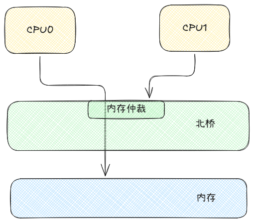
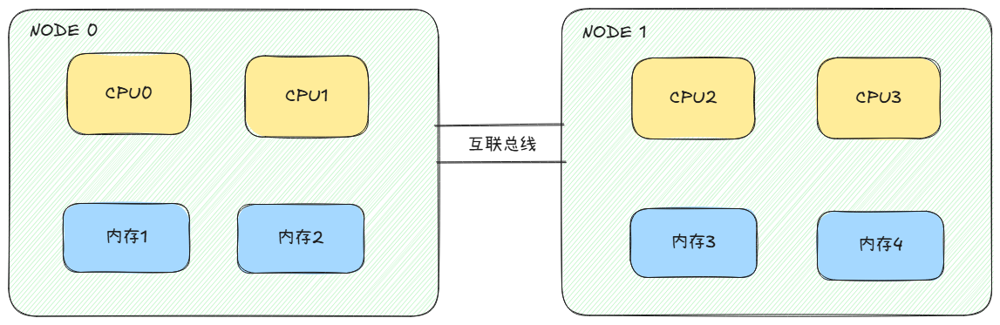
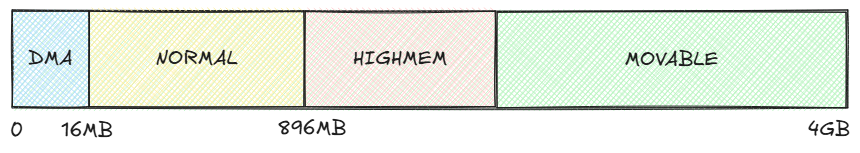

现代计算机的架构始终离不开最早提出的冯诺依曼计算机体系结构，它定义了五大部件——“运算器”、“控制器”、“存储器”、“输入设备”、“输出设备”。

基于该体系的计算机运行流程都是控制器从存储器获取指令与数据，然后经过运算器运算后将结果输出到存储器或输出设备。

“那控制器是如何访问存储器的呢？”这个问题正好作为我们本章节要讨论内容的开场，这次我们要谈到的内容是：

1. SMP架构是什么？内存模型NUMA和UMA又是什么？
2. 内核为什么对内存划分区域（ZONE）？

当本章节的内容讲完后，近几章节的内存机制就终于可以自上而下、“由始至终”的串联在一起了。

---

### 内存架构与内存模型

SMP（Symmetric Multiprocessing， 对称多处理）架构正如其名，讲究的是对称，讲究的是人人平等，哪个CPU想要访问内存的逻辑以及耗时都是相同的。

那么CPU从内存读取数据需要几步呢？答案是三步：

1. 发出内存读取信号
2. 内存收到信号后准备数据
3. 读取内存准备好的数据

简单说来确实是只有这几步，但是其中的门道太多了，我们只讲本章节关注的第一步。

在传统计算机架构中，CPU与内存之间并没有直接的通路，它们需要共同被集成到专门的中转硬件上。

在过去的计算机中有两种中转硬件：

- 南桥（South Bridge）：用于连接速率较低的I/O设备，例如鼠标键盘、声卡等
- 北桥（North Beidge）：用于连接高速设备，例如CPU、内存、显卡等



如图所示，因为CPU和内存都是连接在北桥上，之间并没有直接的通道，所以如果CPU要访问内存实际上是通过北桥作为传输中介，先将请求发送到北桥上，然后北桥再发送给内存。内存准备的数据也是先读取到北桥，再由北桥转回给CPU。

但是CPU和内存往北桥上一插，总线就这么一条，决定了北桥在同一时间只能做一件事。这就带来了访问竞争（race）问题——如果多个CPU同一时刻都想读取内存该如何处理？

最简单的处理方法莫过于”先来后到“，北桥提供了一个内存仲裁机制：假设CPU0的电信号先被北桥收到，北桥就会锁住这个信号，之后CPU1的请求信号就不会被响应。当CPU0获取数据结束后，北桥的信号才会解锁，此时CPU1才可以访问内存。

可想而知，CPU1是真的想认真干活但是又推进不了流程（本章节不考虑超流水线），这得有多么煎熬。

不仅如此，由于北桥承担了数据中介的职责，所有高速设备的数据交换都要经过它，因此北桥的数据转发性能也会成为整个系统的性能瓶颈。

这么来看，传统的SMP计算机架构从北桥这一块可以看到两大问题:

1. 多核竞争:多核同时访问同一块内存，除了其中一个核可以顺利访问之外，其他核都需要等待，产生大量的访问时延。
2. 单点瓶颈:由于北桥上连接的都是高速设备,因此北桥的带宽在多核设备下显得有些捉襟见肘。

既然问题都是北桥带来的，因此现代计算机设计一寻思，那我便不要北桥了，于是北桥的功能就被集成到了CPU中，此时CPU具备直接和其他高速设备直连的能力。

那现在不仅少了北桥的统一仲裁，而且CPU又能直连内存，那岂不是谁都能随时指挥内存干自己的活？这数据还能不能完整读写了？

这样看来多核竞争问题还是没没有解决。考虑到这一点，现代计算机架构继续给出扩展方案：给CPU配备自己的本地内存，这样大家就不必天天争抢了。

此前在北桥的保证下，所有CPU共享一条总线，访问内存的方式、性能是平等的，这种内存模型称为UMA（一致性内存访问）。

如今CPU访问自己、他人的内存出现了性能不一致，这种内存模型便被称为NUMA（非一致性内存访问）。

注：对于单CPU系统（如多数笔记本电脑），所有内存访问速度一致，仍属UMA架构。因此NUMA/UMA并非区分“传统”与“现代”，而是对应不同架构场景。

到这里我们要理解：NUMA是为了解决SMP面临的性能问题而提出的扩展方案，属于是计算机架构进化树上的演进关系而不是对立关系。

看起来NUMA似乎是能够解决SMP架构由于北桥带来的这两个问题了,但是代价是什么呢？

### NUMA下的新问题

NUMA内存模型主动在硬件拓扑层面将CPU、内存划分为了多组，每个组被称为一个NUMA节点。NUMA节点之间通过互联总线进行数据交换。



CPU访问本NUMA节点的内存时，由于是直连，因此访问效率最高。而访问其他NUMA节点的内存时，需要经过NUMA节点间的互联总线进行请求以及数据交换，因此访问效率大大下降，体现为时延较高。

那么内核怎么获取当前设备是什么架构，是什么内存模型呢？其实目前可以说一切的硬件信息，包括前几章节说过的内存信息，通通由BIOS在设备启机后读取硬件信息后给出。

内核通过两张表来获取NUMA节点相关的信息：

- SRAT（System Resource Affinity Table，系统资源关联表）：记录了每个NUMA节点中的CPU信息以及内存信息
- SLIT（System Locality Information Table，系统局部性信息表）：记录了NUMA节点之间的距离信息

可以用命令`numactl --hardware`查看内核解析的结果，例如：

```
numactl --hardware
available: 2 nodes (0-1)
node 0 cpus: 0 1 2 3
node 0 size: 96920 MB
node 0 free: 2951 MB
node 1 cpus: 4 5 6 7
node 1 size: 98304 MB
node 1 free: 33 MB
node distances:
node   0   1 
  0:  10  20
  1:  20  10
```

输出结果中的`node distances`指的是什么？

`distances`表示NUMA节点之间访问的代价的相对值，NUMA节点之间的访问代价大部分情况指的都是CPU访问内存的代价。

例如上面的例子中，node0（行）的CPU访问node1（列）的内存的代价是20，访问自己的内存代价是10。两倍的距离意味着的可能就是近似两倍的访问时延。

注：distances是相对值，表达的是访问的代价，与访问时延之间并不是严格的等比例关系。例如距离30的访问时延可能是距离10的2~3倍。

但不管怎么说，只要不是自己的，总要付出更多的代价。既然存在这种实打实的访问代价，内核能做的自然就是尽量将CPU要访问的内存安排在本地内存中。

实际上内核对NUMA的适配，已经全部蕴含在了前几章节提到的内存管理机制中：

- 伙伴系统（Buddy System）
- 通用分配器

但距离讲述内存分配如何支持NUMA前还有一个内容——内存区域（ZONE）。

### 内存区域

内存区域指的是内核将一块完整的内存区域划分为多个不同用途的区域（ZONE），目前内核中定义的区域类型有：

- ZONE_DMA
- ZONE_DMA32
- ZONE_NORMAL
- ZONE_HIGHMEM
- ZONE_MOVABLE
- ZONE_DEVICE

看着较为复杂，实际上每个区域的功能十分明确，理解起来也非常简单（可以参考Linux对每个枚举值的描述），有的是为了兼容性，有的是为了解决软硬件问题，还有的是为了性能。由于ZONE_NORMAL确实平平无奇（默认类型），因此我们从其他先开始介绍。

#### ZONE_DMA/ZONE_DMA32

初见DMA时可能想到的是AMD反插，但DMA（Direct Memory Access，直接存储器访问）是计算机领域的一项早已存在的技术，只是当下成了游戏外挂的主流技术栈。

在传统的计算机硬件设计中，硬件想要读写内存数据都需要经过CPU，这样就导致CPU可能需要大量的时间扮演数据的搬运工。为了解决这一问题诞生了DMA技术，让硬件（网卡、磁盘、显卡等）可以在不经过CPU转手的情况下，基于总线读写内存，只在关键时刻呼叫CPU批量处理数据（例如网卡的缓冲区实现）。

早期的DMA设备只支持对0~16MB的物理地址进行读写（因为寻址只有24bit），内核为了这些硬件设备能够正常工作，就只能为其分配0~16MB这块硬件能够表示的内存地址，这便是ZONE_DMA区域被划分的原因。内核会将ZONE_DMA区域内的内存优先分配给只能24位寻址的硬件。

而在64位的当下，可能有相当一部分DMA设备只能支持32位寻址，因此内核又设计了ZONE_DMA32，意味着将物理内存16MB（ZONE_DMA的结束地址）~4GB的区域优先分配给只支持32位寻址的硬件。

因此ZONE_DMA与ZONE_DMA32都是为了兼容特定寻址区间的设备。

#### ZONE_HIGHMEM

同样在64位系统下成为历史的还有ZONE_HIGHMEM，这个内存区域的设立与虚拟地址空间里那块内核保留区域有不可分割的关系。

**内核保留区域**

之前的《虚拟内存与进程地址空间》章节中我们有介绍过：“每个应用程序都运行在自己的虚拟地址空间，在4GB的空间（在32位系统）内有一块高位区域是内核保留区域，用于存放内核代码以及运行内核调用栈的区域，只有在程序切换至内核态后才允许访问。”

经过这几章节的学习后，我们有足够的知识来解释为何需要这么一块地址固定的区域：

- 前提一：虚拟地址访问实际数据，需要经过MMU查找页表项后才能得到真实的物理地址

- 前提二：应用程序通过系统调用、系统中断切换到高权限的内核态是为了访问内核代码段以及数据结构
- 前提三：内核的代码、数据结构在初始化后都已经保存在物理页中

在这三个前提下先反过来想——如果没有设计这块区域可能会出现的情况是什么？

1. 首先，应用程序不知道自己想要访问的内核代码或数据结构在哪里，这意味着没办法准确查找物理页
2. 其次，就算准确定位到了物理页，那么应用程序就需要在虚拟内存中映射这块物理地址
3. 再者，映射的物理地址由于数据来自内核，需要高权限才能操作，因此还需要区分对待

如果顺着这个逻辑去解决问题，那么会在整体方案中引入过多的额外处理，不符合Linux的设计审美。因此不如特事特办：分配一块虚拟地址区域用来专门映射内核物理地址，并且映射的关系需要明确，对每个应用都一样。也就是我们见到的“内核保留区域”。

虽然是特殊区域，但程序访问时仍是以虚拟地址进行访问，也仍需要通过MMU页表项进行查询。不同于其他虚拟地址是懒加载的方式通过缺页异常动态分配物理页创建页表，这块区域内的页表都是预先创建好的：内核在初始化时就完成了内核代码页表项的初始化，当通过系统调用`clone()`创建新进程时，新进程的页表中内核空间部分（虚拟地址A~B部分）会被设置为与内核全局页表一致。通过这种方式，内核保留区域的映射仅需在系统启动时初始化一次即可，不再需要在每个程序加载时都走一遍对应的页表项创建流程。

页表项固定还有一个好处是能够避免内核相关的TLB表项在进程调度中被覆盖：由于页表项的查找是多级查询，因此硬件上使用TLB表用于存储近期访问的虚拟地址与物理地址的对应关系，当一个虚拟地址在TLB表中没有记录时才通过MMU查找。当进程调度时，由于每个进程的虚拟地址对应的物理地址可能截然不同，所以会对TLB表进行刷新操作。而由于内核保留区域虚拟地址对应的物理地址都是固定的，因此可以不zuo刷新。关于TLB表的更多内容等后续章节再做介绍。

**保留区域外的访问方式**

由于内核大部分的代码与数据结构都是在低地址的位置，因此保留区域的1G范围足够支撑必要逻辑的高速访问，但1G之外的数据呢？内核可访问的区域被限制在了这1G虚拟地址对应的页表项中，那看来只能对页表项动手，让一些页表项指向其他区域了。

对于这1G虚拟地址对应的页表项，内核将高位的128MB作为动态映射区，这部分的页表项指向的物理地址将根据动态映射的需求进行填充（例如`kmap()`、模块动态加载）。其余的896MB（1G = 1024MB）仍是做对应物理地址0~896MB的映射。

**ZONE_HIGHMEM**

对于内核来说，物理地址大于896MB的区域都是“HIGHMEM”，初始化时被划分到ZONE_HIGHMEM中。这便是ZONE_HIGHMEM与应用程序的内核保留区域不得不聊的关联性。

在64位系统下，因为应用程序虚拟地址空间的划分规则变成了内核与用户空间对半分，内核部分分到的地址长度远远超过当代计算机的物理内存大小，因此所有物理页都可以做到完全映射。由于不再需要动态映射，因此也就不存在ZONE_HIGHMEM了。

#### ZONE_MOVABLE

相对于上面介绍的ZONE_DMA、ZONE_HIGHMEM来说，ZONE_MOVABLE是一个位置、大小并非固定的逻辑区域，内核通常是将可用的最高位区域（基于`find_usable_zone_for_movables()`查找）划分高位部分作为ZONE_MOVABLE的区域。

MOVABLE区域的位置并非固定，体现在：

- 32位系统上从ZONE_HIGHMEM区域划分，假设系统内存较小不存在ZONE_HIGHMEM，则会从ZONE_NORMAL区域划分，或直接不设立该区域（内存大小不足）。
- 64位系统上从ZONE_NORMAL区域划分。

MOVABLE区域的大小并非固定，体现在该区域的大小取决于设备的内存大小与相关的配置参数，例如`required_kernelcore_percent `（预期内核占用大小百分比）与`required_movablecore_percent `（预期可移动内存大小百分比）。

“MOVEABLE”看着也很眼熟，在《物理内存管理（上）》中我们有提到过：“当外部业务需要大块连续内存，但此时因为内存碎片过多，将Buddy合并后也凑不出来时，内核将会触发内存规整操作，会扫描物理内存页，找到可以搬迁的MOVEABLE类型页”。

那么这里的可移动区域与可移动的类型页有什么关系吗？答案是没关系。

- 可迁移的页指的是物理页的迁移类型为`MIGRATE_MOVABLE`，迁移类型不是对内存的描述，而是对其承载的数据的限制——这个数据允不允许“擅自”转移到别的物理页。

- ZONE_MOVABLE是从ZONE_HIGHMEM中划出来的一片内存，专门用于分配业务模块允许迁移数据的物理页。

因此要说关系，就是从ZONE_MOVABLE分配出去的物理页的迁移类型都一定是`MIGRATE_MOVABLE`。

在系统运行的过程中，经历业务反复地申请、归还物理页，伙伴系统原本的高阶物理页都被拆分成了碎片。如果此时想要连续的内存，那就只能对内存进行整理（compaction），将可以移动的数据都归到一边，以便于腾出一块连续的内存。

但万一好巧不巧，多个可移动的物理页之间有一张不可移动的物理页，那么这一块内存就被一己之力截成两份，还是不能腾出更大的连续内存。

为了解决这个问题，内核划分了ZONE_MOVABLE区域专门用于可移动的物理页申请，这样就可以将可移动与不可移动的物理页申请路径区分开来，同类物理页的位置更加集中，更容易腾出连续内存。利好的场景如下：

- 大页分配时需要连续内存或内存碎片过多时，需要对物理页进行移动
- 内存热拔插时，需要转移数据
- NUMA节点间迁移数据（下文将提到）

#### ZONE_DEVICE

ZONE_DEVICE区域的设立并不是为了对设备自身内存做划分，而是对外部硬件设备自带的内存做标记。

该区域表达的意思是：这块内存虽然内核可以访问、读写，但其属于外部硬件，内核不能用来分配给其他业务使用。

例如AMD显卡的显存在内核中就被视作DEVICE区域。

#### ZONE_NORMAL

将内核所有其他区域都介绍了一遍后，可以说利用排除法，没有被特意划分的区域就是ZONE_NORMAL。

例如低地址被DMA划走了，高地址被ZONE_HIGHMEM划走了，那么这高低之间的部分就是ZONE_NORMAL。

以32位系统下的4GB内存设备为例，整体的内存划分如图所示：



结合上面对ZONE_HIGHMEM、ZONE_MOVABLE的设计介绍，可以反过来理解：ZONE_NORMAL更多倾向于分配内核中不可迁移的静态逻辑结构。

### NUMA节点下的ZONE划分

由上面的介绍可以明白，区域ZONE就是内核基于使用途径的不同，对内存中一段段地址区间的定义。

那么从NUMA节点的角度呢?每个NUMA节点基本上都有自己的内存，是每个NUMA都需要划分出上面描述的ZONE_DMA/ZONE_HIGHMEM吗？

实际不然，虽然内存分属于不同的NUMA节点，但是在内核将它们视作一个整体——从0起始的连续物理地址，不会出现重叠部分。

举个例子，假设两个NUMA节点的内存大小均是4GB，那么内核会把它们当成物理地址0~8GB，而不是两个0~4GB。但是这个0~8GB究竟是两个节点对半分，还是交织穿插，在不同的架构中有不同的设计。为了方便介绍知识点，我们这里只介绍对半分的情况，即：

- NUMA节点0：地址0~4GB
- NUMA节点1：地址4GB~8GB

当明白了对内核来说，这就是一个长度8GB的物理内存时，我们就可以明白在NUMA架构下的ZONE划分的做法实际上没什么区别。

内核中对区域的划分其实发生在之前章节介绍的memblock分配器与伙伴系统的交接期间。

由于memblock分配器已经将可用内存按页框为单位分割完成，因此内核就可以按照规则计算每个ZONE的开始与结束页框号（PFN)，示意图如下：

[图片  NUMA下的区域划分]

```
Node 0 (0~4GB)
 └── node_zones[ZONE_DMA]      # 覆盖最低 16MB
 └── node_zones[ZONE_DMA32]    # 如果启用 DMA32，覆盖 0~4G
 └── node_zones[ZONE_NORMAL]   # 剩余部分，4G 内直接映射区

Node 1 (4~8GB)
 └── node_zones[ZONE_NORMAL]   # 只有普通区，没有 DMA/DMA32
```

之前介绍伙伴系统时说到memblock分配器交接后，物理页都是挂在order数组的一条条链表上。

但如今介绍NUMA和ZONE后，需要纠正以前的简化模型：伙伴系统会按NUMA节点、ZONE来分别组织物理页，而非将所有物理页都挂在相同的链表下。

因为NUMA内存模型的特性就是“访问自己的内存快，访问别人的内存慢”。如果伙伴系统把所有页混在一起，分配时就没法快速分配当前NUMA节点的物理页。如果任意分配则有可能造成应用程序性能运行下降，如果在链表内筛选对应节点的物理页。不仅逻辑更复杂，而且分配性能也会大幅下降。

每个NUMA节点在内核中以`struct pglist_data`作为最大的管理结构,划分好的ZONE信息在`pglist_data.node_zones[]`中按类型保存。伙伴系统的`free_area[]`（空闲链表）挂在每个ZONE结构下，最终形成了如下的数据组织情况：

[图片 ]

```
Node 0 (nid=0)                       Node 1 (nid=1)
pglist_data (node0)                  pglist_data (node1)
 ├── node_zones[ZONE_DMA]            ├── node_zones[ZONE_DMA]
 │    └── free_area[] (伙伴系统)      │    └── free_area[]
 └── node_zones[ZONE_NORMAL]         └── node_zones[ZONE_NORMAL]
      └── free_area[]                      └── free_area[]
```

既然存在多个空闲链表而非一个，那么意味着之前章节提到的所有内存管理逻辑。例如物理页的申请、内存低于水位线启动kswapd异步回收、内存申请失败时的同步回收等等，实际上都是在某个NUMA或某个ZONE下进行的。

### NUMA下的内存分配机制

**基于nid申请内存**

在之前的章节我们也说过，内核中的业务通常使用`kmalloc()`或`kmem_cache_alloc()`来申请所需的内存，那么这些函数为何完全没有NUMA和ZONE的相关传参出现,以至于之前不懂NUMA与ZONE也可以理清大部分的流程逻辑呢？

原因是内核对这些函数做了内部封装：

- 通过内部调用`get_nid()`函数获取运行当前业务代码的CPU所属的NUMA节点ID
- 通过业务传入的gfp标志选择内存分配的区域

这样做的好处是避免业务在设计编码时还需要考虑NUMA与ZONE的相关逻辑，减少了业务的实现难度.

不论是`kmalloc()`还是`kmem_cache_alloc()`，都是在与内存缓存（kmem_cache）打交道。

由于NUMA内存模型下的设计理念是要分配最合适的内存给业务,因此大部分的管理结构都是以NUMA或CPU的维度来分割.

`kmem_cache`也是如此，当内核或者业务初始化一个指定大小的`kmem_cache`时，其内部会为每个NUMA节点都创建对应的`kmem_cache_node`结构——也就是通用分配器的管理结构，如slab分配器的已满、未满、全空链表。

当内存申请函数调用时，`kmem_cache`可以基于传入的不同`nid`从不同的`kmem_cache_node`中分配对应的内存，实现最优内存分配。

在通用分配器这一层面，实际上不考虑ZONE的影响，因为不论物理页在哪，都不影响应用程序的读写。

对ZONE的考虑,实际上发生在伙伴系统层面,面对通用分配器的物理页的申请，伙伴系统要根据其携带的gfp标志来选择合适区域的物理页。

**基于gfp标志分配物理页**

gfp标志中包含了很多用于指导内存分配的信息，例如我们最常见的GFP_KERNEL或者GFP_ATOMIC等。

其意思为：

- GFP_KERNEL
- GFP_ATOMIC:

XXXXXXX


**fallback**

XX


### NUMA下的内存性能优化

内存迁移


